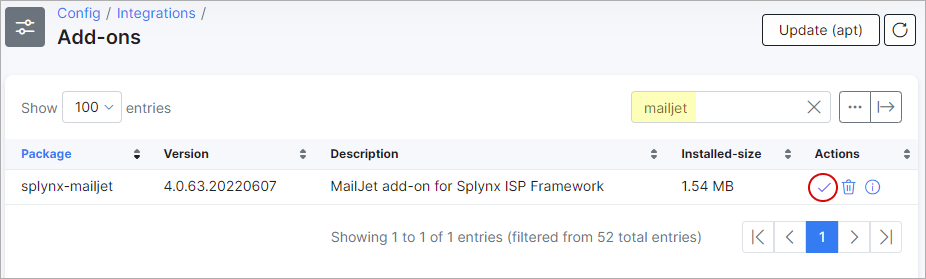
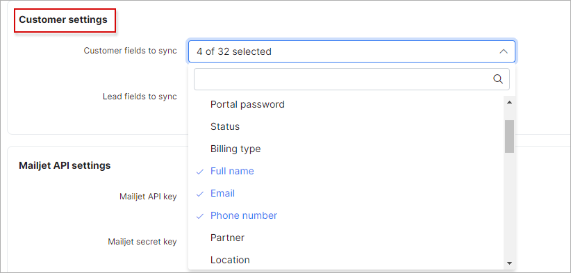
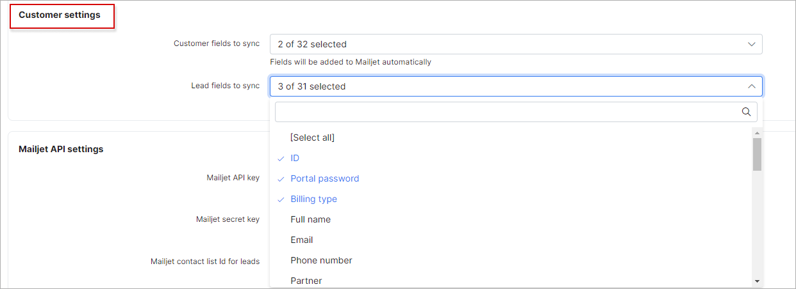
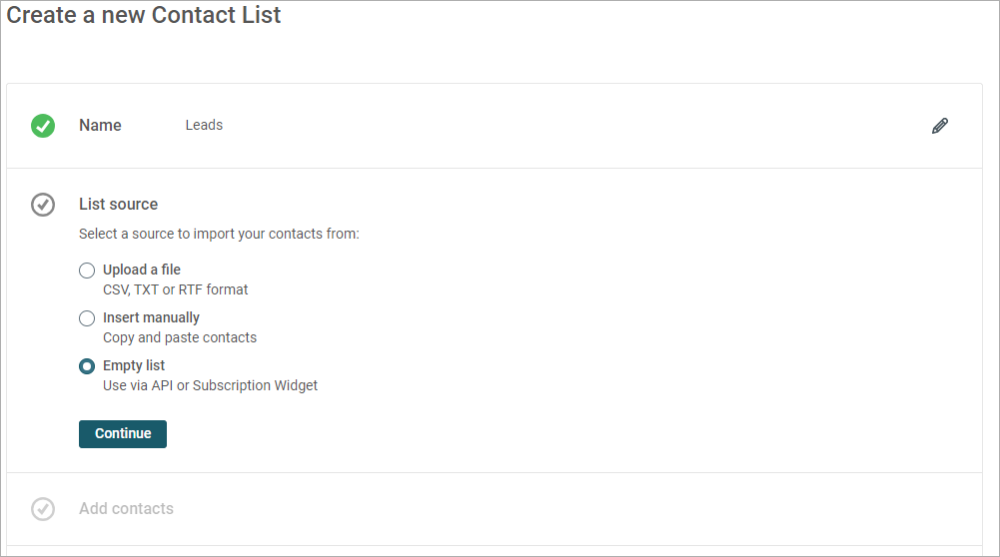
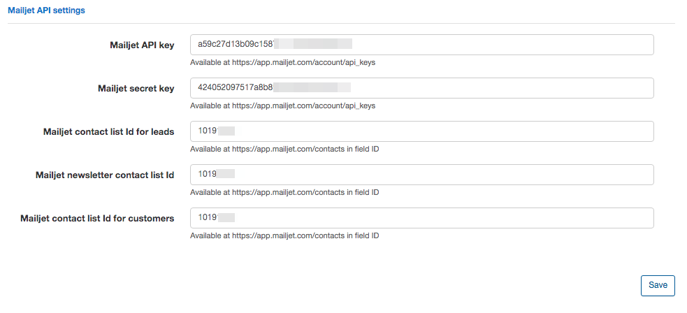

Splynx Mailjet
===========

Splynx is a multidimensional platform where you can send email and SMS messages directly from the system. For more information on emailing and SMS's please use the following guides:
Email messages: https://docs.splynx.com/support_messages/email_messages
SMS messages: https://docs.splynx.com/support_messages/sms_messages

However, our main goal is to help ISPs to grow their client base and up-scale their business. To help you provide better marketing we have integrated Splynx with the mail platform - MailJet.

In this short tutorial, we will show you how to configure Splynx synchronization with MailJet. All further automation, email templates, campaigns etc. should be configured in MailJet directly. We would suggest going through their documentation to get acquainted with the product: https://app.mailjet.com/docs

To install the MailJet add-on, navigate to  `Config → Integrations → Add-ons`, locate or search for the MailJet add-on and click on the install button in the *Actions* column as depicted below:

In order to open the add-on configuration settings, navigate to `Config > Integrations > Modules list` > and click on the edit icon in the *Actions* column of the module name 'Splynx Add-on Mailjet'.

Here we only need to configure Customer settings and MailJet API settings sections.

In Customer settings section we are able to choose the data that will be automatically pushed from Splynx to MailJet:

All this information will be stored in MailJet contact properties. They will automatically be defined by Splynx according to the fields that you selected to synchronize. For more information about contact properties please refer to this page: https://app.mailjet.com/support/how-to-create-manage-contact-properties,468.htm

In the next step of our configuration, we need to define the MailJet API settings.

Before proceeding with this, we need to do a few steps in MailJet. Splynx allows you to synchronize your clients or leads into 3 contact lists that will be used in MailJet for email targeting and further segmentation. One list should be for your existing customers, another for leads, and the third one for the newsletter.

To create a contact list in MailJet please go to app.mailjet.com > Contact lists > press the button 'Create contact list'. You can name your lists according to your requirements, we only require a list ID.

Once contact lists are complete, please navigate to Account > API Keys (https://app.mailjet.com/account/api_keys) to get you API and Secret keys.

The last step is to enter all this information into the Splynx MailJet API settings section.

Once all has been, Splynx will automatically synchronize your customers and leads with MailJet. All further configurations of your campaigns, email templates and mail automation should be configured in MailJet.
