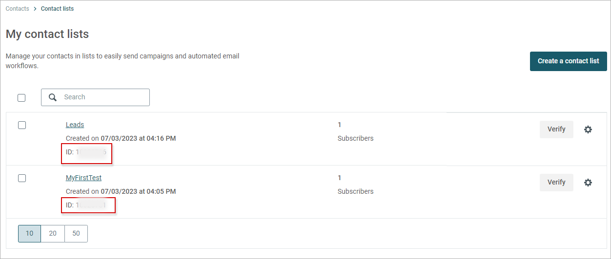

Mailjet
===========

Splynx is a multidimensional platform where you can send email and SMS messages directly from the system. For more information on emailing and SMS, please refer to the following guides: [Email messages](support_messages/email_messages/email_messages.md) and 
[SMS messages](support_messages/sms_messages/sms_messages.md).

However, our main goal is to help ISPs to grow their client base and upscale their businesses. To assist you in providing better marketing, we have integrated Splynx with the mail platform - [Mailjet](https://app.mailjet.com/).

In this short tutorial, we will show you how to configure Splynx synchronization with Mailjet. All further automation, email templates, campaigns etc., should be configured directly in Mailjet. We would suggest going through their documentation to get acquainted with the product: https://app.mailjet.com/docs

## Installation

To install the Mailjet add-on, navigate to  `Config → Integrations → Add-ons`. Locate or search for *splynx-mailjet* and click the *Install* button in the *Actions* column, as depicted below:

## Configuration

To open the add-on configuration settings, navigate to `Config → Integrations → Modules list`. Then, click the *Edit* icon in the *Actions* column next to the module named **splynx_addon_mailjet**.

Here, we only need to configure the Customer settings and the Mailjet API settings sections.

In the Customer Settings section, we have the ability to choose the data that will be automatically pushed from Splynx to Mailjet:

All this information will be stored in Mailjet contact properties, which will be automatically defined by Splynx based on the fields you selected to synchronize.

To learn more about contact properties, please refer to this page on Mailjet's website: [How to create & manage contact properties?](https://documentation.mailjet.com/hc/en-us/articles/360043176353-How-to-create-manage-contact-properties-)

### API settings

In the next step of our configuration, we need to define the MailJet API settings.

Before proceeding, we need to complete a few steps in Mailjet. Splynx allows you to synchronize your clients or leads into three contact lists, which will be used in Mailjet for email targeting and segmentation. One list should be for your existing customers, another for leads, and the third one for the newsletter.

To create a contact list in Mailjet please go to https://app.mailjet.com/ → Contacts → Contact lists. Click the `Create a contact list` button.

You can name your lists according to your requirements, we only require a list ID.

Once the contact lists are complete, please navigate to [Account → API Keys](https://app.mailjet.com/account/apikeys) to get you API and Secret keys.

The last step is to enter all this information into the *Splynx Mailjet API settings* section.

Once everything has been set up, Splynx will automatically synchronize your customers and leads with Mailjet. Any additional configurations for your campaigns, email templates, and mail automation should be done in Mailjet.
