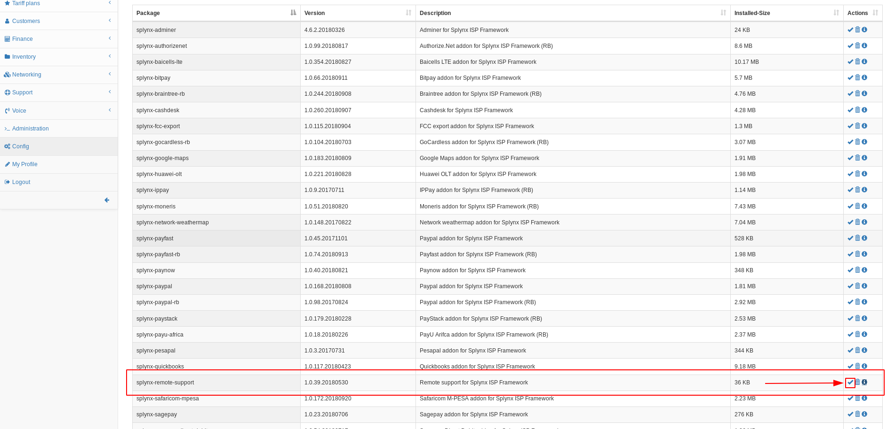
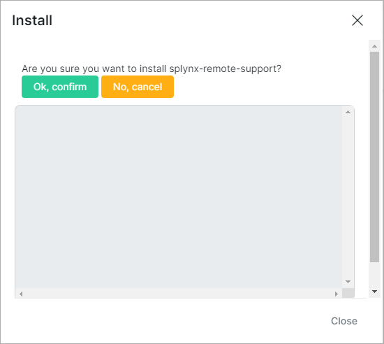
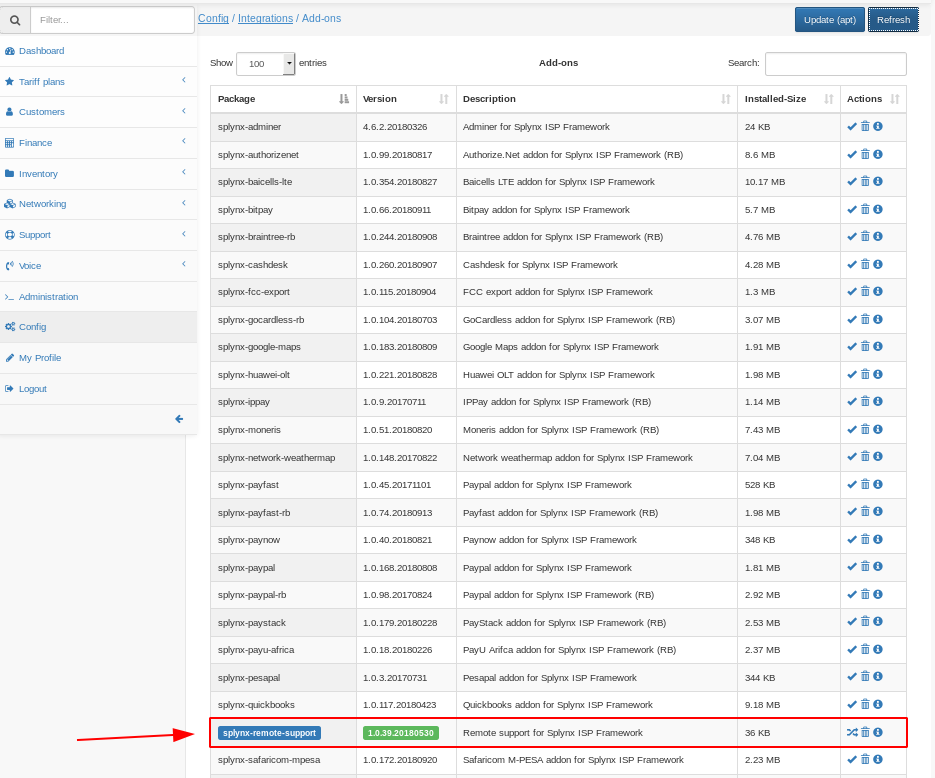

Splynx remote support
=====================

This package is designed to simultaneously solve two issues:
1. Secure remote access for technical support.
This simplifies the service when you contact us with questions.
2. Сreating backup copies in the cloud, which can be very useful in case of loss or damage to local data.


During the installation of the add-on, the user "splynx-remote-support" will be added to the server as a UNIX user and as an administrator of Splynx.
For this user, two-factor authentication is enabled, and the password is changed regularly, in order to avoid password brute-force attacks.

In order to avoid the transfer of your data over the Internet, the package uses OpenVPN to create a private encrypted tunnel between your server and our cloud.

The advantage of this approach is that you do not need to share the server, you can limit SSH or web access at your discretion. For maintenance, it's enough to allow traffic within our tunnel.


## Installation can be performed in 2 methods:


### Web-based installation

Navigate to `Config -> Add-ons`


Locate or search for the "splynx-remote-support" add-on and click on the *install* button <icon class="image-icon"></icon> in the *Actions* column  



Click on the "OK, confirm" button to begin the installation process



Wait for confirmation that the addon was correctly installed

Check that the addon is installed in `Config -> Add-ons`




### Installation using the command line

To install the addon via CLI, run the followong command:
```
apt-get update && apt-get -y install splynx-remote-support
```

After installation process has completed, you can test the tunnel using the ping command:

```
op@splynx22:~$ ping 172.29.64.1                                                                          
PING 172.29.64.1 (172.29.64.1) 56(84) bytes of data.                                                     
64 bytes from 172.29.64.1: icmp_seq=1 ttl=64 time=49.0 ms                                                
64 bytes from 172.29.64.1: icmp_seq=2 ttl=64 time=49.2 ms                                                
^C                                             
```

---
> ***Please do not remove these users, and do not close the SSH and WEB TCP ports in the firewall of the OpenVPN interface.***
