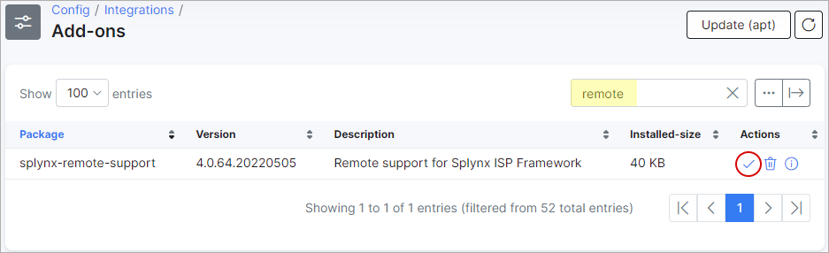

Splynx remote support
=====================

This package is designed to simultaneously solve two issues:
1. Secure remote access for technical support.
This simplifies the service when you contact us with questions.
2. Сreating backup copies in the cloud, which can be very useful in case of loss or damage to local data.


During the installation of packet, the user splynx-remote-support will be added to the server as a unix user and as a administrator of splynx.
For this user, two-factor authentication is enabled, and the password is regularly changed, in order to exclude password bruteforce.

In order not to transfer your data over the Internet, the package uses openvpn to create a private encrypted tunnel between your server and our cloud.

The advantage of this approach is that you do not need to share the server, you can limit ssh or web access at your discretion. For maintenance, it's enough to allow traffic inside our tunnel.


## Installation can be performed in 2 ways:


### Web-based installation

Open `Config -> Add-ons`


Click the install button  for  splynx-remote-support



Confirm the installation process


Wait for confirmation that the addon was correctly installed


Check


### Installation using the command line

To install, run
```
apt-get update && apt-get -y install splynx-remote-support
```

After installation, you can test the tunnel using the ping command:

```
op@splynx22:~$ ping 172.29.64.1                                                                          
PING 172.29.64.1 (172.29.64.1) 56(84) bytes of data.                                                     
64 bytes from 172.29.64.1: icmp_seq=1 ttl=64 time=49.0 ms                                                
64 bytes from 172.29.64.1: icmp_seq=2 ttl=64 time=49.2 ms                                                
^C                                             
```

---
> ***Please don't remove these users, and don't close SSH and WEB TCP ports in firewall on OpenVPN interface.***
