Ticket feedback add-on
================================

<icon class="image-icon"></icon> To start using the Ticket feedback add-on, you need first to configure [the sending of emails](configuration/main_configuration/email_config/email_config.md) from Splynx.

Navigate to *Config → Integrations → Add-ons*, search for **splynx-ticket-feedback** and click the install button:

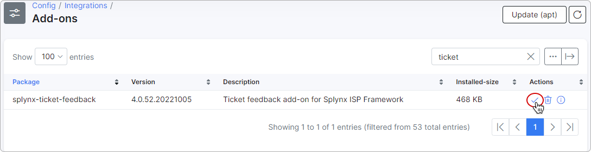

After the add-on installation, create a new template in *Config → System → Templates* under the type ***Ticket Automation***:

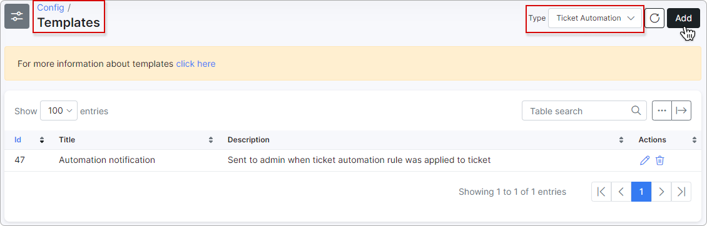

Insert the following code in the *Code* field:

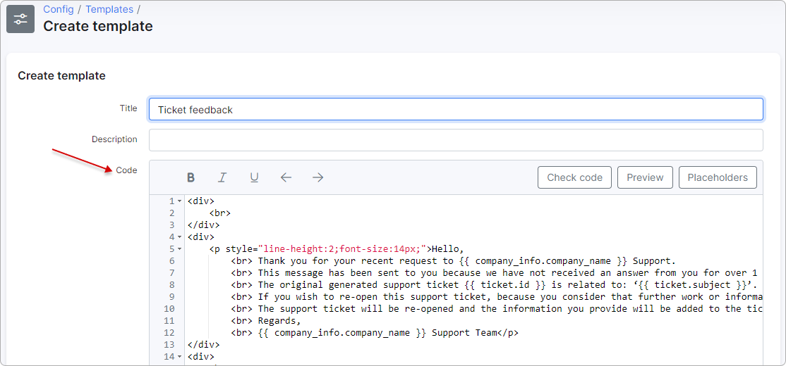

```html
<div>
    <br>
</div>
<div>
    <p style="line-height:2;font-size:14px;">Hello,
        <br> Thank you for your recent request to {{ company_info.company_name }} Support.
        <br> This message has been sent to you because we have not received an answer from you for over 1 week.
        <br> The original generated support ticket {{ ticket.id }} is related to: ‘{{ ticket.subject }}’.
        <br> If you wish to re-open this support ticket, because you consider that further work or information is needed, or for any reason, please reply to this email.
        <br> The support ticket will be re-opened and the information you provide will be added to the ticket.
        <br> Regards,
        <br> {{ company_info.company_name }} Support Team</p>
</div>
<div>
    <br>
</div>
<table style="width:100%;">
    <tbody>
        <tr style="height:45px;">
            <td colspan="2" style="text-align:center;">Also we would love to hear your feedback! Are you satisfied with our work?</td>
        </tr>
        <tr style="height:45px;">
            <td style="width:50%;text-align:right;"><a class="btn btn-primary" href="https://my.splynx.com/ticket-feedback?ticketId={{ ticket.id }}&customerId={{ ticket.customer_id }}&rate=0" rel="noreferrer noopener" style="display: inline-block;border-radius: 4px;font-weight: 400;line-height: 1.6;text-align: center;text-decoration: none;vertical-align: middle;cursor: pointer;padding: 4px 12px;font-size: 14px;color: #fff;background-color: #357bf2;border-color: #357bf2;margin-right: 10px;" target="_blank">Not Satisfied</a></td>
            <td style="width:50%;text-align:left;"><a class="btn btn-primary" href="https://my.splynx.com/ticket-feedback?ticketId={{ ticket.id }}&customerId={{ ticket.customer_id }}&rate=1" rel="noreferrer noopener" style="display: inline-block;font-weight: 400;line-height: 1.6;text-align: center;text-decoration: none;vertical-align: middle;cursor: pointer;padding: 4px 12px;font-size: 14px;border-radius: 4px;color: #fff;background-color: #357bf2;border-color: #357bf2;margin-left: 10px;" target="_blank">Satisfied</a></td>
        </tr>
    </tbody>
</table>
```

Then you can edit this template according to your needs.
_______________________________________________________

Once this done, navigate to *Config → Helpdesk → Ticket Automation* and create a new rule with the following parameters:

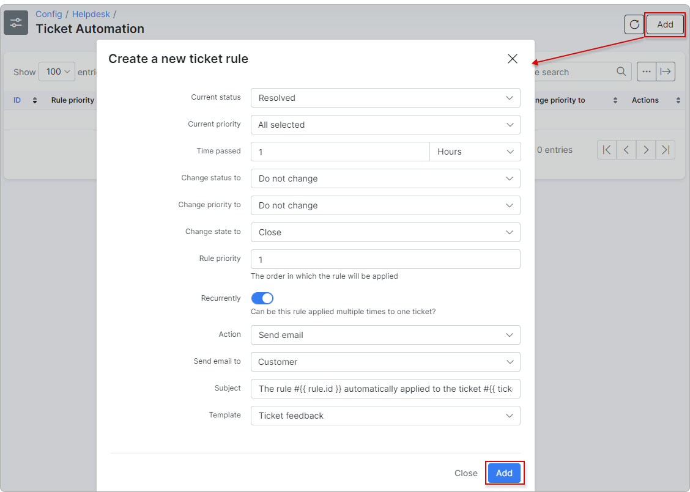


After this step, all tickets with the *Resolved* status will be closed in 1 hour (being in the resolved status for 1 hour), and the customer will receive a message to their email with the survey buttons:

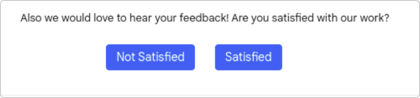

The customer can leave an extended comment about this ticket after clicking on some button.

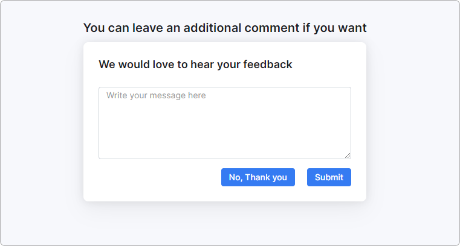

Then, you will receive a new ticket message with the reaction and a comment in the closed ticket:

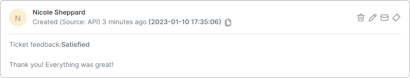

Finally, you can check the customer's feedback under *Administration → Reports → Ticket reports*:

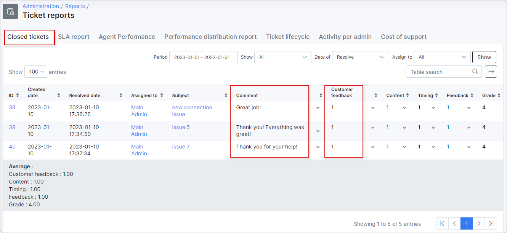

Where under the **Customer feedback** column:

1 - satisfied;

0 - not satisfied.

You can create a new canned response under *Config → Helpdesk → Canned responses* with the feedback buttons.

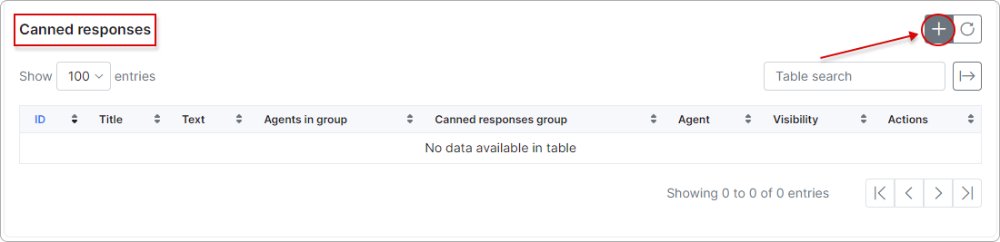

Add the relevant title, click on `Add feedback buttons` - the template will be inserted automatically. Then click the `Add` button.

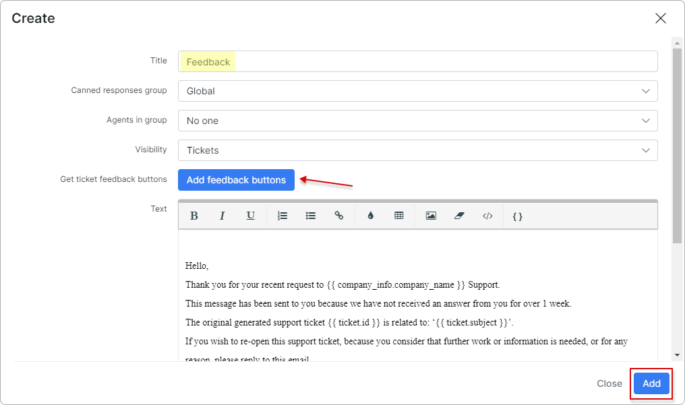

The new canned response will appear in the *Canned responses* list:

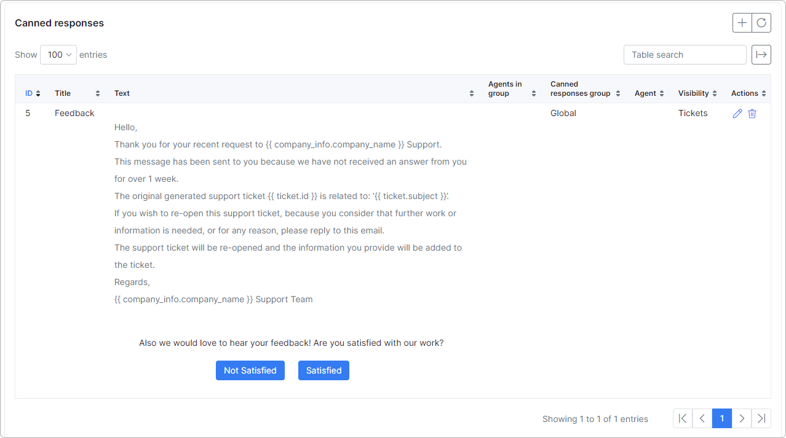

Now you can use this canned response when replying to tickets:

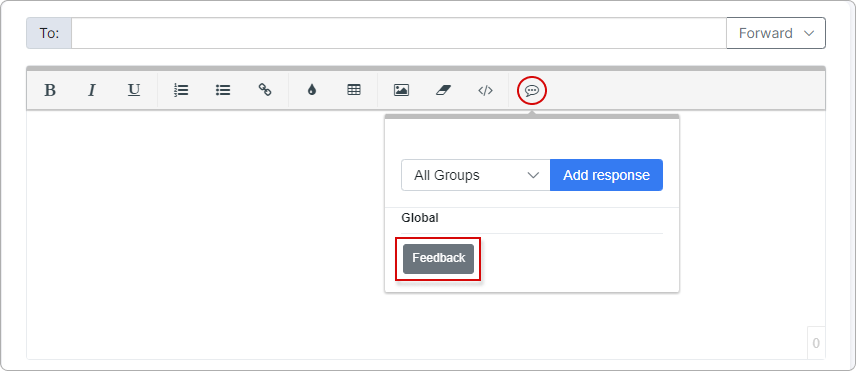