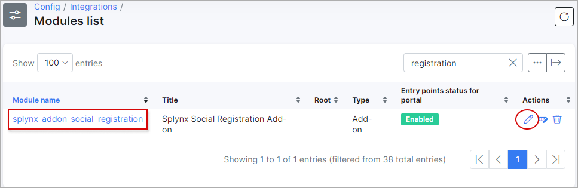
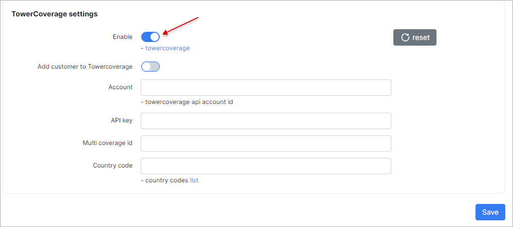

TowerCoverage Integration
=========================

Splynx has ability to use [Towercoverage](https://www.towercoverage.com/) to help you understand where your existing and potential clients are located. Towercoverage integration is a part of the [Self Registration add-on](addons_modules/self_registration/self_registration.md). That is why it is necessary to install the Self Registration add-on first.

After installing the self_registration addon, open the add-on settings by navigating to _Config / Integrations / Modules list_, locate the self_registration addon and click on the edit icon in the *Actions* column

Enable Towercoverage:

**Add customer to Towercoverage** - when a customer registers via Self Registration, their coordinates will appear in the Towercoverage portal.

It is necessary to have Towercoverage account. You can register for an account on the following page - [https://www.towercoverage.com/En-US/Home/Register](https://www.towercoverage.com/En-US/Home/Register)

Copy your Towercoverage **Account Id** and **Account key** into Splynx.

Then create a Multi-coverage map (aka Multimap), open it and copy it's ID onto Splynx. You can find ID of the Multimap in your browser. It will be the last part of the URL.

Finally, enter the country code (where you create Multimap), and save the settings. You can see the list of country codes on the following page - [http://wiki.towercoverage.com/wiki/79/api-country-codes](http://wiki.towercoverage.com/wiki/79/api-country-codes)

* * *

### Registration

When a customer registers their account and the Towercoverage integration is enabled, the **Street** and **City** fields become required/mandatory fields to complete.

**Street** and **City** values entered by the customer will be transferred to Towercoverage. Towercoverage will try to translate the **Street** and **City** values to geographical coordinates and if it is possible - the customer will be added to the Towercoverage portal.
