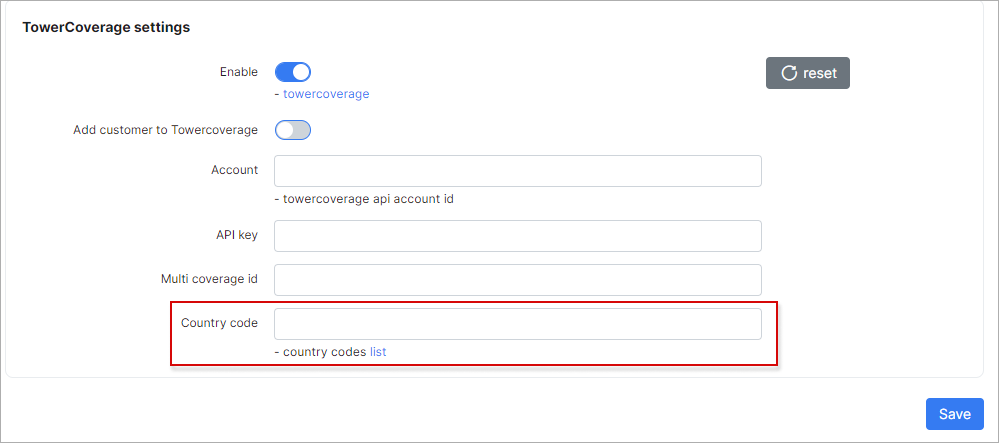

TowerCoverage Integration
=========================

Splynx has ability to use [Towercoverage](https://www.towercoverage.com/) to help you understand where your existing and potential clients are located. Towercoverage integration is a part of the [Self Registration add-on](addons_modules/self_registration/self_registration.md). That's why you have to install Self Registration add-on first.

After installation open add-on settings - _Config / Integrations / Modules list_

Enable Towercoverage:

**Add customer to Towercoverage** - when the customer registers via Self Registration, his coordinates will appear in the Towercoverage portal.

It is necessary to have Towercoverage account. You can register it here - [https://www.towercoverage.com/En-US/Home/Register](https://www.towercoverage.com/En-US/Home/Register)

Copy Towercoverage **Account Id** and **Account key** to Splynx.

Then, create Multi-coverage map (aka Multimap), open it and copy it's ID to Splynx. You can find ID of the Mutimap in your browser. It will be the last part of the URL.

Finally, enter the country code (where you create Multimap), and save the settings. You can see the list of country codes here - [http://wiki.towercoverage.com/wiki/79/api-country-codes](http://wiki.towercoverage.com/wiki/79/api-country-codes)

* * *

### Registration

When customer registers his account and Towercoverage integration is enabled, then **Street** and **City** fields are required to fill.

**Street** and **City** values entered by the customer will be transferred to Towercoverage. Towercoverage will try to translate **Street** and **City** to geographical coordinates and if it is possible - customer will be added to the Towercoverage portal.