Whalebone
=============================

[Whalebone](https://www.whalebone.io/) is a service for security filtering of DNS traffic and based on the implementation of [Knot Resolver](https://www.knot-resolver.cz/) features. Whalebone is used to monitor DNS activity to indicate that a security issue may occur elsewhere in your network. This secure DNS solution provides: content filtering, malware, phishing, outgoing SPAM or DoS campaigns blocking, blacklisting of IPs and many more options. As a result it makes your network secure, fast, and reliable.

To allow you to make use of all advantages of Whalebone, our developers have integrated Whalebone service into Splynx via API.

In this guide, we are going to learn how to install the *Whalebone* add-on in Splynx, make the basic configuration of *Whalebone* as a local DNS resolver and how to check the statistic of visited websites in the measured period.

### Installation of Whalebone as local DNS resolver

Whalebone can be deployed in several [scenarios](https://docs.whalebone.io/en/latest/deployment.html), but in our example we will use it as a full-fledged **local DNS resolver** in the following network topology:

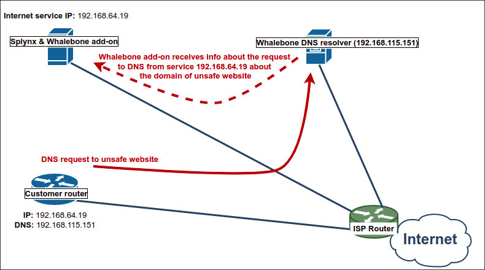

The **main advantage of such scheme is visibility of local IP addresses that send the actual DNS requests**.

Whalebone supports the latest versions of the most popular Linux server distributions, e.g. Ubuntu. The **minimum hardware requirements** are 2 CPU cores, 4 GB RAM, and a 40 GB HDD. Such machine can handle up to 20 000 users.

The **network setup requirements** you can find [here](https://docs.whalebone.io/en/latest/local_resolver.html#local-resolver-system-requirements).

Once your virtual or physical server is ready and you bought the Whalebone license, go to the Whalebone Portal - https://latest.whalebone.io (resolver is managed using cloud platform only), on the menu bar click on **Resolvers** and press the button **Create new**.

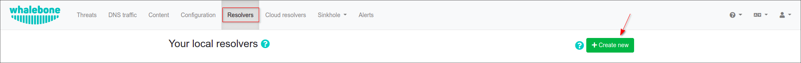

Type a name for your new resolver.

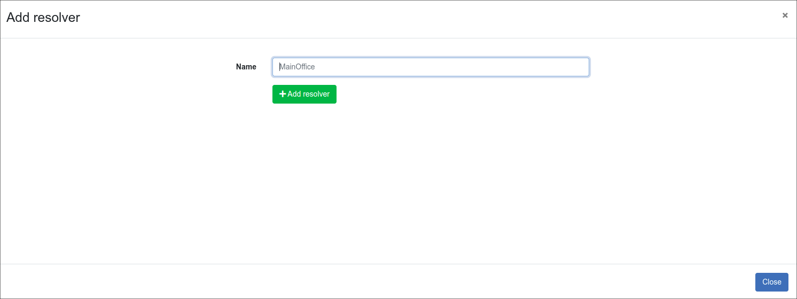

Once you’ve entered the name, click **Add resolver** button, after clicking the button an informative window will pop up with one-line command for the installation.

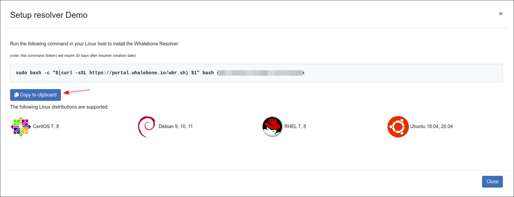

Copy the command and run it on your server dedicated for the local resolver. The command will run the installation script and will pass the one time token used for the resolver activation (the same command can not be used repeatedly).

If the script installation is successful, the notification `Final tuning of the OS - [OK]` will be displayed. Also, the script creates a detailed log - `wb_install.log` in current directory.

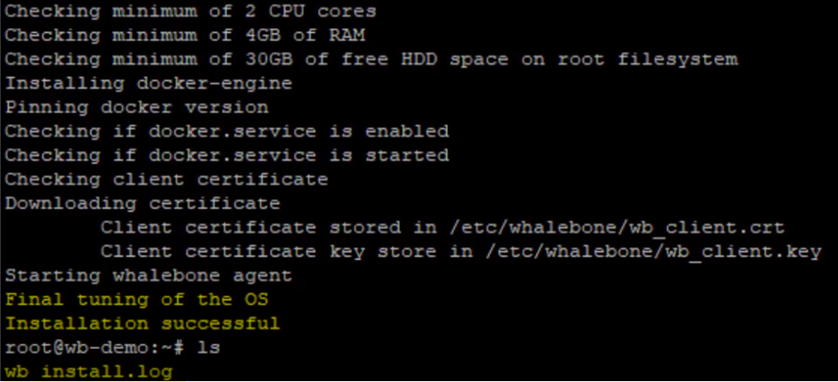

<icon class="image-icon"></icon> **IMPORTANT:** Make sure you limit the access to the local resolver on port 53 (UDP and TCP) from the trusted networks only, otherwise it can be misused for various DoS attacks. Also, double check if traffic is allowed on localhost as well, e.g. `iptables -A INPUT -s 127.0.0.1 -j ACCEPT`.

As soon as the resolver becomes **Active**, you can route the traffic to it and start protecting your network.

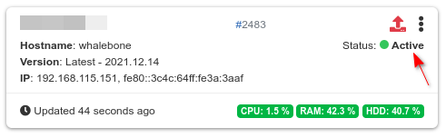


###  Whalebone Basic Configuration

The first component that need to be configured is **Security Policies**. Navigate to the [Whalebone Portal](https://latest.whalebone.io), then `Configuration → Security Policies`

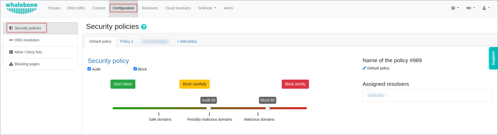

In the Security policies tab you can customize security functions, such as **Audit and Block score**, your **Allow and Deny lists**, choose the **Regulatory restrictions** depending on the country, use the **Content filtering**.

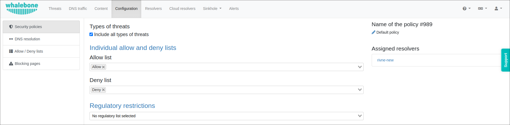

For example, you can lower the blocking threshold or disable Blocking completely, leaving only Audit mode. In this mode, Whalebone monitors incidents without preventing them.

The audit and blocking configuration is based on the so-called `score`, which is assigned to individual domains by the Whalebone algorithm. The higher the score, the more dangerous the domain is. You can select one of the preset sensitivity levels or adjust the threshold manually.

<icon class="image-icon"></icon> **NOTE:** The lower the threshold, the more sensitive the blocking. Keep in mind, though, that setting a low threshold increases the risk of false positives.

You can also choose different types of threats to be blocked.

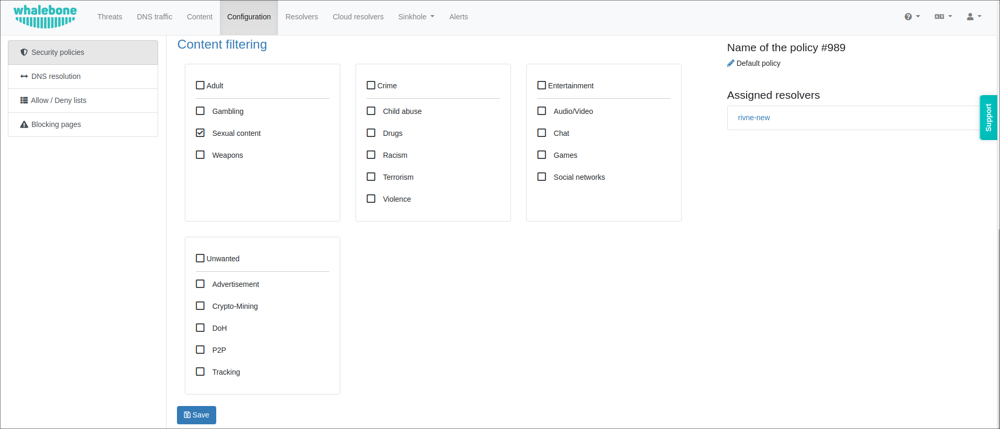

If needed, you can easily create your own blocking lists or define domains that should always be accessible.

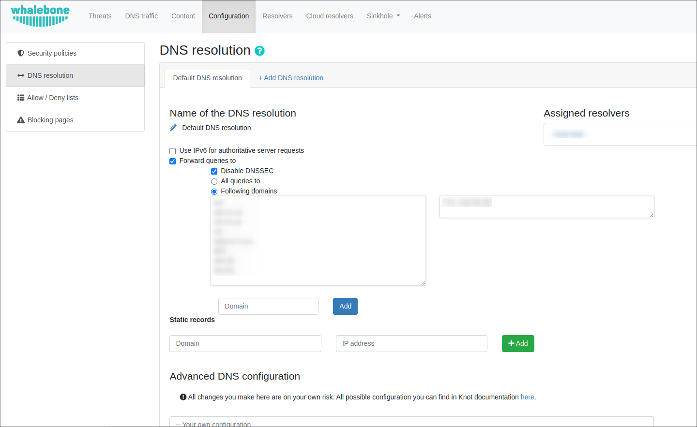

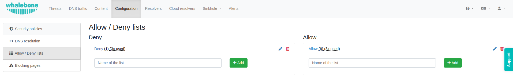

After the configuration of policy is completed, navigate to the resolver config page and assign your policy to it, the different IP addresses and ranges can be applied.

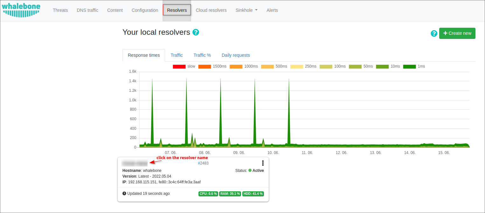

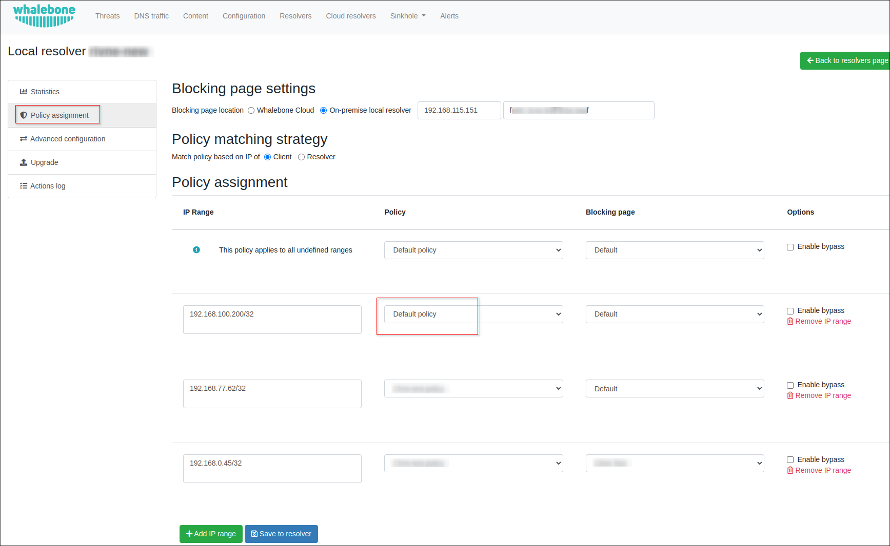

<iframe width="350" height="270" src="https://www.youtube.com/embed/sUqVXKaPuIc" title="YouTube video player" frameborder="0" allow="accelerometer; autoplay; clipboard-write; encrypted-media; gyroscope; picture-in-picture" allowfullscreen></iframe>

---

To customize the **Blocking page**, which appears when customer tries to visit a dangerous site in their browser, navigate to `Configuration → Blocking pages`. You can change the default one or create a new page:

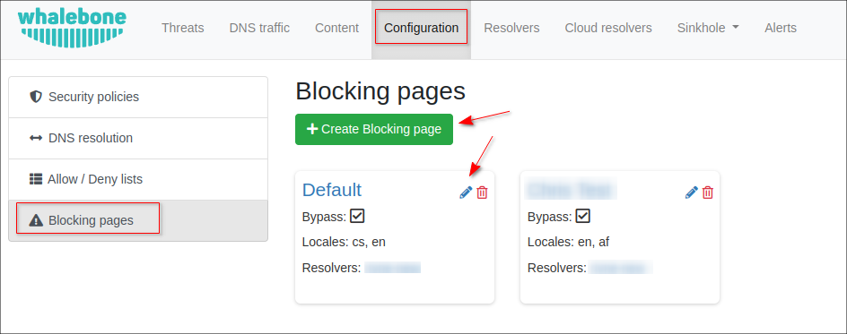

You can define the page name, the domain and the language of the page. Afterward, fill in all the necessary data including the name of the company, its logo and contact information.

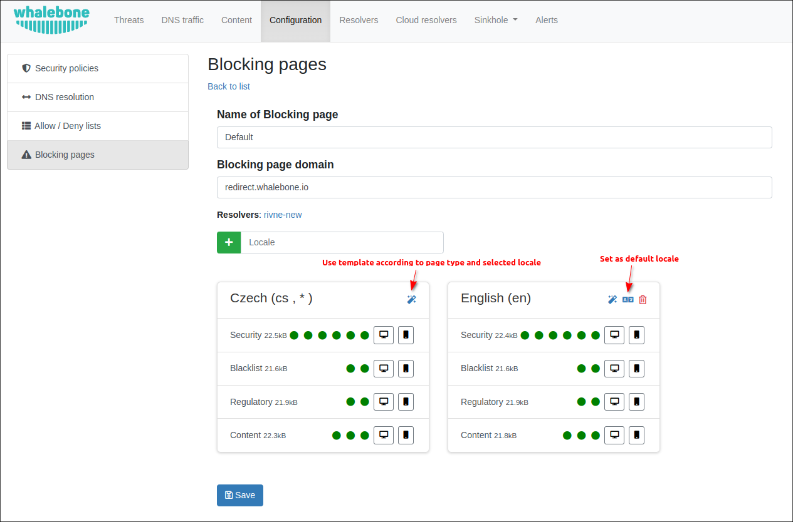

In order to change the information use the magic stick or edit directly in the HTML code. You can modify the design as well as the content of the blocking page as you choose. All you need to do is to preserve the necessary variables shown over the blocking field.

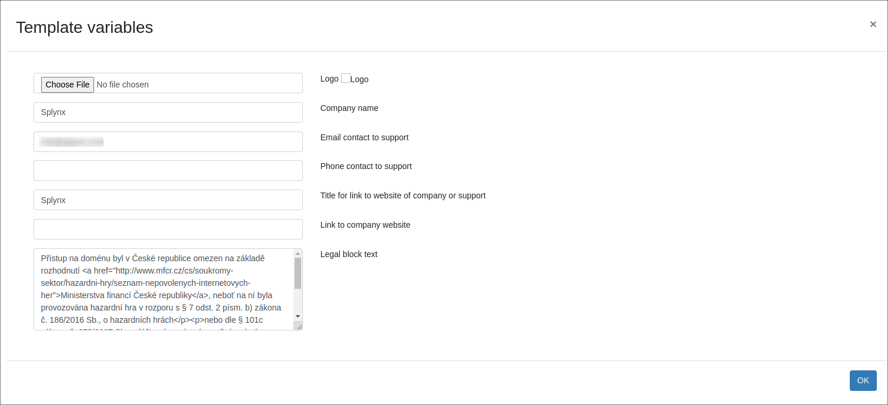

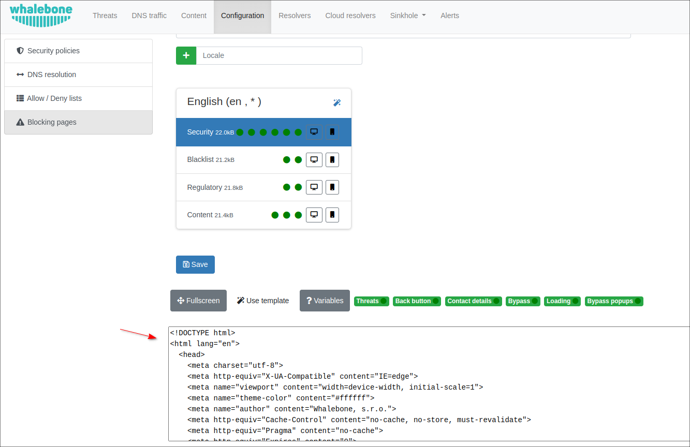

<details style="font-size: 15px; margin-bottom: 5px;">
<summary><b>Variables</b></summary>
<div markdown="1">

**Variables available in Blocking page templates for inserting dynamic content provided by Whalebone Resolver:**

- ```{$targetUrl}``` - Target URL of original request;

- ```{$threatTypes}``` - Detected threats;

- ```{$contentTypes}``` - Detected types of content.

**Usage example:**

`<p>You wanted to reach address {$targetUrl}</p>`

**Threat names:**

You can translate threat names by providing names in Javascript

```
<script>
window.__WB = {
    trans: {
        'MALWARE': 'Malware', 'C_AND_C': 'Botnets', 'PHISHING': 'Phishing', 'SPAM': 'Spamsites',
        'COMPROMISED': 'Compromised', 'COINMINER': 'Cryptomining'
    }
};
</script>
```

**Content categories**

You can translate content category names by providing them in Javascript

```
<script>
window.__WB = {
    trans: {
        'ADVERTISEMENT': 'Advertisement',
        'AUDIO_VIDEO': 'Audio/Video',
        'CHAT': 'Chat',
        'COINMINER': 'Cryptomining',
        'DRUGS': 'Drugs',
        'GAMBLING': 'Gambling',
        'GAMES': 'Games',
        'PORN': 'Sexual content',
        'RACISM': 'Racism',
        'SOCIAL_NETWORKS': 'Social networks',
        'TERRORISM': 'Terrorism',
        'TRACKING': 'Tracking',
        'VIOLENCE': 'Violence',
        'WEAPONS': 'Weapons',
    }
};
</script>
```

</div>
</details>
<br>


Once the configuration of blocking page is completed, navigate to **Resolvers**, click on your resolver item and go to **Policy assignment**, in drop down list choose the blocking page you would like to apply:


You can assign a particular Blocking page to a specific IP address or range. Also, you can use the **bypass** option which allows the customer to access the blocked domain (proceed anyway).

---

To set up the Whalebone **alerts** about your resolver's operations, click **Alerts**, then press the *Add* button and choose the necessary template


then, choose what type of information you want to get and specify the destination, e.g. Email, Slack, Syslog etc.

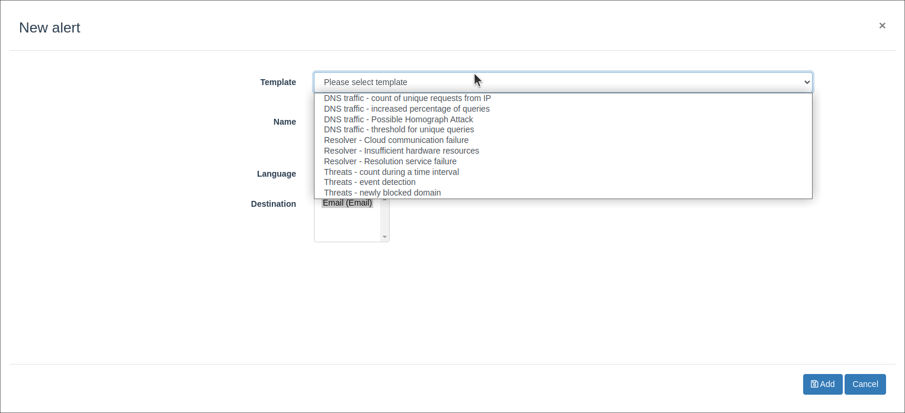

---

### Installing Whalebone add-on

The add-on can be installed in two methods, via the **CLI** or the **Web UI** of your Splynx server.

To install the **Whalebone** add-on via **CLI**, the following commands can be used:

```
apt-get update
apt-get install splynx-whalebone
```

To install it via the **Web UI**:

Navigate to `Config → Integrations → Add-ons`:


Locate or search for the `splynx-whalebone` add-on and click on the **Install** icon in the *Actions* column:


Click on the **OK, confirm** button to begin the installation process:

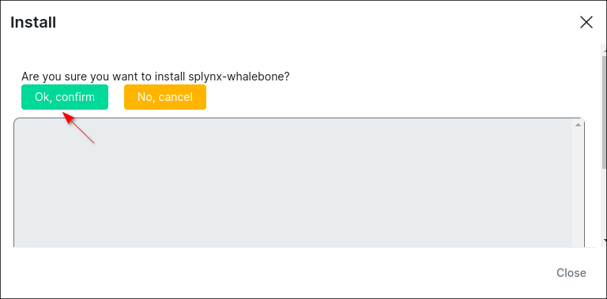


### Add-on settings

After the installation process has completed, you have to configure add-on, navigate to `Config → Integrations → Modules list`:

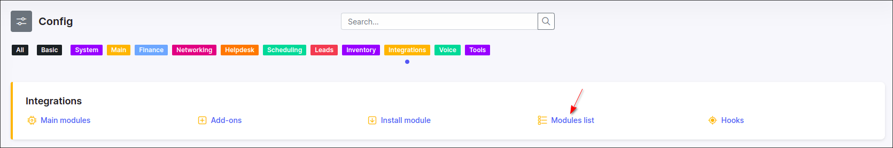

Locate or search for the `splynx_addon_whalebone` add-on and click on the
<icon class="image-icon"></icon> (**Edit**) icon in the *Actions* column:

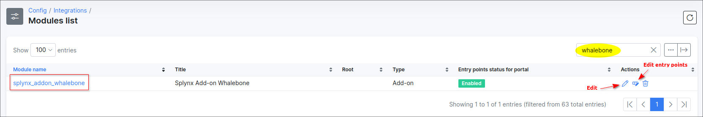

**Main information & API settings**

Make sure that **Entry points** option is **enabled**. Note that changes are not saved until you click **Save**.

The configuration of add-on **Entry points** can be found in `Config → Integrations → Modules list`, near the `splynx_addon_whalebone` module item in *Actions* column, click on the <icon class="image-icon"></icon> (*Edit entry points*) icon. More information about *Modules list* can be found [here](configuration/integrations/modules_list/modules_list.md).

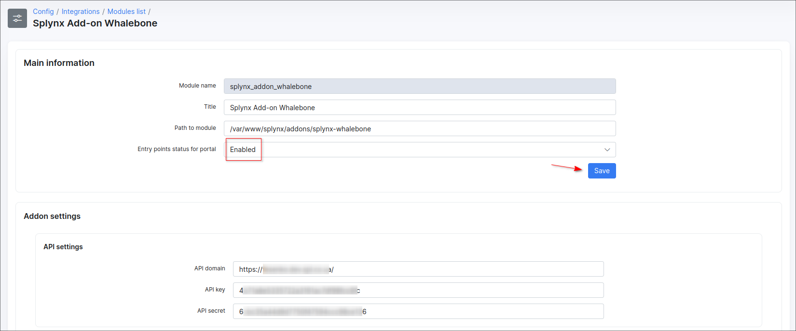

**Whalebone settings**

The API keys can be obtain from [Whalebone Portal](https://latest.whalebone.io).

Navigate to the User drop-down menu and click **API keys** and press the **Create new key** button:


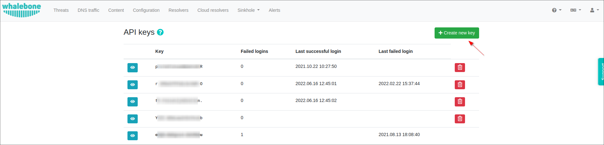

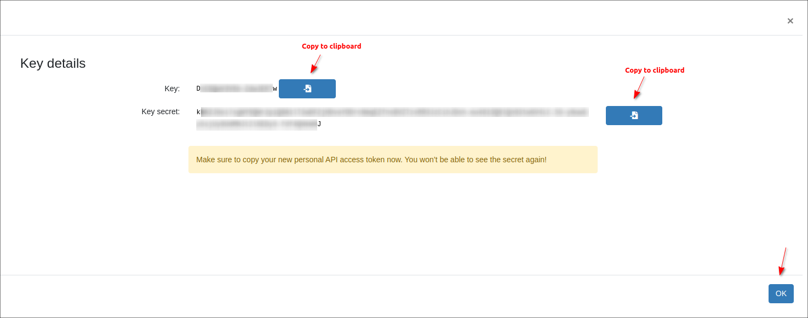

Copy the generated values (`Key` and `Key Secret`) and paste them into the appropriate fields on the Whalebone add-on configuration page in Splynx. The secret for the API key will never be displayed again, so make sure you really copied it.

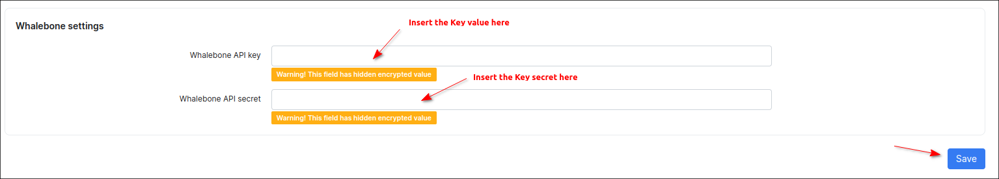

Make sure to save the settings.


### Splynx and Whalebone connection

The Whalebone statistic will be represented in Splynx in two places:

* the **general statistic** in `Networking → DNS threats`:

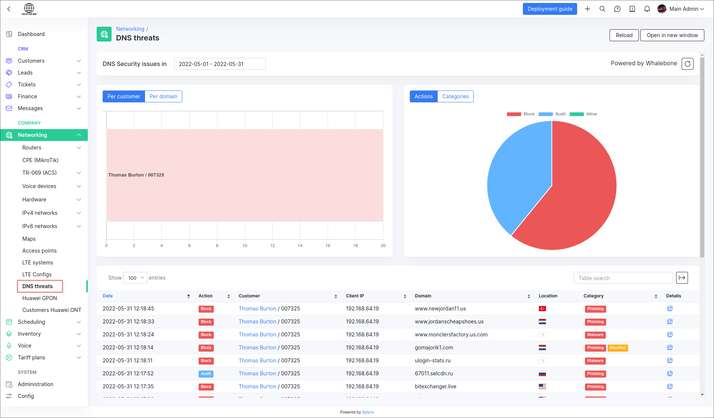

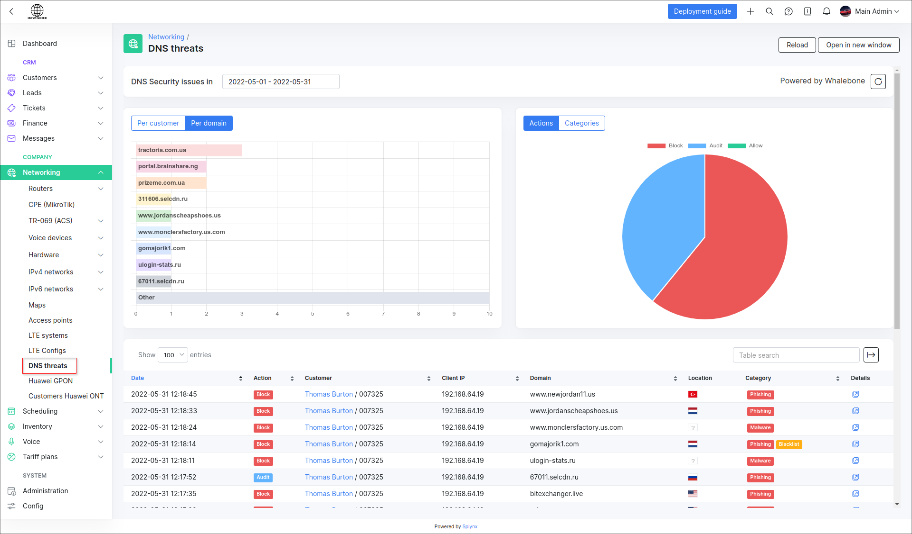

* the **statistic per customer and their service (-s) in each customer profile** under the `DNS security` tab:

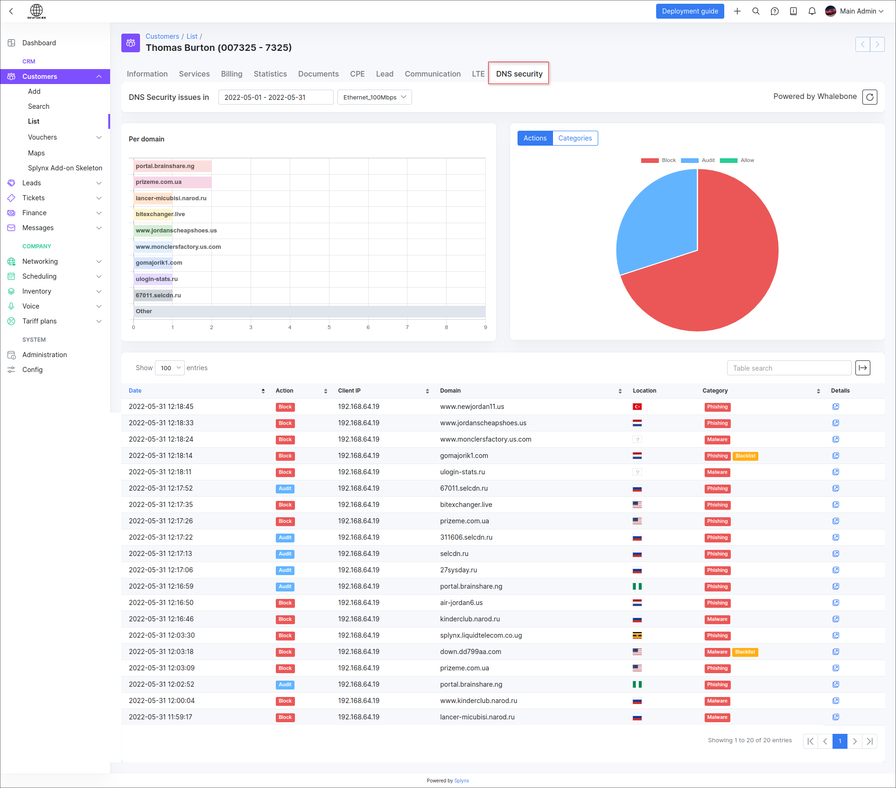

<icon class="image-icon"></icon> **NOTE:**

- To Splynx we will only get incident/security issues. In Whalebone it’s called `events`;

- For the add-on to be able to determine which service refers to a particular DNS query, the service must have a permanent IP from which the Whalebone DNS server will be used for queries, and the customer service must be online with such IP.

To **check the security filtering of your Whalebone resolver**, change the DNS settings on the customer's router, in our case the address should be changed to `192.168.115.151` and the customer should try to open the following domains:

- `http://malware.test.attacker.online`
- `http://c2server.test.attacker.online`
- `http://spam.test.attacker.online`

A blocking page like the following should appear:

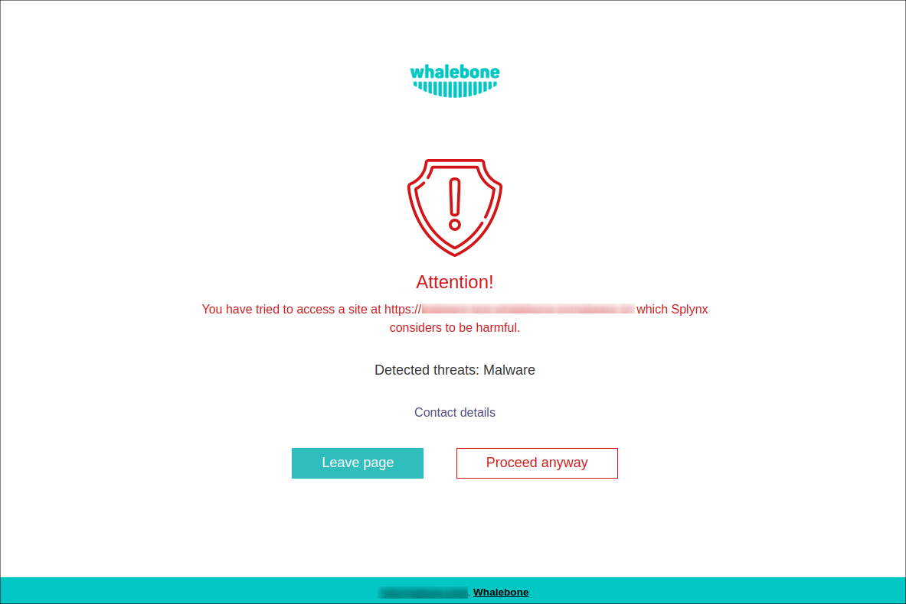
