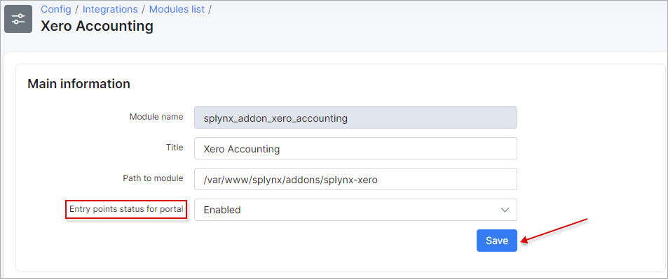
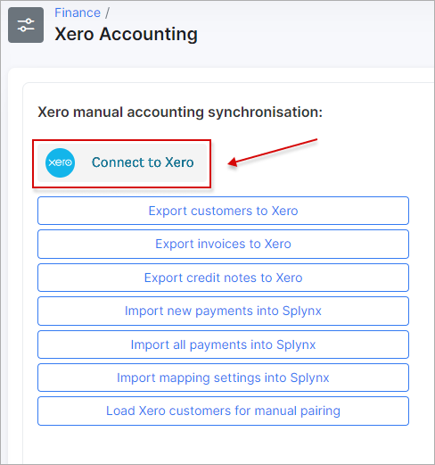
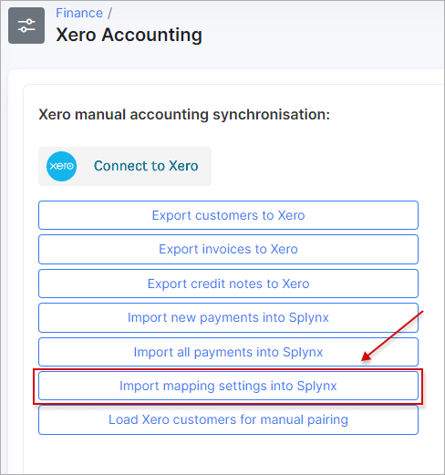
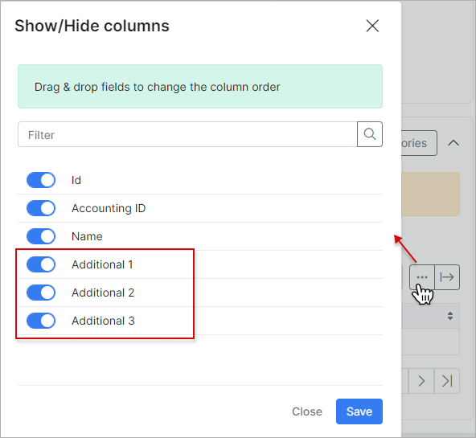
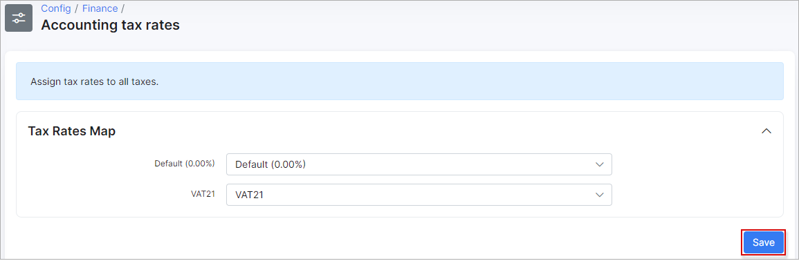
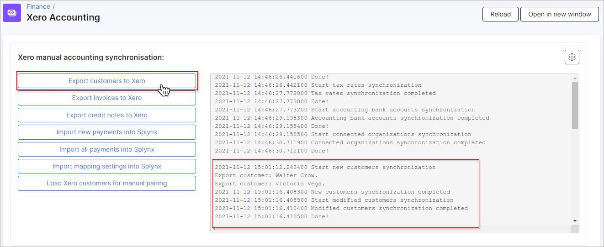
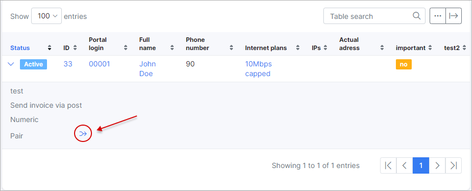
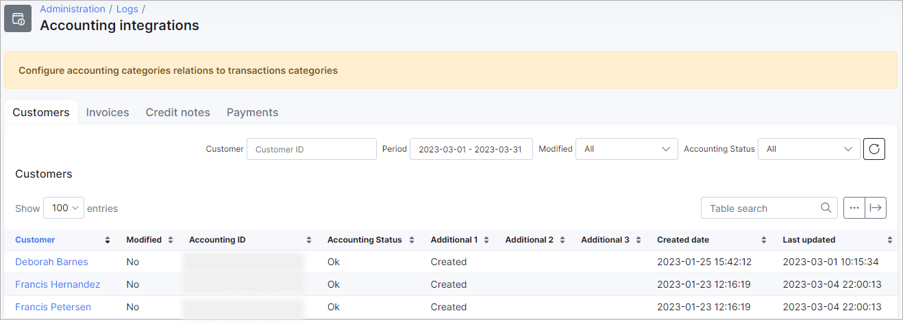
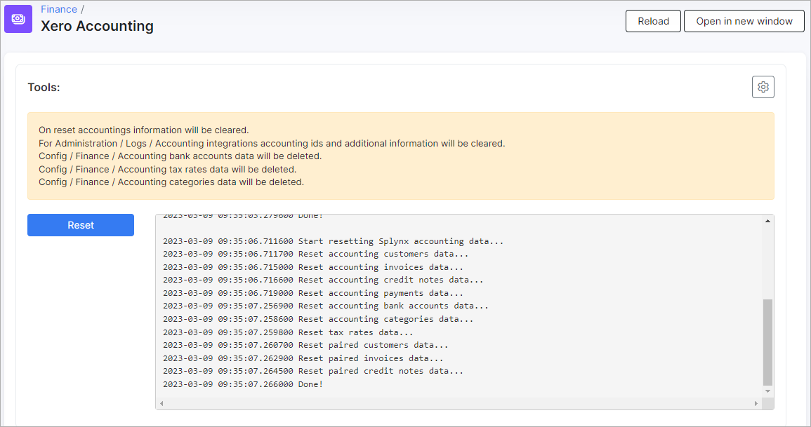

Xero accounting
=============================================

Splynx is able to sync customers, invoices and payments with Xero accounting software - https://www.xero.com

### Important:

**It's recommended do not configure the add-on on your own.**
**Please, contact our support team before starting the accounting integration.**

To install the Xero add-on, navigate to `Config → Integrations → Add-ons`:


In the list of available add-ons, click on the *Update (apt)* button, then locate or search for `splynx-xero`. Once located, click install button in the *Actions* column to begin the installation process:


To install the add-on via CLI, the following commands can be used:

```bash
apt-get update  
apt-get install splynx-xero
```

Once the installation has completed, navigate to `Config → Integrations → Modules list` and click on the edit button in the *Actions* column:


The general configuration of the Xero integration module can be viewed and edited here. First of all we need to enable **Entry points status for portal** and specify the **Splynx domain** in the `Accounting API settings` section:



**Note:** The **Splynx domain** must be the same as the **API domain URL** but without last slash `/`. **HTTPS is required!**


### Synchronization settings:

- **Payment method ID** - select the payment method for imported payments. Payments with selected method id will not be pushed to Xero;

- **Bank statements group** - group bank statements by "month" or "day";

- **Partners ignore list** - select the [partners](administration/main/partners/partners.md) of which will be ignored in sync process. Customers, invoices and payments of the partners selected here, **WILL NOT** be synced with Xero;

  **Note:** Only one partner should be synced - multiple partner sync is not supported in accounting integrations.

- **Payments synchronization direction** - define the direction of syncing payments: `Xero → Splynx`, `Splynx → Xero` or `Bidirectional`. If **Xero to Splynx** direction is selected - all payments which were created in Splynx will not be synced to Xero;

- **Payments push to Xero** - select the [payment methods](configuration/finance/payment_methods/payment_methods.md) to sync to Xero, this selection only applies if the selected method to sync payments is set to `Splynx → Xero`;

- **Import payments from date** - specify the date in 'Y-m-d'(2021-03-31) format, which will be used as the start date for importing all payments;

- **Import prepayments from date** - specify the date in 'Y-m-d'(2021-03-31) format, which will be used as the start date for importing all prepayments;

- **Import overpayments from date** - specify the date in 'Y-m-d'(2021-03-31) format, which will be used as the start date for importing all overpayments (if customer accidentally pays too much);

- **Prepayments Account code** - a unique code (limited to 10 characters) of prepayments items (the expenditures that have been paid for in advance) in Xero account (`Accounting menu → Advanced → Chart of Accounts`);

- **Rounding Account code** - a unique code (limited to 10 characters) of rounding item (an adjustment entry to allow for rounding) in Xero account (`Accounting menu → Advanced → Chart of Accounts`);

- **Create payments for prepayments** - a toggler allows to enable creating payment for prepayment (a payment made in advance) in Splynx or, in disabled status - add such payment to the bank statements only. Used on payments import;

- **Create payments for overpayments** - a toggler allows to enable creating payment for overpayment in Splynx or, in disabled status - add such payment to the bank statements only. Used on payments import;

- **Create payment without invoice** - a toggler allows to enable/disable creating payment in Splynx when customer doesn't have invoice. Used on payments import. **Attention:** in some cases can lead to duplicate payments;

- **Ignore expense payments on import** - a toggler allows to enable/disable ignoring 'Spend money' (a payment that doesn't relate to a bill, expense claim, or refund) in Xero payments during payments import. If option is enabled, 'Spend money' payments will not be added to bank statements;

- **Customer name pattern** - used as Xero customer 'Contact Name'. The following variables can be used: `{id}`, `{login}`, `{name}`, `{email}`.

- **Decimal Places** - by default Xero is rounding prices to `2` decimal places. `4` decimal places can be used instead.

### Cron settings

These are the global settings to automatically sync items between the two platforms, in any selected direction of syncing.

- **Customers** - enables/disables automatic syncing of customers;
- **Invoices** - enables/disables automatic syncing of invoices;
- **Payments** - enables/disables automatic syncing of payments.

If any of the above items are not enabled to sync automatically, we can manually sync items via the Web UI under `Config → Integrations → Splynx Xero Accounting`, with the export and import functions.

### Let's start with Xero


In the next step, we have to connect the Xero account with Splynx, to achieve this, click on the "Connect with Xero" button:



Or click on the <icon class="image-icon"></icon> icon on the right side of the window


After linking your Xero account with Splynx you will see a list of Xero organizations. Select the organization of which you will use with Splynx:


**Note:**: **all customers, invoices and payments will only be synced with the selected organization. If the organization must be changed in the Splynx Xero addon, you will have to reset all synced invoices, customers, and payments, and start from scratch.**

When the Xero account linking is completed, the first step is to import mapping settings (chart accounts in Xero, tax rates, and bank accounts) into Splynx. Click on the `Import mapping settings into Splynx` button to achieve this.



When this process completed, navigate to `Config → Finance`, you will see 3 new sections: **Accounting categories**, **Accounting bank accounts** and **Accounting taxes** - each of which will have to be configured.


Let's start with **Accounting categories**:


In `Categories map` section, ALL categories must be selected with the related item from `Accounting categories` table. Pay attention to the `Additional 2` field in `Accounting categories` table, each category should have an account code. To enable displaying of additional fields, click on the breadcrumbs (column selector) button at the bottom of the page and simply enable the fields to display:



**Note:** If the synced category has no account code - Xero will not be able to sync invoices for this category.

As soon as the relevant categories are configured, we can proceed with **bank accounts**:


We will follow the same procedure with bank accounts, each bank account should have an account code (`Additional 3` field here) and the default bank account should be selected.

The last accounting config to sync are **tax rates**:



Once `Accounting categories`, `Accounting bank accounts` and `Accounting tax rates` are configured, the Splynx Xero addon is ready to start syncing.

In our test environment, we have 2 customers and a few invoices for each customer, let's sync them to Xero:



Once the customer sync has completed, we can sync the invoices:

**NOTE:** The invoices without transactions or marked as **Deleted** in Splynx will not be synced to Xero.


As you can see from the image above, an invoice was skipped due to an incorrect tax rate (not matching with the tax rates that we synced from Xero).

On the Xero interface, we can see our synced customers and invoices:


Let's capture the payment related to the invoice "C0000006" for the customer "Andrew":


Now we can sync payments from `Xero → Splynx` by clicking on `Import new payments into Splynx`. On our test Xero account we had a lot of payments, so all of them were synced, but only payments which are matched to a corresponding customer will be created in Splynx.


Payments which we've synced from Xero can be viewed in `Finance → Bank statements → History`:


If some payments are skipped, or you need to view payments - navigate to the above mentioned section to view all payments.


As you can see from the image above, only 1 payment was processed (created). The statement record with an "Error", did not create a payment because all invoices with an amount of "2" were already paid in Splynx (we marked it as paid), but overdue in Xero. When there's a discrepancy in payments, we do not sync these payments.

Sometimes it's required to manually pair a statement record (create a payment in Splynx) to a customer because the integration logic has been built in directly to avoid any mistakes. But we recommend to check bank statements on a regular basis.
To do the manual pair, open `Finance → Bank statements → History`, choose Xero statemetns, then click on the <icon class="image-icon"></icon> icon related to the item that is need to be paired


and find the necessary customer, invoice or proforma invoice to pair with:



And the last, we can view the paid invoice as well as the payment under the customer's billing tab:


### Xero logs

Sync logs can be found under `Administration → Logs → Accounting integrations`:


If a customer/invoice/payment has an `Accounting ID`, this indicates that it was synced, if not - it was not synced.



The same for invoices and payments, if `Accounting ID` is present - it was synced:

`Invoice ID` corresponds with Splynx invoice ID's.


`Payment ID` corresponds with payment ID's in Splynx.


### Xero tweaks


In this menu, there are a few more settings and tools related to the Xero add-on:

- **Connect with Xero** - if the Splynx-Xero addon was disconnected from the Xero account, you have to reconnect here;

- **Refresh OAuth token** - setting to refresh the OAuth token;

- **Edit connection** - used for editing the connection with Xero, when the credentials were changed in Xero;

- **Manual Synchronization** - used to open `Config → Integrations → Splynx Xero Accounting` when you are located in other menu window;

- **Customers manual pairing** - this function is used where there are existing customers in Splynx as well as Xero. There is a `Load Xero customers for manual pairing` button. This feature pulls the customer list from Xero into Splynx and allows the admin to manually pair the customers without having to create them in either platform again.


We only have 2 customers and they are paired, if the status is `Not paired` in the "status" field, you can find the required customer from Xero to pair with this customer;

- **Tools** - this menu is used for resetting the accounting database, all items that were selected previously in `Accounting categories`, `Accounting bank accounts` and `Accounting tax rates` will be erased. It is mainly used when the organization changes. Before changing the organization, the accounting database must be reset:


