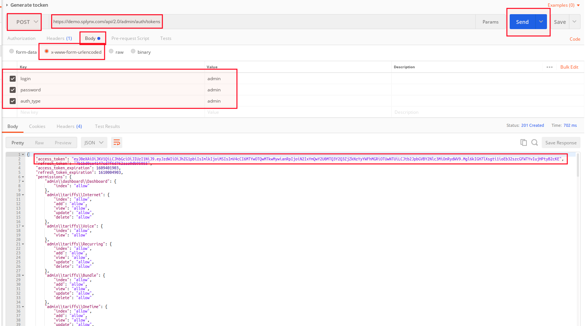

API Documentation
=============
Splynx system has its own Application Programming Interface (API) which allows software applications to communicate with each other via API calls. In order to simplify the workflow with Splynx API in testing and development you can use [Postman](https://www.postman.com/). *Postman* - is an open source tool and can be easily downloaded [here](https://www.postman.com/downloads/) according to your desired platform. After install the app and sign up for account you can start work on Postman startup screen.

To get started with the **Postman** app, please check this [documentation](https://learning.getpostman.com/).

Splynx supports the following type of authentication:

#### Access by token

* **Authentication as admin**

Generate the token for authorization and send GET request. Required fields: `login`, `password`. Please note that it's necessary to create an admin user account in Splynx and assign the role e.g. super administrator, it depends on what the access rights you need.




The request method (verb) determines the nature of action you intend to perform.

* **Authentication by API key**

Create a new request in Postman, specify its details such as method *GET*, request URL and keys.

Required fields: `auth_type`, `signature`, `nonce`, `key`.
Where `key` - is your API key, `nonce` -  a current timestamp in seconds.
Then, create pre-request script in Postman, for example:

```
var crypto = require('crypto-js');

const KEY = 'bfe72xxxxxxxxxxa123bdc8e78a7c82f'; // Your Api key
const SECRET = '7bxxxxxxxxxxc4332567c8afdfa18e65'; // Your Api secret

var nonce = pm.globals.get('nonce');
if (!nonce) {
    nonce = 0;
}

var str = ++nonce + KEY;
var hash = crypto.HmacSHA256(str, SECRET).toString().toUpperCase();

console.log(hash,nonce);
pm.environment.set("hash", hash);
pm.environment.set("nonce", nonce);
pm.globals.set('nonce', nonce);

```
Then, use *POST* with *Content-type* to add new data and press *Send*. Check your *access token* in body section.


---

#### Basic authentication

Add API key with *Unsecure access* in `Administaration → API keys`;

Encode you secret phrase to *Base64*, for example on this [web site](https://codebeautify.org/base64-encode);

Copy the encoded text, insert it as a value for *Authorization* key in Postman and press Send. Check the result in *body* section.


---

#### Access by signature
(*Like in API v1*)

Create API key and its secret in `Administaration → API keys`;

Create pre-request script in Postman, for example:

```

var crypto = require('crypto-js');

const KEY = 'a7f0e9d5a438e920d107c5099f98f13b'; // Your Api key
const SECRET = 'd503b67764b4fef63298b4c4453c6337'; // Your Api secret

var nonce = pm.globals.get('nonce');
if (!nonce) {
    nonce = 0;
}

var str = ++nonce + KEY;
var hash = crypto.HmacSHA256(str, SECRET).toString().toUpperCase();
var authHeader = 'Splynx-EA (key=' + KEY + '&nonce=' + nonce + '&signature=' + hash + ')';

pm.environment.set("authorizationHeader", authHeader);
pm.globals.set('nonce', nonce);


```

Create autorizaton request with `{{authorizationHeader}}` value and press Send.


The output results indicate that tests were successful.

---

#### API search

**Example:**

```
<?php

$params = [
    'main_attributes' => [
        'login' => ['LIKE', 'durden'],
        'partner_id' => ['BETWEEN', 1, 10],
        'date_add' => date('Y-m-d'),
        'added_by' => 'api',
    ],
    'additional_attributes' => [
        'sex' => ['IN', ['male', 'female']],
    ],
    'order' => [
        'id' => 'DESC',
    ],
    'limit' => 10,
    'offset' => 20,
];

$apiUrl = 'admin/customers/customer' . '?' . http_build_query($params);
```

<details style="font-size: 15px; margin-bottom: 5px;">
<summary><b>All operators list</b></summary>
<div markdown="1">

- `=`
- `!=`
- `>=`
- `<=`
- `>`
- `<`
- `<>`
- `IS`
- `REGEXP`
- `BETWEEN`
- `LIKE`
- `IN'`
- `FIND_IN_SET`


</div>
</details>

<br>


---

#### Splynx PHP API template with examples

For the developers, it's recommended to check this [template](https://bitbucket.org/splynx/splynx-php-api/src/master/) (`splynx-php-api/src → SplynxApi.php` and the files in `splynx-php-api/examples`), it provides useful methods on **how to make queries to the Splynx API**.

If you have already installed the Splynx system, you can **find the same template on your server**, just navigate to `/var/www/splynx/addons/splynx-addon-base-2/vendor/splynx/splynx-php-api` location.

For more information about the Splynx API, see our wiki page: https://splynx.docs.apiary.io
