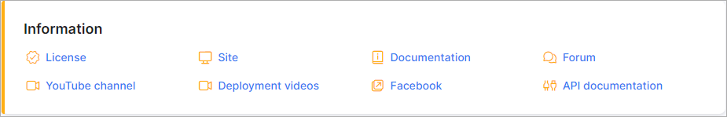

Information
=============

This sections provides information of your Splynx server and other useful pages to information relevant to operating and using the Splynx software.

Please follow the links below to each of the subcategories of the information section:

* [API documentation](administration/information/api_documentation/api_documentation.md)

* [Documentation](administration/information/documentation/documentation.md)

* [Facebook](administration/information/facebook/facebook.md)

* [Forum](administration/information/forum/forum.md)

* [License](administration/information/license/license.md)

* [Site](administration/information/site/site.md)

* [Video Tutorials](administration/information/video_tutorials/video_tutorials.md)
