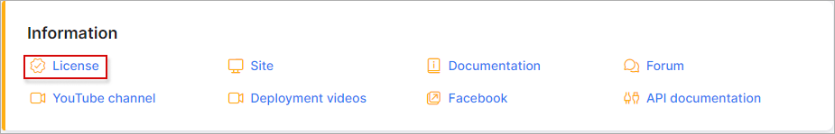

License
==============

This section provides some useful information on the license of your Splynx server.

Your Splynx server version can be found here and the status of your license with regards to its limitations.

**Product**:	This displays the name of the software being Splynx ISP Framework

**Version**:	This displays which version of Splynx your server is currently running on

**Compiled**:	This displays when the software version was compiled on the server

**Registered to**:	This displays the company the software license is registered to

**License limit**:	This displays the limitations to the number of customers of your license

**Licensed customer count**: This displays how much of your license count you have used up.

### Functions

1. **Reload license** - this button can be used to reload your Splynx license, typically after migrating, etc.
2. **Upgrade your license** - this button will redirect you to the Splynx subscription page where you can purchase additional licensing for your server:

3. **Check validity** - this button will redirect you to a Splynx subscription page where it will display the validity/expiry date of your license:

