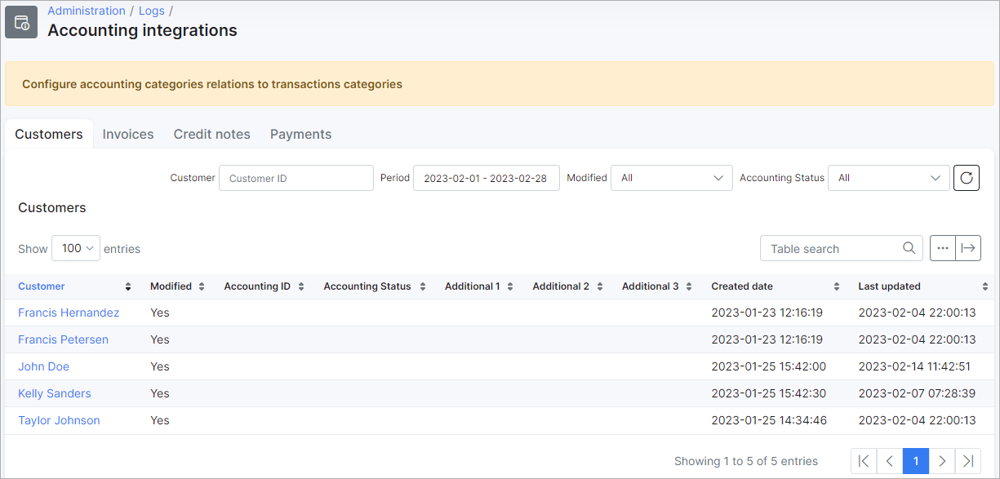

Accounting Integrations
=============

In this section we can view logs of finance elements that have been modified, added or deleted on the system.

In order for the system to properly categorize these elements it is necessary to configure the relations between accounting categories and transaction categories. This can be done in `Config / Finance / Accounting categories`

Each of the tabs in this section can be filtered to display data by the ID relevant to the tab(Customer, Invoice or Payment ID), a specific period, the modified status(All, Yes or No) or the accounting status of each of the elements(All, New, Pending, Error or OK).

Like all tables in Splynx, the table can be modified to display data of your choice with the breadcrumbs icon at the bottom of the table or exported in a format of choice with the export icon<icon class="image-icon"></icon>.
