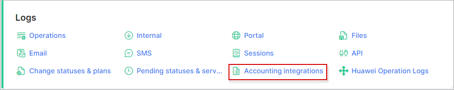
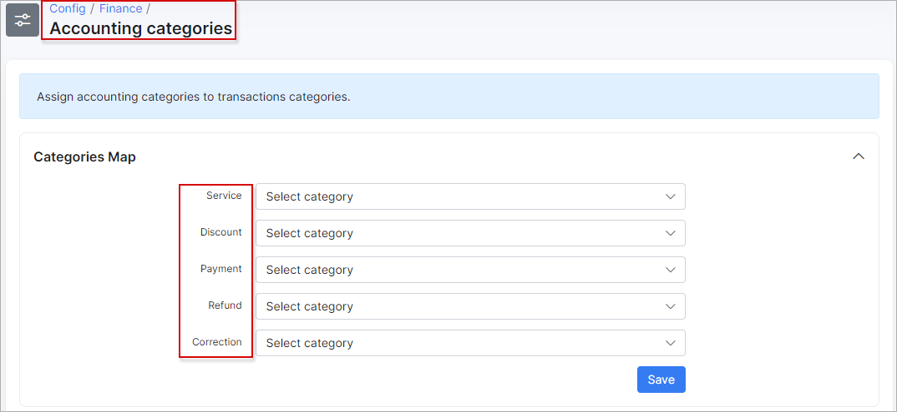
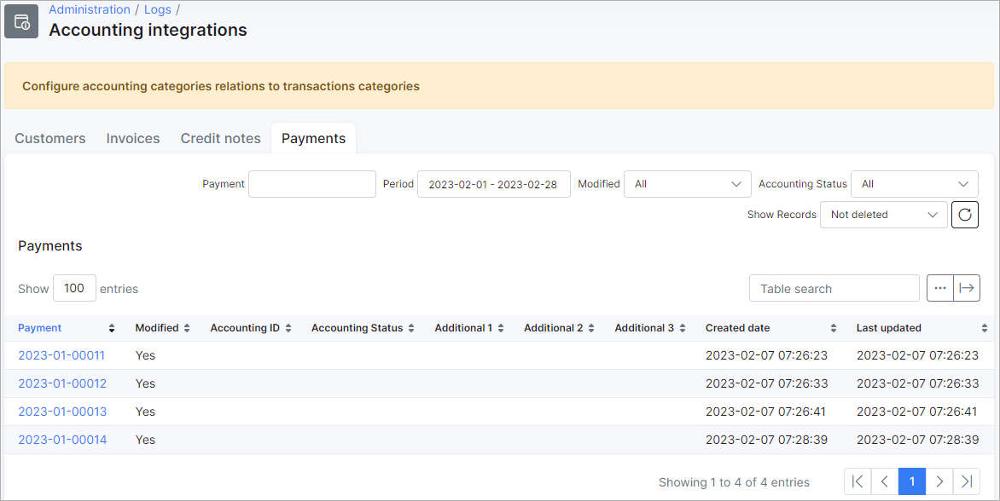

Accounting Integrations
=============

<icon class="image-icon"></icon> This section appears when one of the following add-ons is installed: [Xero](addons_modules/xero/xero.md), [SageOne](addons_modules/sageone/sageone.md) or [Quickbooks](addons_modules/quickbooks/quickbooks.md).

Here we can view logs of finance elements that have been modified, added or deleted on the system.

In order to properly categorize these elements by Splynx, it is necessary to configure the relations between *accounting categories* and *transaction categories*. This can be done in `Config → Finance → Accounting categories`.

Each of the tabs in this section displays the relevant data to the *Customers, Invoices, Credit notes and Payments* and can be filtered according to the customer's ID, period of time, modification status and accounting status.

Like all tables in Splynx, the table can be modified to display fields of your choice with the breadcrumbs <icon class="image-icon"></icon> icon at the top of the table or exported in a format of choice with the export <icon class="image-icon"></icon> icon.
