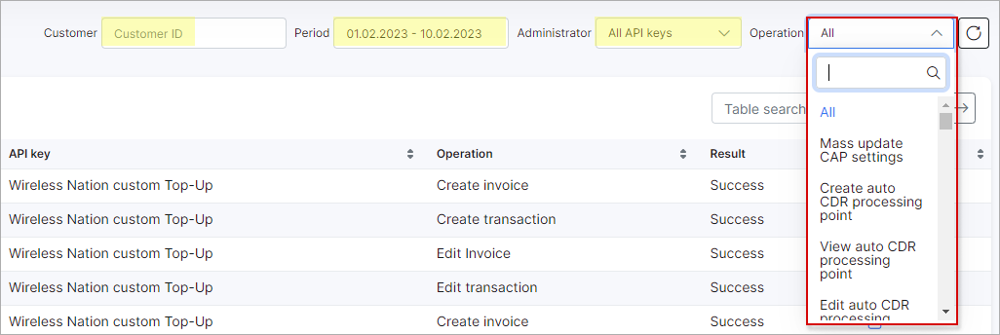

API logs
===

The API logs table displays a list of all important API requests of installed Splynx add-ons. The requests such as a creating, editing, listing values are logged here.

The table contains information about the date & time, api key, operation and the result of the operation for each log. Additionally, the Actions column with an option to view the details of the available logs is also included in the table.

There is a filter at the top-right corner of the table, which can be used to view API keys for a particular *Period of time, Add-on relation* and *Operation*.

API logs will only be generated if it has been enabled in the configuration of the add-on [API key](administration/main/api_keys/api_keys.md).

