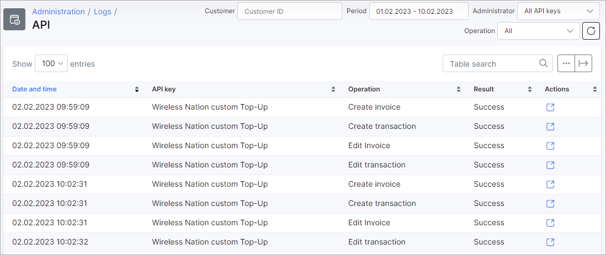

API
===

The API logs table displays a list of all important API requests for Addons. Requests like additions, editing and deletions is logged here.

The table contains information about the date & time, API Key, operation and the result of the operation for each log. additionally, an Actions column with an option to view the details of the available logs is also included in the table.

API logs will only be generated if it has been enabled in the configuration of the addon API key.

