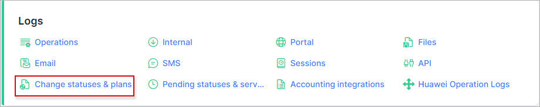

Changes of statuses & plans
=========================

The logs of *Changes of statuses & plans* displays information about all changes of customer account or service statuses (e.g. from new to active, from blocked to active, from active to blocked status etc.) for a particular period of time. Also, you are able to view the administrator's names who changed the status or plan.

It is possible to filter logs of changes of statuses & plans by a particular period of time, by a selected administrator or by customer id.

You can also open the customer profile by clicking on their ID in the Customer's column and view the *Tariff plan information* by clicking on it in the Plan's Column.

With the help of the export <icon class="image-icon"></icon> icon at the bottom left corner of the table you can print, copy the list of the information or save it in PDF or CSV file. By clicking on the breadcrumbs <icon class="image-icon"></icon> icon, you can choose columns to be displayed by enabling or disabling toggles or by dragging & dropping items to change the order of the information displayed.

