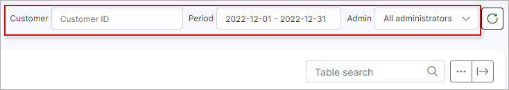

Changes of statuses & plans
=========================

The logs of Changes of statuses & plans displays information about all changes of statuses (for example, from new to active, from blocked to active, from active to blocked status etc.) for a particular period of time. You are also able to view the administrator's names who changed the status or plan.

It is possible to filter logs of changes of statuses & plans by a particular period of time or by a selected administrator.

You can also view the *Customer's Information* by clicking on their ID in the Customer's column and view the *Tariff plan information* by clicking on it in the Plan's Column.

With the help of the <icon class="image-icon"></icon> export icon at the bottom left of the table you can print, copy the list of the information or save it in PDF or CSV format. By clicking on the <icon class="image-icon"></icon> breadcrumbs icon you can choose columns to be displayed by enabling or disabling them and by dragging & dropping each, you can change the order of the information displayed.

