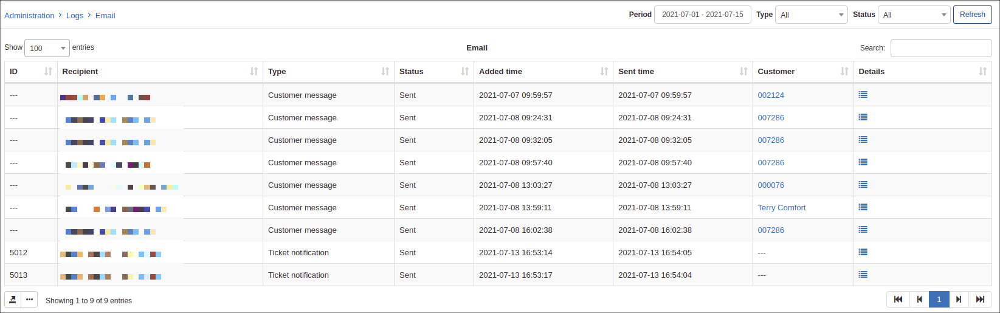
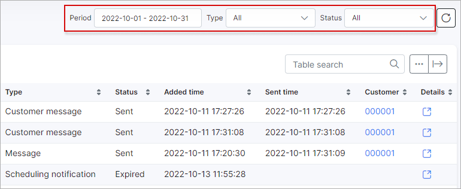
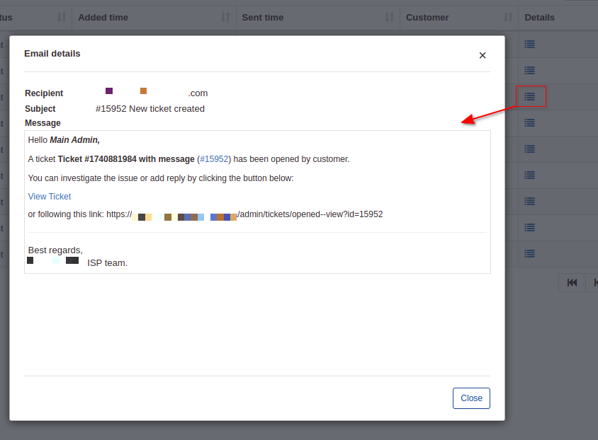

Email
=====

The Email logs' table show a list of emails that has been sent from the system, the list can be filtered by a specified period of time, the type of messages or the status of the messages. The table contains information about the customer's ID, email address of the recipients, the type of message and the status of the each message (new, sending, sent, error, expired). The time added, sent time and details of the message is also included in the table.

At the top-right of the table is a filter which can be set to display specific emails. You can filter the list of emails by a specific *Period of time, Type of message* (for example, Message, Test mail, Ticket notification, Monitoring notification etc.) and the Status thereof (New, Sending, Sent, Error, Expired).

You can also view the message by clicking on the <icon class="image-icon"></icon>  icon in the Details column. 

