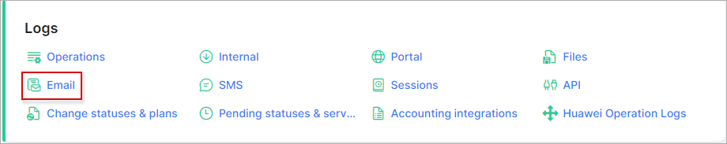

Email
=====

The *Email* logs table shows a list of emails that have been sent from the system. The list can be filtered by a specified period of time, the type of messages or the status of the messages. The table contains information about the email id, email address of the recipient, the type of message and the status of the each message (new, sending, sent, error, expired, attachment error), the added time, sent time, customer id and details of the message.

At the top-right corner of the table is located a filter which can be set to display specific emails. You can filter the list of emails by a specific *Period of time, Type of message* (e.g. customer message, ticket notification, reminder for lead, mention notification etc.) and by the *Status* (new, sending, sent, error, Expired, attachment error).

You can also view the message by clicking on the *View* <icon class="image-icon"></icon>  icon in the *Details* column.

