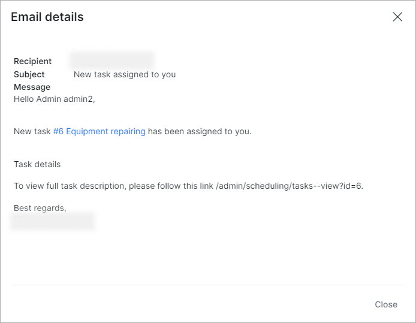

Email
=====

The Email logs' table show a list of emails has been sent for a period of time. It contains information about the customer's ID, email of the recipient, type of the message and its status (new, sending, sent, error, expired), the time added, sent time and details.

At the top-right corner there is a filter which can be set to display particular emails. You can select viewing emails by specific *Period of time, Type of message* (for example, Message, Test mail, Ticket notification, Monitoring notification etc.) and the Status thereof (New, Sending, Sent, Error, Expired).

You can view the message by clicking on the <icon class="image-icon"></icon> icon in the Details column. 

