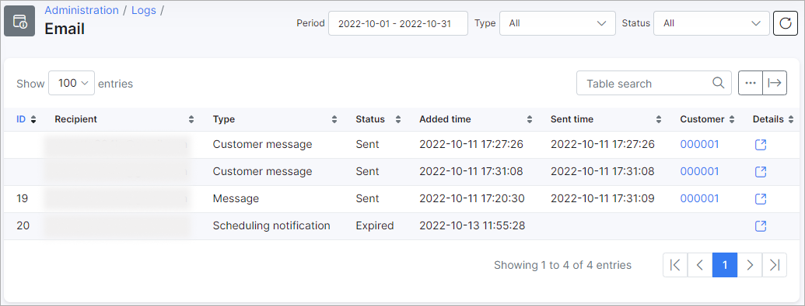

Email
=====

Email logs' table show a list of emails has been sent for a some period of time. It contains information about customer's ID, email of the recipient, type of the message and its status (new, sending, sent, error, expired), added time and sent time and details.

At the top-right corner there is a filter can be set to choose particular emails. You can select viewing emails by specific *Period of time, Type of message* (for example, Message, Test mail, Ticket notification, Monitoring notification etc.) and Status (New, Sending, Sent, Error, Expired).

You can view the message by clicking on icon <icon class="image-icon"></icon> in Details column. 

