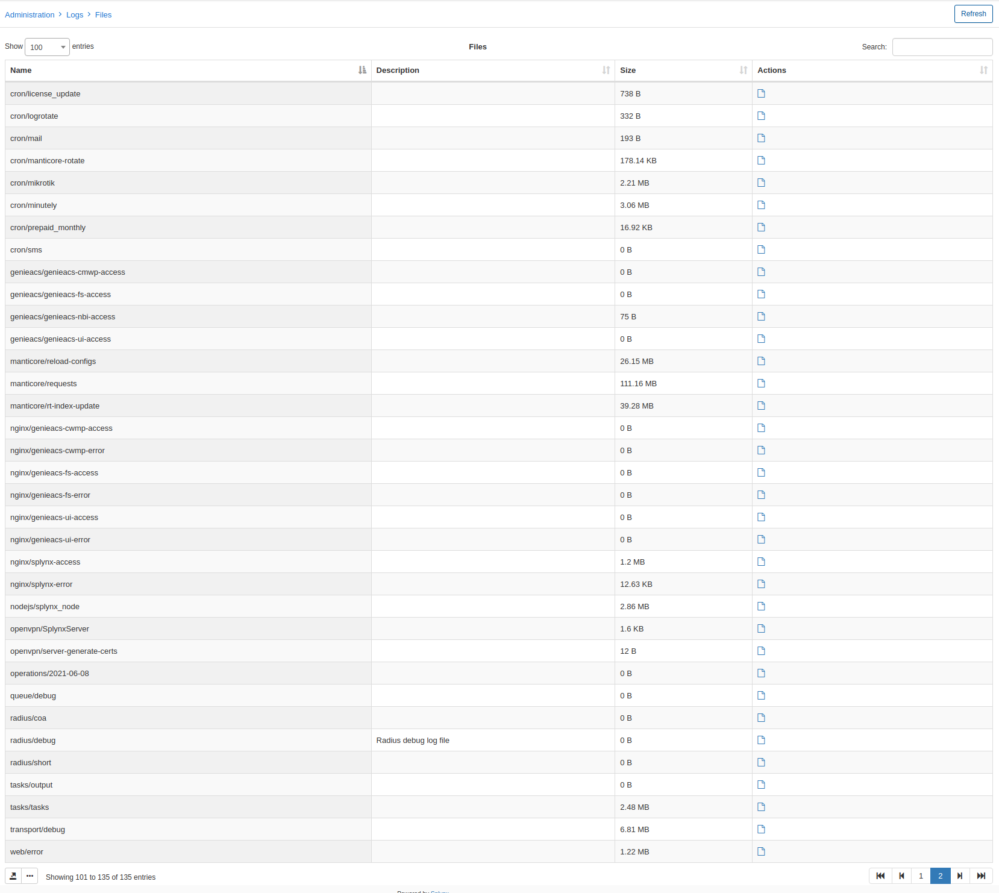
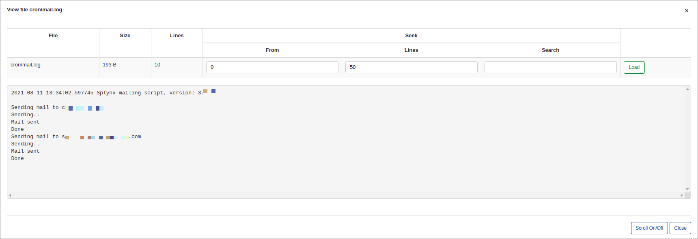

Files
=====

The Files table contains a list of log files generated by the system. Each file contains records relevant to the name of the file, descriptions and sizes of each of the log files are displayed on the table as well.

To view a particular log file from the list, simply click on the View icon <icon class="image-icon"></icon> in the Actions' column.

