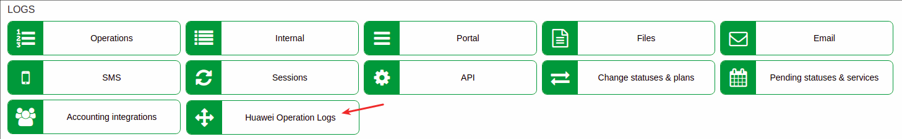

Huawei Operation Logs
============

This sections displays a list of all operations executed by the [Splynx Huawei OLT add-on](networking/huawei_gpon/huawei_gpon.md).

Logs of all operations display the *id* of the operation, a log *message*, a *status* of the operation with the *date and time*. The *administrator id* and *action* is also listed within the *details* column.

Detailed information of the operation can be accessed by clicking on the <icon class="image-icon"></icon> icon in the _Details_ column:

The table can be refreshed with the use of the button located at the top right corner of the table:

The search bar, which is located at the top right corner of the table, can be used to search the particular text of operation.

The data displayed in this table can be printed, copied or exported in a file, with the use of the export <icon class="image-icon"></icon> icon located at the top of the table:

