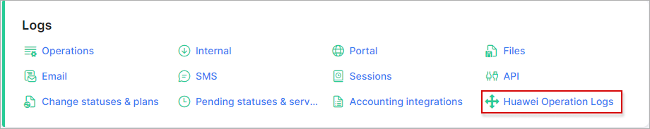
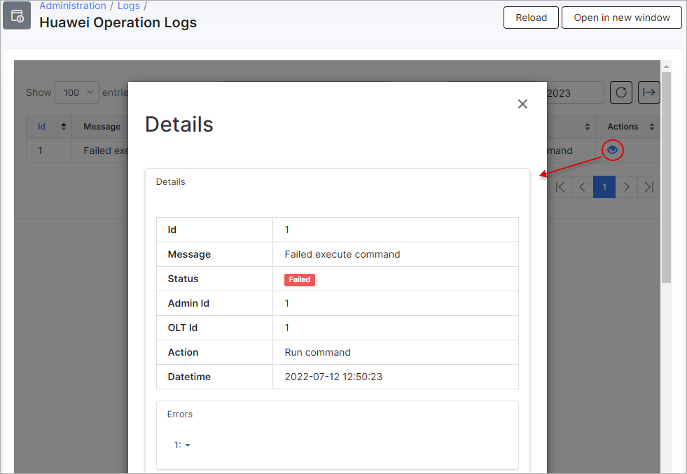

Huawei Operation Logs
============

This sections displays a list of all operations executed by the Splynx Huawei OLT addon.

Logs of all operations display an *id* of the operation, a log *message*, a *status* of the operation with the *date and time*. The *administrator id* and *action* is also listed with a *details* column.

Detailed information of the operation can be accessed by clicking on the <icon class="image-icon"></icon> icon in the _Details_ column:

The table can be refreshed or cleared with the use of the buttons located at the top right corner of the table.

The search bar, which is located at the top right corner of the table, can be used to search the particular text of operation.

The data displayed in this table can be printed, copied or exported in a file, with the use of the export <icon class="image-icon"></icon> icon located at the bottom of the table:

