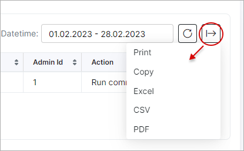

Huawei Operation Logs
============

This sections displays a list of all operations executed by the Splynx Huawei OLT addon.

Logs of all operations are displayed in a table format, displaying an ID of the operation, a message describing the log, the status of the operation with the date and time. The administrator ID and action is also listed along with a details column with an option to view detailed information of the operation.

Detailed information of the operation can be accessed by clicking on the details icon in the _Details_ column:

The table can be refreshed or cleared with the use of the buttons located at the top right of the table.

Also located at the top right of the table is a search bar to search for operations by particular text.

The data displayed in this table can be exported in a format of choice available, with the use of the export icon located at the bottom of the table:

