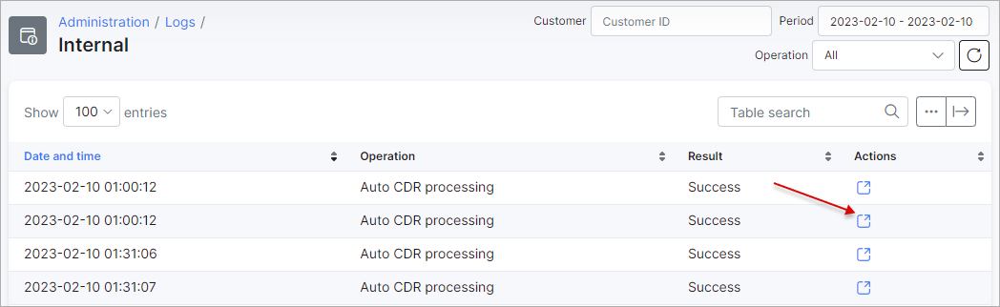

Internal
============

This section displays a list of all internal operations of executed automatically by the system.

All data is represented in a table displaying the date & time of the operation, the operation executed, the result of the operations and a actions column with an option to view detailed information of the operation.

This table can be filtered to view data by a specific _Customer ID_, a specific _Period_ and type of _Operation_ with the filter bar provided at the top right of the table. Also located on the top right of the table, is a search bar where operations can be searched for by particular text relevant to internal operations.

Detailed information of each operation can be viewed by clicking on the details icons in the _Actions_ column:

Like all tables in Splynx, the table can be modified to display data of your choice with the breadcrumbs icon at the bottom of the table or exported in a format of choice with the export icon <icon class="image-icon"></icon>.
