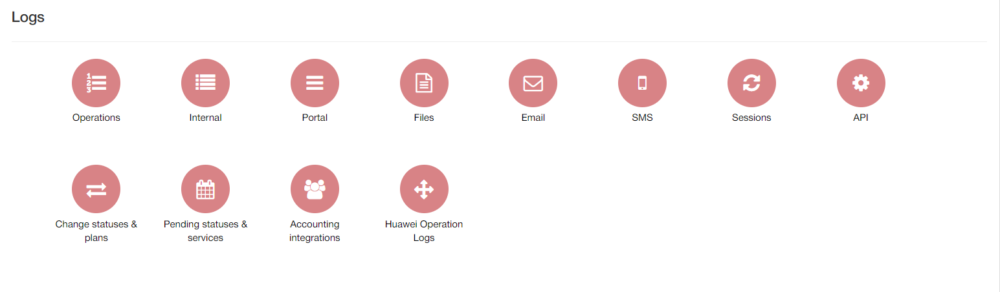

Logs
====

There are various types of logs in available in the Administration section. These logs will help you track various activities within the system.

Please follow the links to each section below for tutorials and information pages of each of the sections of logs:

* [API](administration/logs/api/api.md)

* [Changes of statuses/plans](administration/logs/changes_statuses_plans/changes_statuses_plans.md)

* [Email](administration/logs/email/email.md)

* [Files](administration/logs/files/files.md)

* [Internal](administration/logs/internal/internal.md)

* [Operations](administration/logs/operations/operations.md)

* [Pending statuses and services](administration/logs/pending_statuses_and_services/pending_statuses_and_services.md)

* [Portal](administration/logs/portal/portal.md)

* [Sessions](administration/logs/sessions/sessions.md)

* [SMS](administration/logs/sms/sms.md)
