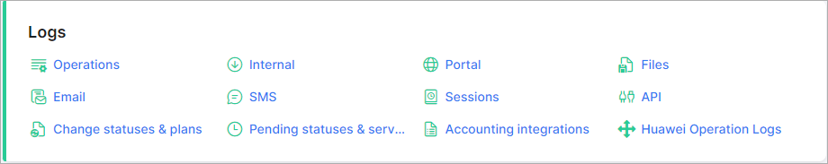

Logs
====

There are various types of logs available in the Administration section. These logs will help you track various activities within the system.

Please follow the links to each section below for tutorials and information pages of each of the sections of logs:

* [Operations](administration/logs/operations/operations.md)
* [Internal](administration/logs/internal/internal.md)
* [Portal](administration/logs/portal/portal.md)
* [Files](administration/logs/files/files.md)
* [Email](administration/logs/email/email.md)
* [SMS](administration/logs/sms/sms.md)
* [Sessions](administration/logs/sessions/sessions.md)
* [API](administration/logs/api/api.md)
* [Change statuses & plans](administration/logs/changes_statuses_plans/changes_statuses_plans.md)
* [Pending statuses & services](administration/logs/pending_statuses_and_services/pending_statuses_and_services.md)

------------

#### Additional logs:
###### extra logs sections will appear after new add-ons will be installed, or new functionality will be introduced in Splynx

* [Accounting integrations](administration/logs/accounting_integrations/accounting_integrations.md)
* [Huawei Operation Logs](administration/logs/huawei_operation_logs/huawei_operation_logs.md)

