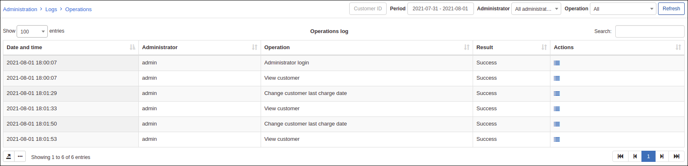
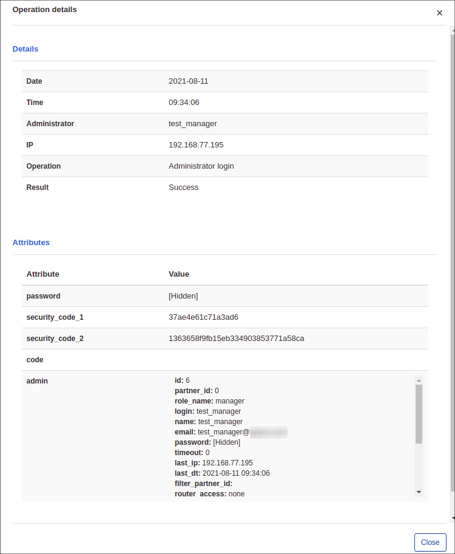
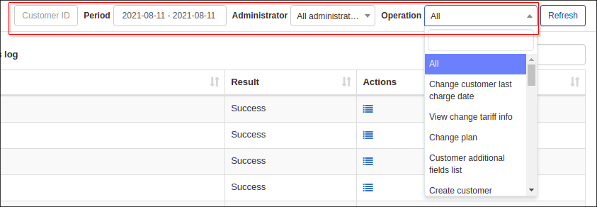
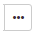
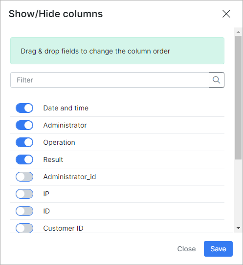

Operations
==========

Operations logs' table contains detailed information about all operations that was performed in  Splynx for a particular period of time by all administrators. The table displays the date and time of the operation, the admin's name that executed the operation, a description of the operation, as well as the results and details of the operation.

 By clicking on the <icon class="image-icon"></icon> icon in the *Details* column, we can view the operations details such as: Date, Time, Name of the Administrator, IP, Operation's description, Result and Attributes, etc.

At the top-right of the table, there are options of filtering operations by *Period of time, Administrator or Type of the operation*.

With the help of  the export <icon class="image-icon"></icon> icon at the bottom left of the table you can print or copy the list of the operations or choose to save it in PDF or CSV format. By clicking on breadcrumbs <icon class="image-icon"></icon> icon, you can choose the columns to be displayed in the table by enabling or disabling each available item and by dragging & dropping them, we can rearrange the order of the selected items.

