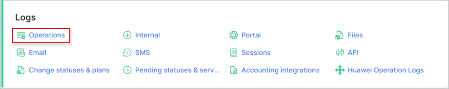
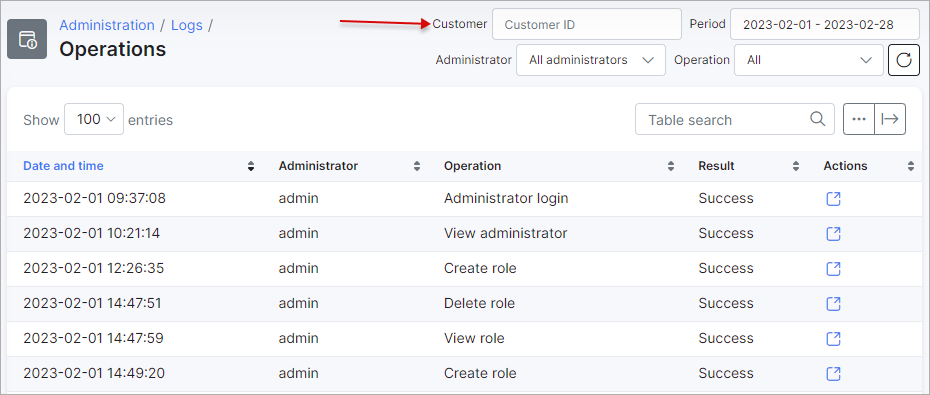
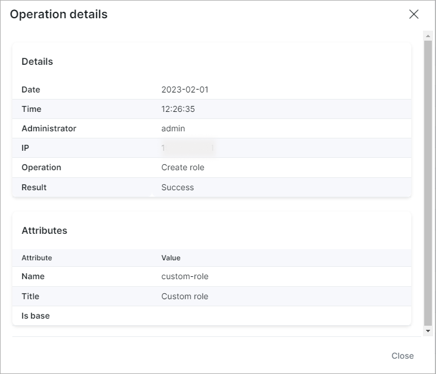
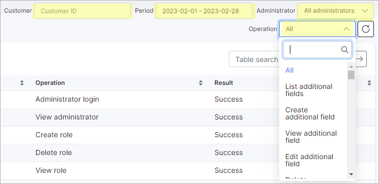

Operations
==========

The Operations logs table contains detailed information about all operations that were performed in Splynx for a particular period of time by all administrators.

The table displays the date and time of the operation, the admin's name that executed the operation, a description of the operation as well as the results and details of the operation.

 By clicking on the <icon class="image-icon"></icon> icon in the *Actions* column, we can view the operations details such as: Date, Time, Administrator' login, IP, Operation's description, Result and Attributes.

______________________________________________________

At the top-right corner of the page, there are options of filtering operations by *Customer ID, Period of time, Administrator* and  *Type of the operation*.

With the help of the export <icon class="image-icon"></icon> icon at the bottom left corner of the page you can print or copy the list of the operations or choose to save it as PDF or CSV file. By clicking on breadcrumbs <icon class="image-icon"></icon> icon, you can choose the columns to be displayed in the table by enabling or disabling each available item. And by dragging and dropping them, we can rearrange the order of the selected items.

