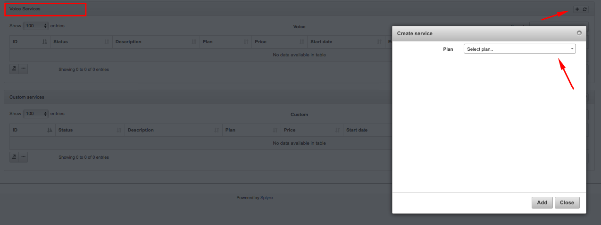
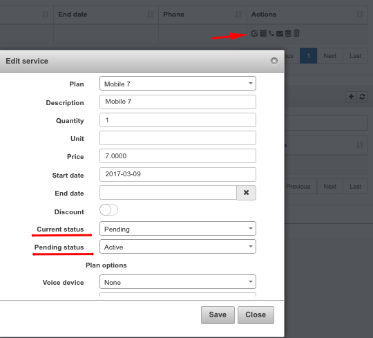

Pending statuses & services
======================

The pending statuses & services logs tables shows the list of statuses or plans with forthcoming changes.  It could be, for example, when customer's status is set to be changed on a particular day or a new service will be activated on a specific day.

*Pending statuses* - this section displays the date of change, customer's ID and status (new, activate, blocked, inactive). To view a Customer's information you can simply click on the customer's ID in the table.

*Pending services* - this section displays the date of change, description of the service, it's price, type and plan. To view the Service plan information you can simply click on the name of the plan in the *Plan's* column of the table.

1. **How to set up pending change of status**

To set up a pending change of status for a customer click on the *Calendar* icon next to the *Status* <icon class="image-icon"></icon> in the *Customer's Information* window. You can then set the date when the status will be changed and choose the desired status to change to and save changes.

After changes will be saved the *Calendar* icon next to the *Status* will change its colour <icon class="image-icon"> </icon>. And you will be able to check the pending status in *Administration → Logs → Pending statuses\plans*.

2. **How to set up pending change of service**

To set up a pending change of service go to *Customers → View → Services*, select a service you'd like to add, and click on icon <icon class="image-icon"></icon>.

 Then, choose the plan and fill up the rest of fields in open window if needed: *Quantity, Unit, Price, Dates, Status, Voice device, Phone*. You can also turn on a Discount option here, so customer will be charged  discounted price for the service. Set up the start date for the service. If it is any further date you can choose a pending status for the service until that date. On a planned start date of the service iыt status will be automatically changed on active.

If you click on *Edit icon* <icon class="image-icon"></icon> you will see current and pending status of the service, which can be changed if needed.

After service has been added it will be possible to check it in in *Administration → Logs → Pending statuses/plans (if starts date differs from today's date and it has pending status)*.

