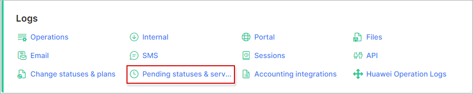
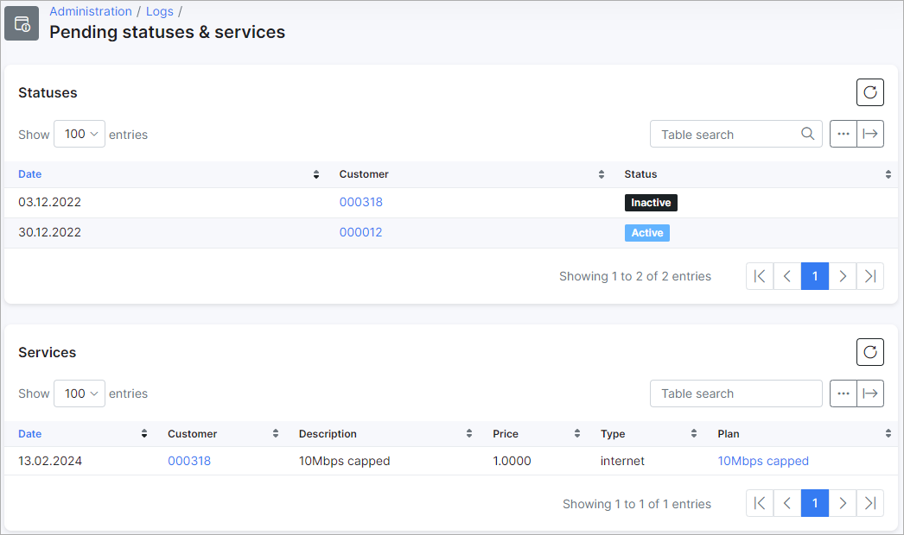
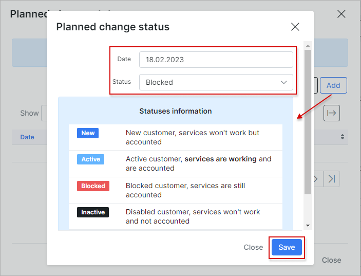
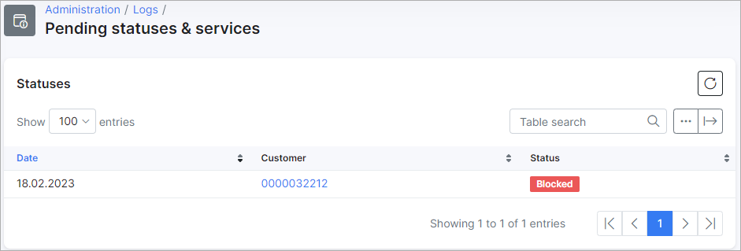
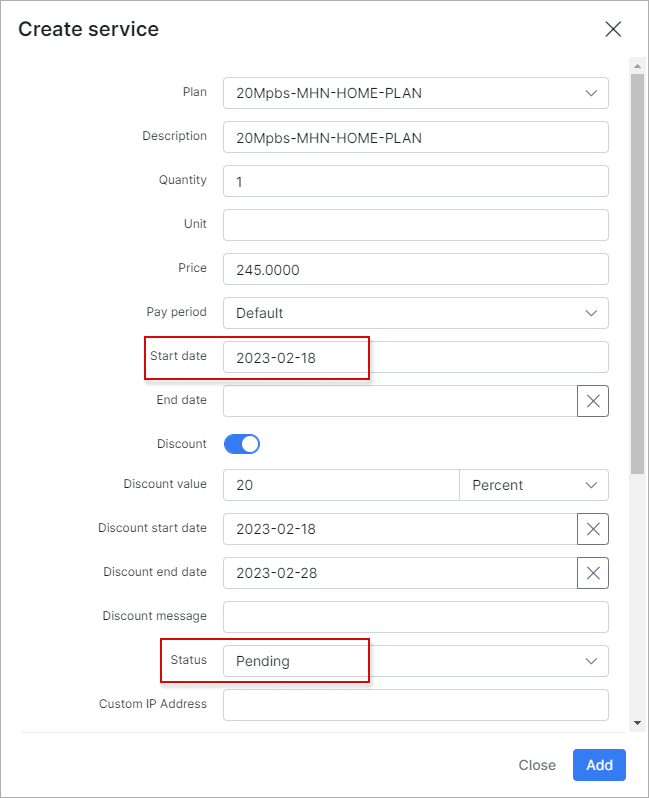
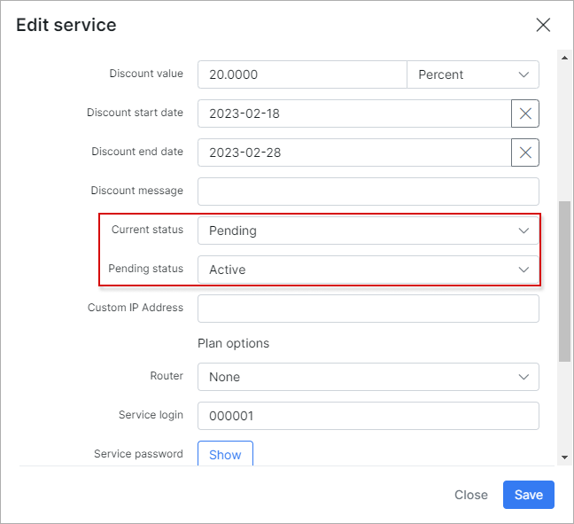
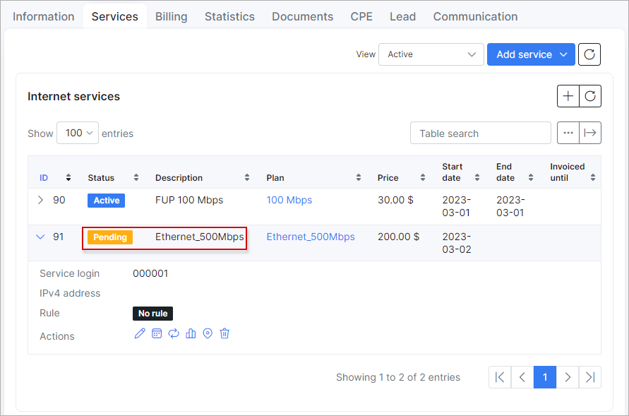
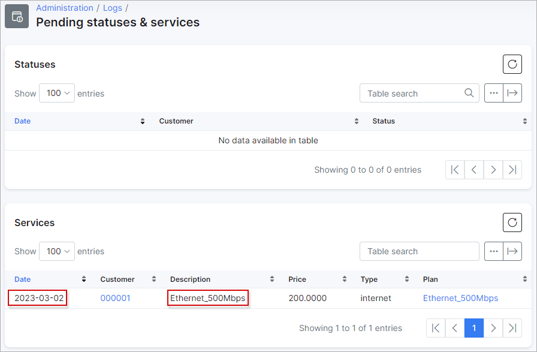

Pending statuses & services
======================

The pending statuses & services logs tables show the list of statuses or plans with forthcoming changes, e.g. when customer's status is set to be changed on a particular day or a new service will be activated on a specific day.

**Pending statuses** - this section displays the *date* of change, *customer's id* and *status* (new, activate, inactive, blocked). To view a customer's information you can simply click on the *customer's id* in the table.

**Pending services** - this section displays the *date* of change, *customer's id*, *description* of the service, its *price*, *type* and *plan*. To view the *service plan* information you can simply click on the name of the plan in the column of the table.

**How to set up pending change of status**

To set up a pending change of status for a customer click on the *Calendar* icon next to the *Status* <icon class="image-icon"></icon> in the *customer's Information* tab. You can then set the date when the status will be changed and choose the desired status to change to and save the result.

After the result was saved,  the *Calendar* icon will change its colour <icon class="image-icon"> </icon>. And you will be able to check the pending status in `Administration → Logs → Pending statuses & services`.

**How to set up pending change of service**

To set up a pending change of customer's service go to `Customers → View → Services`, click on *Add service* button in order to select type of service you would like to add.

 Then, choose the plan and fill up the rest of fields in open window if needed: *Start date, Type of Connection, Router* etc. You can also turn on a *Discount* option here, so customer will be charged with discounted price for the service. Set up the start date for the service. If it is any forthcoming date, the *pending* status for the service will be set automatically. On a planned start date of the service its status will be automatically changed to active as well.

If you click on *Edit icon* <icon class="image-icon"></icon> you will see current and pending status of the service, which can be changed if needed.

In case customer already has the active service and you would like to change it, open `Customers → View → Services` tab and click on <icon class="image-icon"></icon> in order to change the plan. In new window you can choose a *New service* and specify its *Start date*. A new service plan will be added in pending status

After service has been added it's possible to check its status in `Administration → Logs → Pending statuses & services` (only if start date differs from today's date and it has pending status)*.

With the help of the export <icon class="image-icon"></icon> icon at the bottom left corner of the table you can print, copy the list of the information or save it in PDF or CSV file. By clicking on the breadcrumbs <icon class="image-icon"></icon> icon, you can choose columns to be displayed by enabling or disabling toggles or by dragging & dropping items to change the order of the information displayed.

