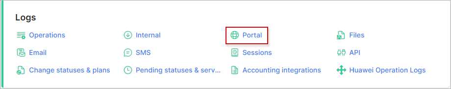
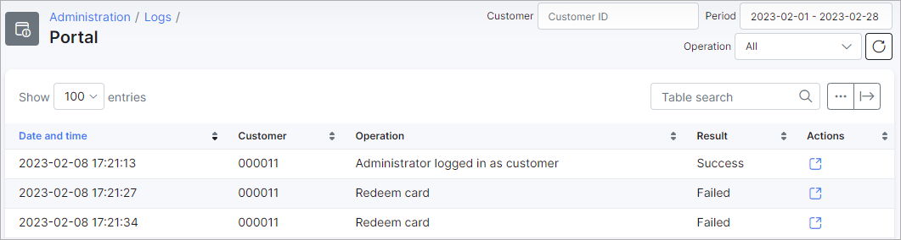
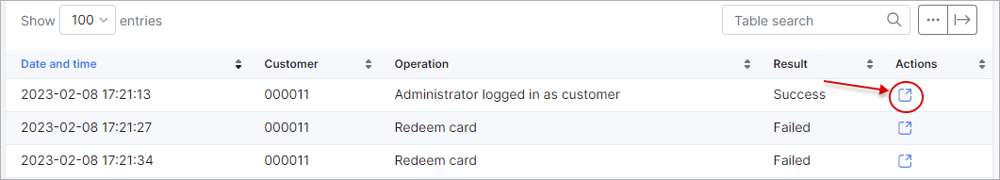
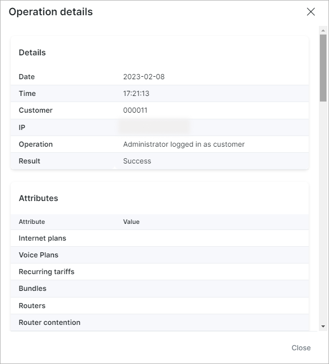

Portal
===============

This sections displays all activities of the customer portal.

The data is presented in a table displaying the date & time of the operation, the customer id, the operation description, the result of the operation and a actions column with an option to view detailed information of the operation.

The data displayed can be filtered by a specific _Customer ID_, _Period_ of time or type of _Operation_ with the use of the filter bar located on the top right corner of the table. Also, below the filter, is located a search bar where operations can be searched for by particular text.

To view detailed information of an operation, simply click on the details icon in the _Actions_ column:

Like all tables in Splynx, the table can be modified to display fields of your choice with the breadcrumbs <icon class="image-icon"></icon> icon at the bottom of the table or exported in a format of choice with the export <icon class="image-icon"></icon> icon.
