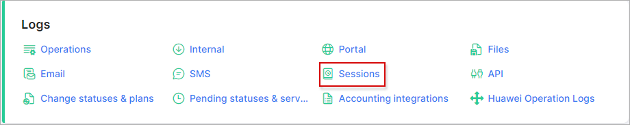

Sessions
========

On the *Sessions* log page a list of all PPPoE, DHCP or static sessions are collected here.

All the sessions are conveniently displayed in one table:

We can perform a search on *Customer* or *Prepaid vouchers* statistics and select particular sessions for certain periods by IPv4/IPv6/MAC address.

