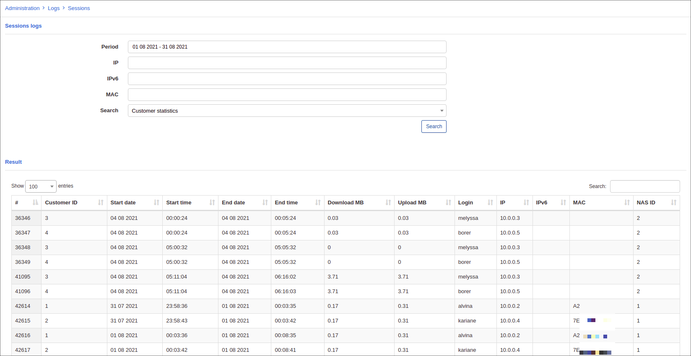
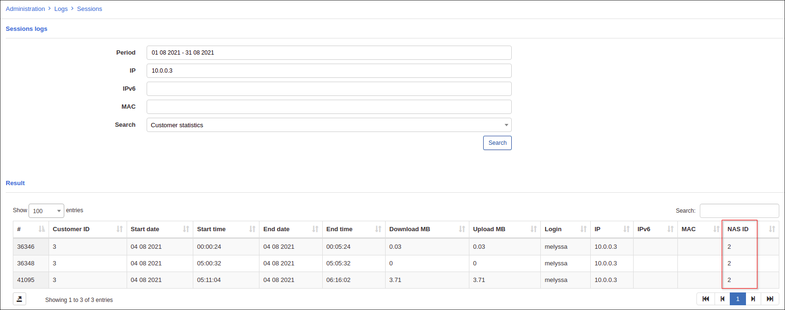

Sessions
========

On the Sessions log page a list of all PPPoE, DHCP or static sessions are collected here.

All the sessions are conveniently displayed in one table:

We can also search and select particular sessions for certain periods for a specific IP/MAC address.

The example below shows that in May, 2017, the IP address: 192.168.102.5 was used the user - alex: 

