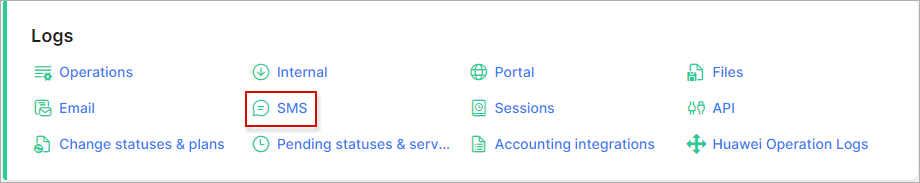

SMS
===

The SMS logs' table shows a list of SMS messages that has been sent for a period of time within the system. It contains information about the sms id, phone number of the recipient, type of the message, it's status (new, sending, sent, error, expired, attachment error), added/sent time and details of the message.

There is a filter at the top-right corner of the table, which can be used to view SMS messages for a  particular *Period of time, Type of message* (e.g. message, test, add-on, monitoring, scheduling notification) and *Status* (new, sending, sent, error, expired, attachment error).

You can view the message by clicking on the <icon class="image-icon"></icon> icon in the Details column.

