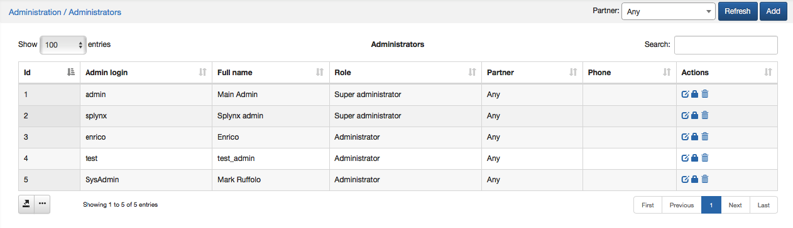
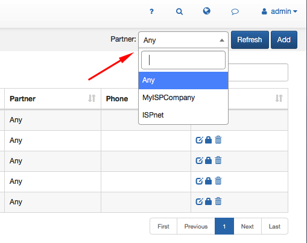
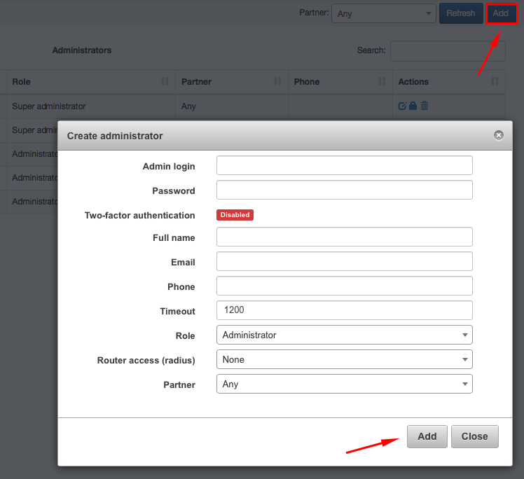
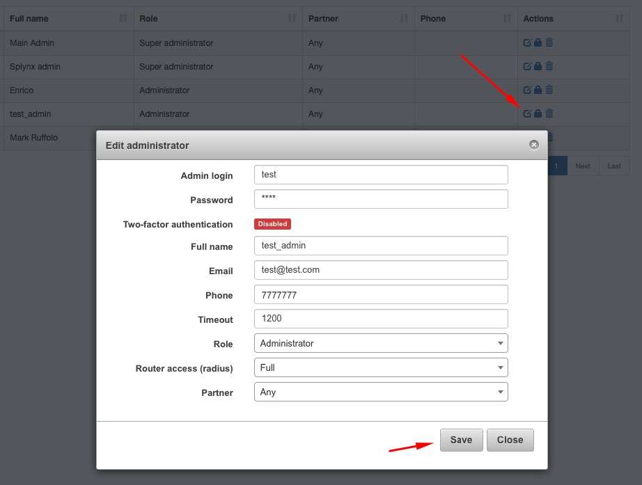
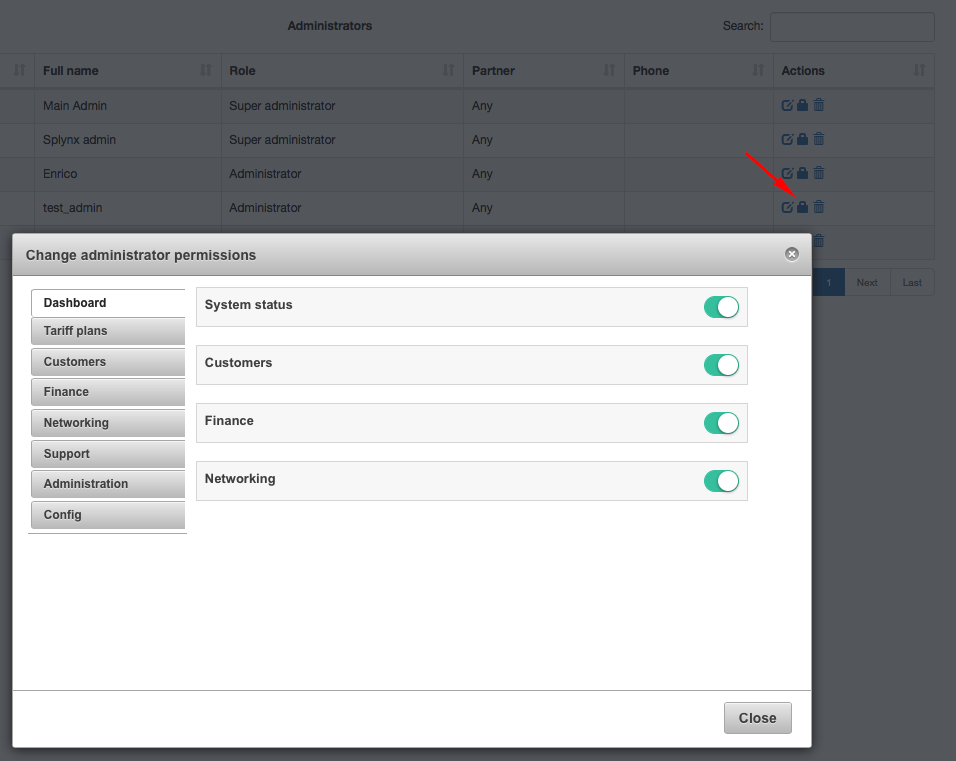
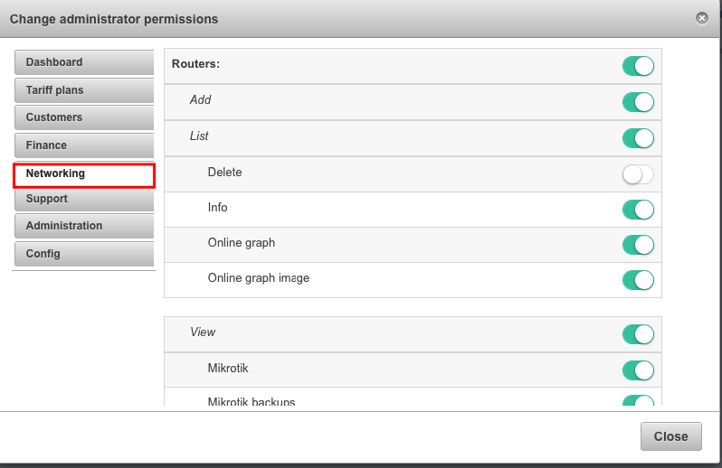
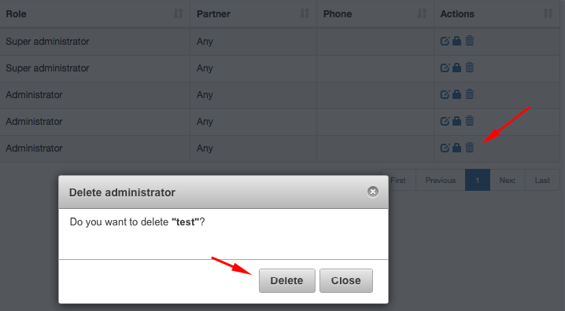

Admins and permissions
======================

Administrators' table in Logs shows a full list of all administrators using Splynx, their admin login, full name, role, phone number and other information. 

It is possible to choose administrators to display by their partners. 

You can print, copy or save the list of admins in PDF and CSV file formats by clicking on  icon below the table. It is also possible to select columns to be displayed in the table by clicking on  below the table.

####To add an administrator
click on *Add icon* in the top right corner and window will pop up with the next fields to fill up:

* **Admin login** - Login of the administrator 

* **Password** - Password of the administrator 

* **Two-factor authentication** - disabled or enabled  

* **Full name** - Full name of the administrator 

* **Email** - Email of the administrator 

* **Phone** - Phone number of the administrator 

* **Timeout** - Timeout 

* **Role** - Roles you can assign to administrator: Administrator, Customer Creator, Financial Manager, Manager, Super Administrator

* **Router** access (radius) - default permissions: None, Read, Write, Full 

* **Partner** - Partner 

####To edit the administrator
click on edit icon  in Actions section of the table. The edit window will pop up, where you can make changes if needed. 

####To  change permissions for the new administrator
click on  icon in Actions column. The window will show up, where you will be able to check and change all administrator's permissions. 

Main fields for changes will be: 

* **Dashboard**

* **Tariff plans**

* **Customers**

* **Finance**

* **Networking** 

* **Support** 

* **Administration**

* **Config** 

By clicking on each field you will be able to change particular permissions for different subcategories of that field. 

####To delete the administrator
click on  icon in Actions' column. 

It is possible **to see all operations of each Administrator** by clicking on *Administration → Logs → Operations*. If you click on  icon in Details column you will be able to see details of each operation:

There is a way to limit the access to information for admins in Splynx by selecting only one partner, so administrator will be able to operate with all information associated with one particular partner. Click on Edit icon  in Action column and window will pop-up, where it will be possible to choose one partner or option *Any*. 

You can also change permissions for adding, editing or deleting partner (s) for the particular administrator by clicking on icon  in Actions column. In a window poped-up click on *Administration section*, enable or disable *Partner* and choose additional permissions of the Partner you'd like to assign to the administrator.

