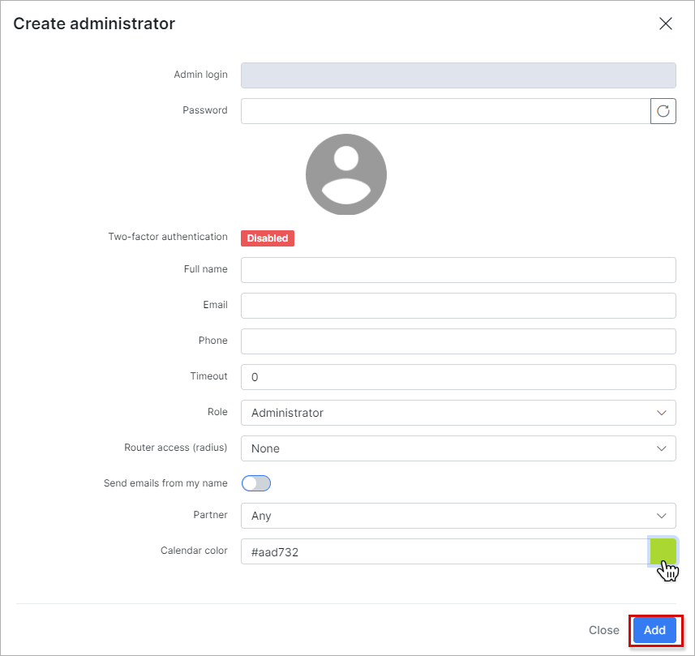

Admins and permissions
======================

The administrators' table in administration displays a full list of all administrators using Splynx, their admin login's, full names, roles, phone numbers and other information relevant to the administrator.

You can easily filter administrators to display the list by partners using the partners filter at the top right of the table.

You can export via print, copy or saving the list of admins in PDF and/or CSV file formats by clicking on the export <icon class="image-icon"></icon> icon below the table. It is also possible to select the columns to be displayed in the table by clicking on the breadcrumbs <icon class="image-icon"></icon> icon below the table.

#### Adding an administrator
To add a new administrator, click on the *Add icon* in the top right corner of the page and a window will appear with the following fields to enter the relevant details of the administrator :

* **Admin login** - type the login of the administrator

* **Password** - type or generate the password of the administrator

* **Two-factor authentication** - disables/enables two factor authentication for the administrator  

* **Full name** - specify the full name of the administrator

* **Email** - specify the email address of the administrator

* **Phone** - specify the phone number of the administrator

* **Timeout** - specify the timeout interval for login sessions in seconds

* **Role** - assign a role to the administrator: Administrator, Customer Creator, Financial Manager, Manager, Super Administrator or a custom role you have created

* **Router** access (radius) - specify the permissions to routers for the administrator: None, Read, Write, Full

* **Send emails from my name** - enables/disables sending of emails from the administrators email, overrides system email configuration.

* **Partner** - select a partner to associate the administrator with

#### Editing an administrator
To edit and administrators details, click on the *edit icon* <icon class="image-icon"></icon> in the Actions column of the table. The edit window will appear, where you can make the desired changes to their details.

#### Changing permissions for the new administrator
To change the permissions of an administrator, click on the permissions icon <icon class="image-icon"></icon> in Actions column. The window will appear, where you will be able to check and change all administrator's permissions.

Main fields available for changes :

* **Dashboard**

* **Tariff plans**

* **Customers**

* **Finance**

* **Networking**

* **Support**

* **Administration**

* **Config**

By clicking on each field you will be able to change particular permissions for different subcategories of that field.

#### Helpdesk

By clicking on the helpdesk icon <icon class="image-icon"></icon> in the *Actions* column of the table, we can change the scope of the administrators access to tickets. The feature allows you to restrict administrators to only view/interact with tickets you wish to grant them access to. This feature only restricts the administrator's access to tickets by your selection of scope, it does not change any permissions you have granted to the administrator, it only narrows or broadens the scope of ticket the admin will have access to with the same permissions you have granted the admin via the role assigned or the custom permissions you have selected for the admin.

There are 3 scopes you can assign an administrator to:

* **Global** - selecting this option will give the administrator access to all tickets on the system.
* **Group** - selecting this option will limit the administrator to a specific group which you will have to specify upon clicking this option.

* **Restricted** - restricts the administrators access to the tickets which are assigned to them.

#### Deleting an administrator
To remove an administrator account from the system, click on the trash <icon class="image-icon"></icon> icon in the Actions' column.

It is possible **to view all the operations executed by each Administrator** by navigating to *Administration → Logs → Operations*. If you click on the details <icon class="image-icon"></icon> icon in Actions column of the table you will be able to see details of each operation:

There is a way to limit the access to information for admins in Splynx by selecting only one partner, so the administrator will only be able to operate with all information associated with one particular partner. Click on the  *Edit icon* <icon class="image-icon"></icon> in the Actions column and window will appear, where it will be possible to choose one partner or the option *Any* to give the admin access to all the partners and their information on the system.

You can also change permissions for adding, editing or deleting partner (s) for the particular administrator by clicking on the permissions <icon class="image-icon"></icon> icon in Actions column. In the window that will appear, click on the *Administration section*, and enable or disable the *Partner* section and choose additional permissions of the Partner you'd like to assign to the administrator.

