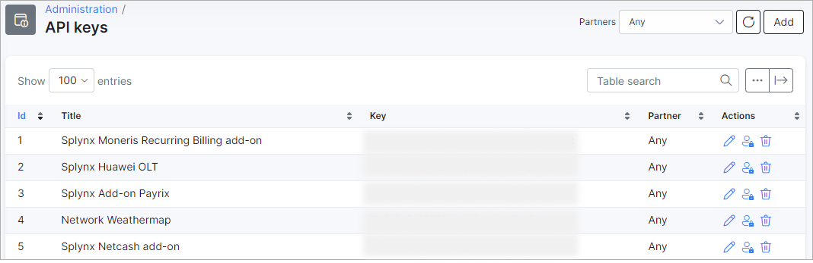
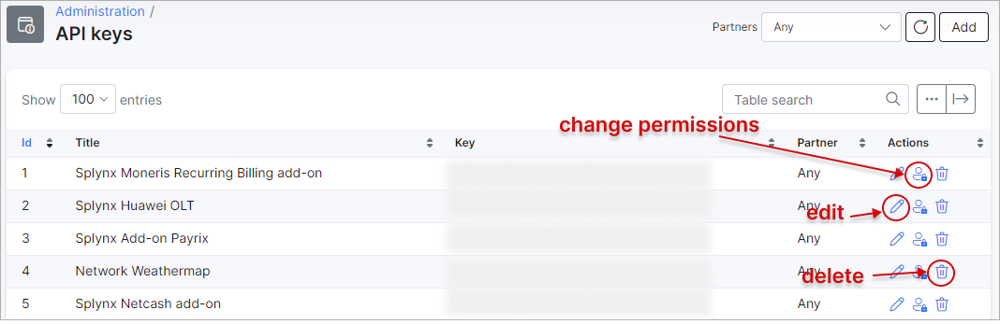
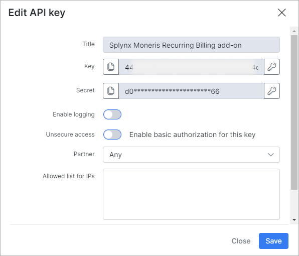
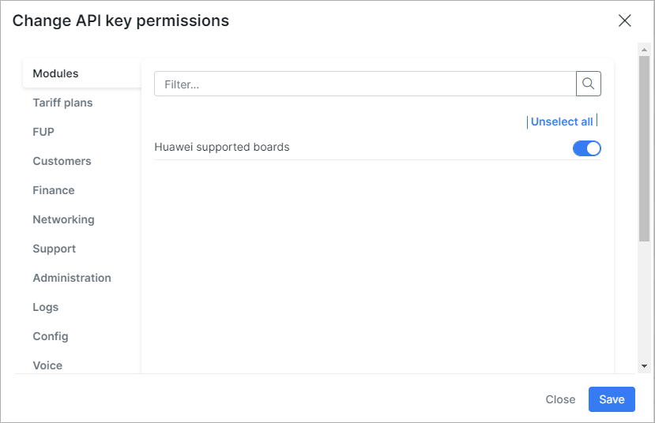
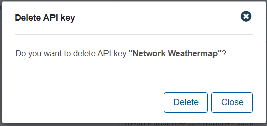

API Keys
==================

In this section we can configure, add and edit API keys used by the system.

This section displays a table of all API keys used by addons, information such as the name of the addon, api key and the partner it is associated with will appear here.

Additionally, an *Actions column* is provided for you to *Edit*, change *permissions* for the API key/addon or *delete* the API key:

**Actions**:

With use of the *Edit* icon <icon class="image-icon"></icon> you can edit the configurations of the API key in the fields that are available. If the field is greyed out, this means it cannot be edited:

With the use of the permissions icon <icon class="image-icon"></icon> you can modify the permissions of the API key to limit or grant access to each of the modules:

With the use of the trash icon <icon class="image-icon"></icon> you can delete API keys:

## Please Note!

Please be very careful when making any changes to your API keys as it may cause your addon's to malfunction or stop working entirely.
