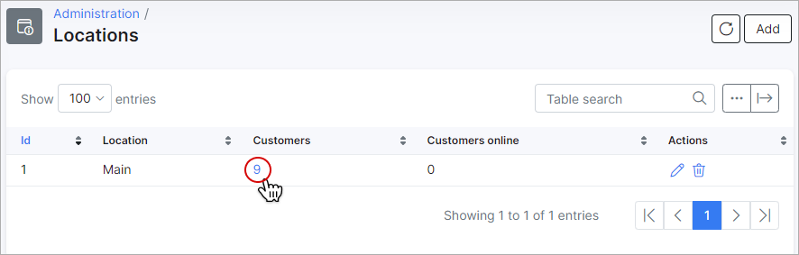
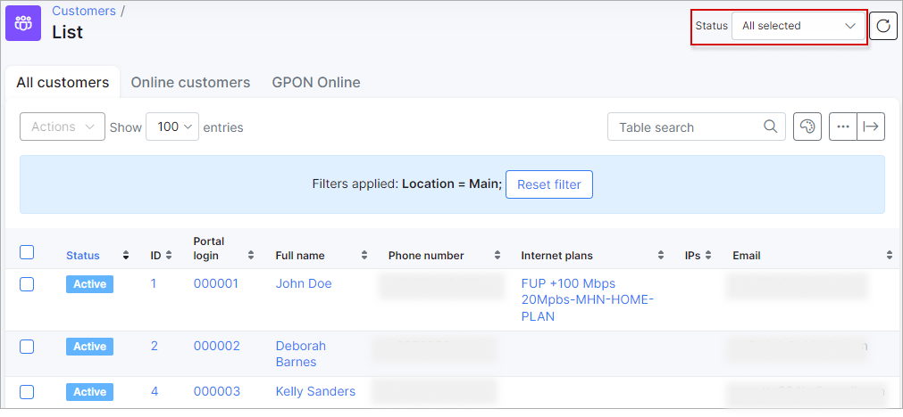
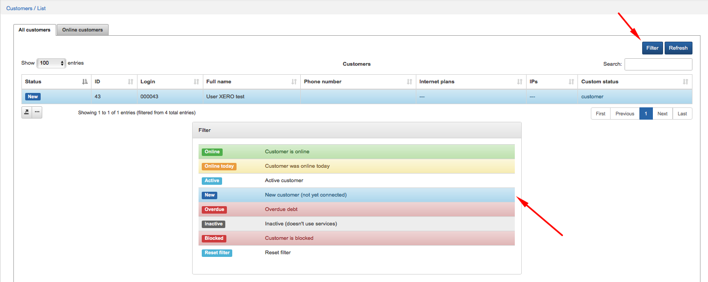
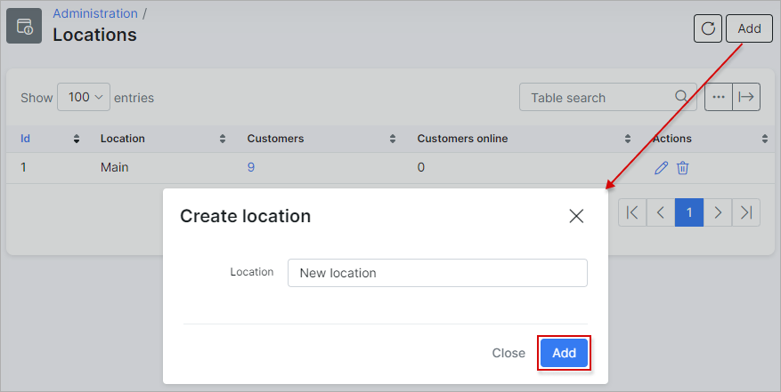

Locations
=========

The locations  table displays a list of all locations with a number of customers and the number of online customers. If you click on each number in the Customers' column, the full list of customers associated with that location will appear.

If it is a long list of customers and you have to check customers by a particular status you can use the filter by clicking on a specific status below the table.

You can add a new location here by clicking on Add on the top right of the table.

You can also edit a location by clicking on the *Edit icon* <icon class="image-icon"></icon> in the Actions column. 

