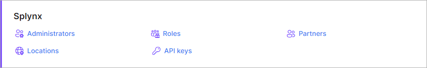

Splynx
==========

In this section you can configure all administrative details on the system.

There are 5 subcategories in the Splynx (*Main*) section of Administration.

Please, follow the links below to find tutorial pages about the different sections of the Splynx configuration of administration:

  * [Administrators](administration/main/admins_and_permissions/admins_and_permissions.md)
  * [Roles](administration/main/roles/roles.md)
    * [Default roles in detail](administration/main/roles/default_roles/default_roles.md)
  * [Partners](administration/main/partners/partners.md)
  * [Locations](administration/main/locations/locations.md)
  * [API keys](administration/main/api_keys/api_keys.md)
