Partners
========

A partner in Splynx is basically a service provider or any sub-provider of your services. The partners table shows a list of all Partners on the system with number of customers assigned to them and number of online customers.  If you click on each number in the Customers' column, the full list of customers associated with the Partner appear.

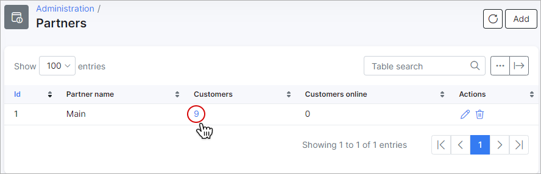

If it is a long list of customers and you have to check them by a particular status you can use the filter in the top right corner of the page.

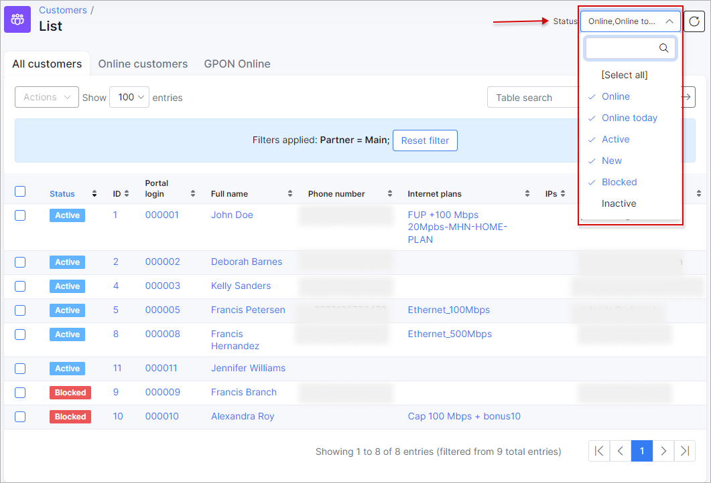

**Another way to filter or search** customers who belong to the same Partner is by clicking on *Partner tab* in *Customers → Search*.

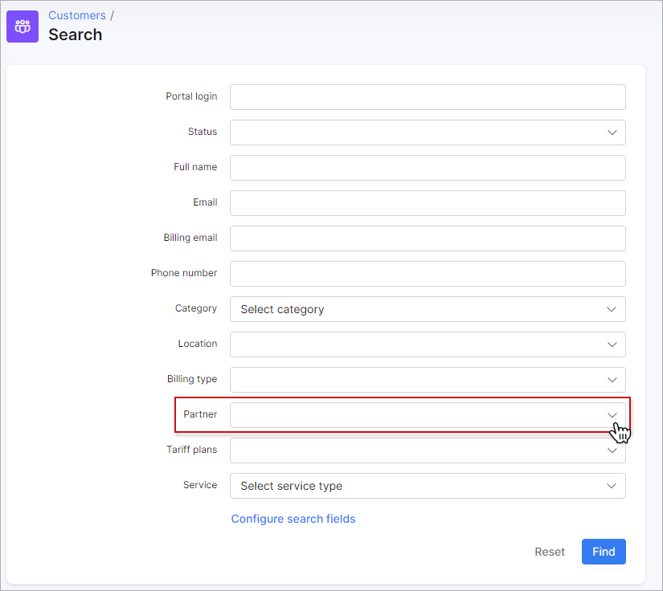

When you choose a preferred partner, the list of customers associated with the partner will appear. The table will contain information about name of the customers, their phone numbers, Internet, Voice and Custom plans, etc. The columns to display in the table can be selected and customized with the breadcrumbs <icon class="image-icon"></icon> button below the table.

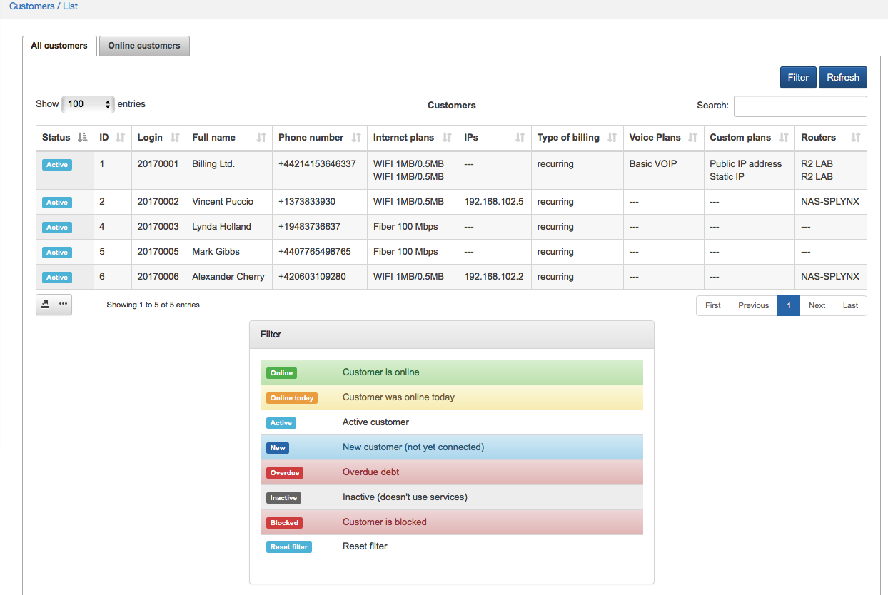

You can **add a new partner** here by clicking on *Add* at the top right corner of the table.

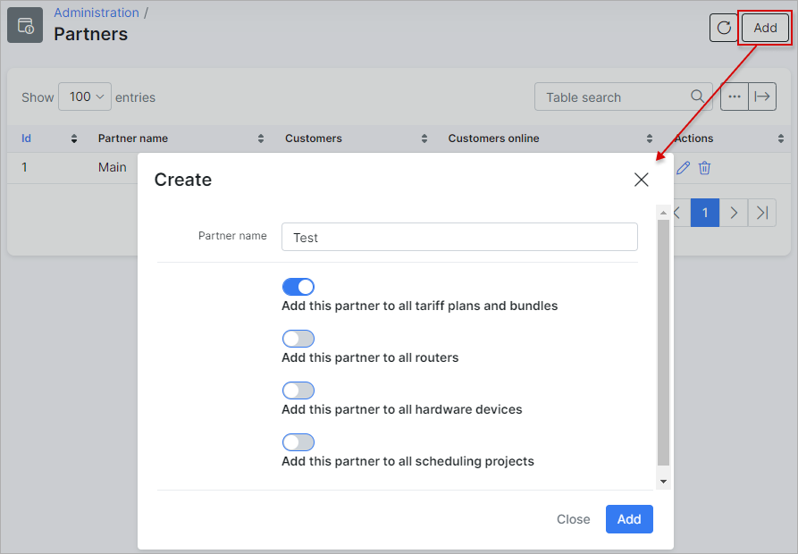

You can also **edit the partner's name** by clicking on *Edit icon* <icon class="image-icon"></icon> in the Actions column.

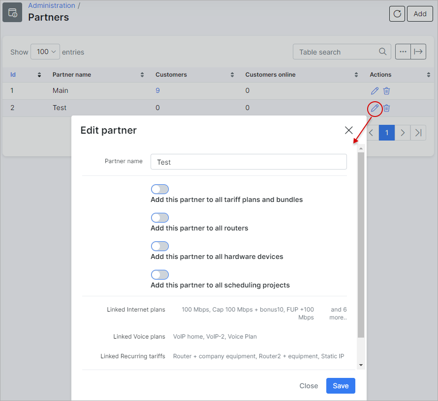

Here are a few more tips on the configuration of Partners:

1. **Not only Customers can be assigned to a particular Partner, but also Routers and Tariff plans.**

In *Networking → Routers → List* you can check the full list of **Routers** and filter the table by a Partner. If you'd like to change or add a partner to the particular router you have to click on it in the *Title* column or click on *Edit* <icon class="image-icon"></icon> in the Actions column.

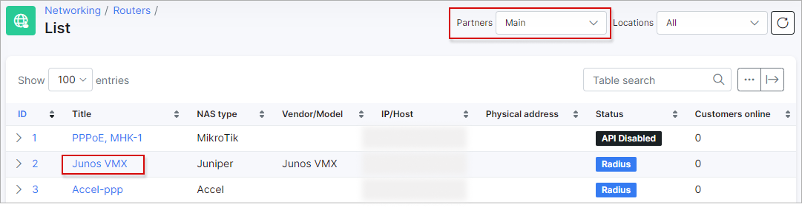

The window will appear, where you can make the changes:

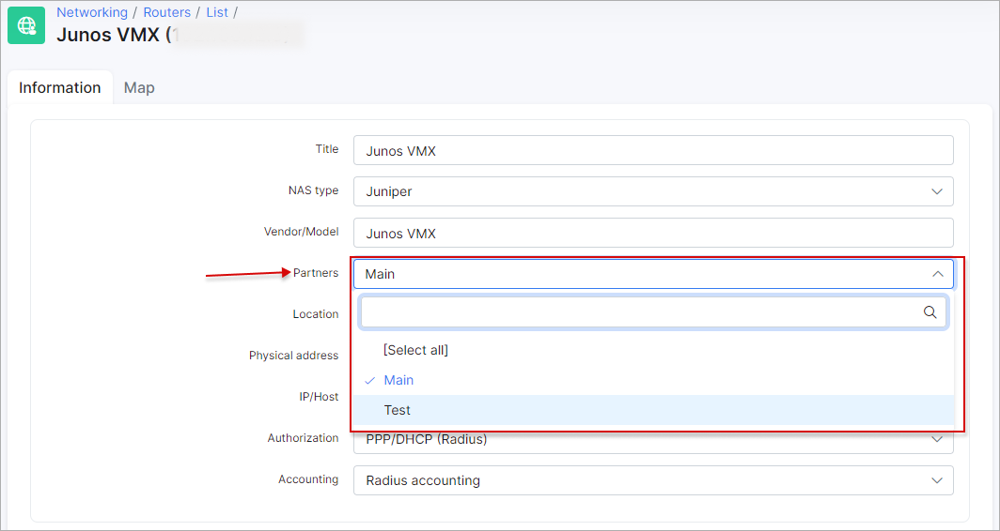

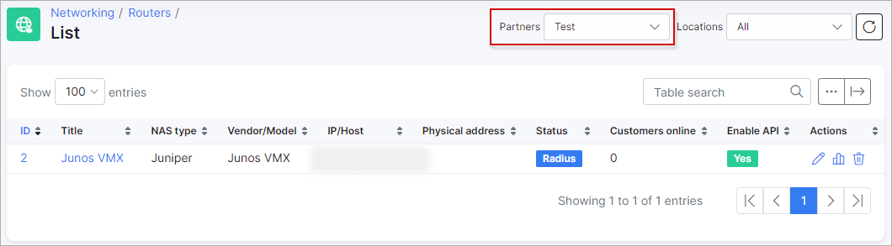

The same procedure can be used for **Tariff Plans**. When you click on *Tariff plans → Internet* a full list of Internet Tariff Plans will appear, where you can filter the table by a Partner. If you'd like to change or add a partner to the particular Tariff Plan you have to click on it in thw *Title* column or click on icon *Edit* <icon class="image-icon"></icon> in the Actions column.

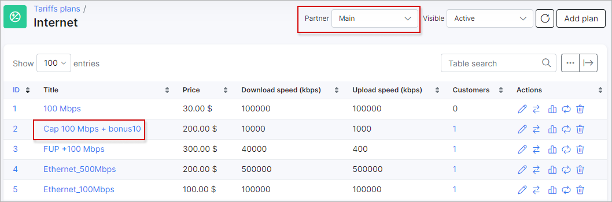

The window will appear, where you can make the changes:

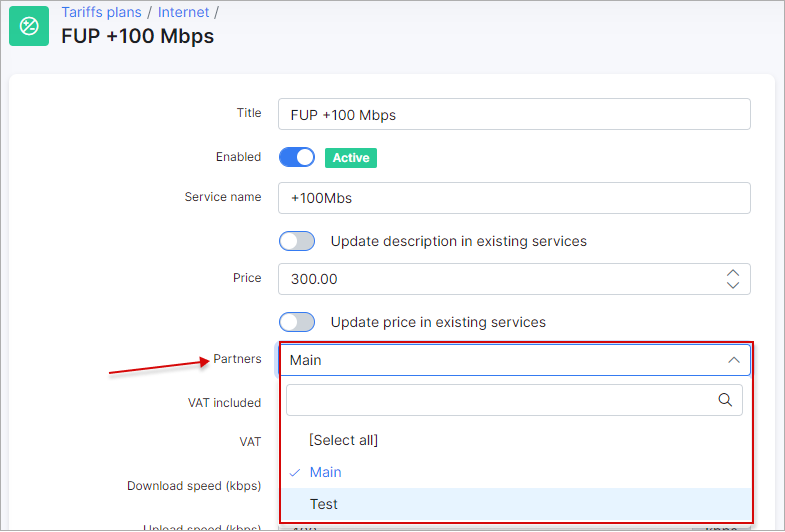

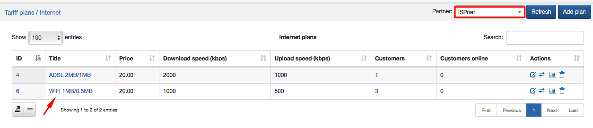

2. **There is a way to limit the access to information for admins in Splynx by selecting only one partner**

Administrators will be able to operate with all information associated with one particular partner if you associate them with only one specific partner. You can find this option in *Administration → Administrators*. Click on the edit <icon class="image-icon"></icon> icon in the Actions column and window will appear, where it will be possible to select one partner or the option *Any*.

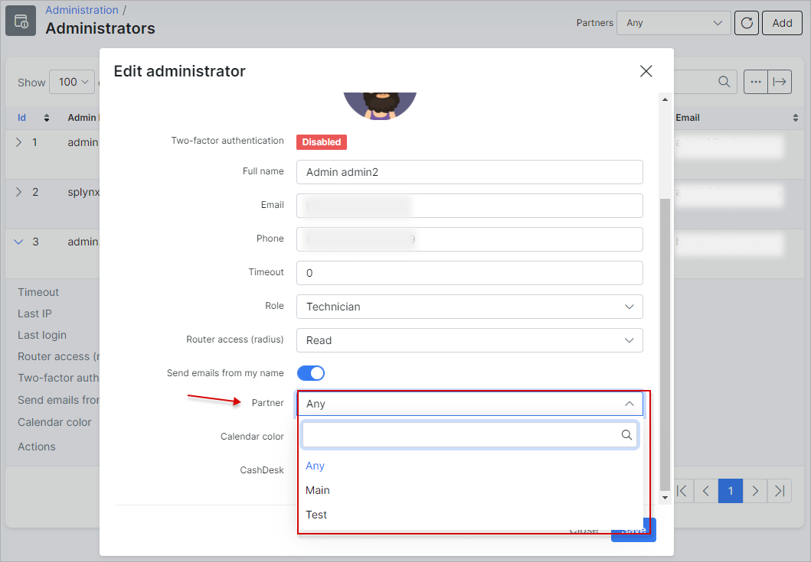

**You can also change permissions for adding, editing or deleting partner (s) for the particular administrator** by clicking on the permissions <icon class="image-icon"></icon> icon in the Actions column. In the window that will appear, click on the *Administration* section, enable Partner and select permissions to add, edit or delete Partners.

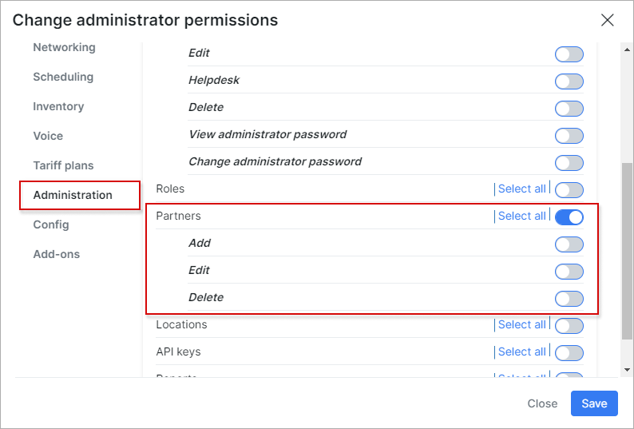

3. **It is possible to set up a commission for partners from each payment made by customers for partners services**

You can set it up in *Config → System → Company Information*. In *Company Information*, select the desired Partner to work with and in the *Partner percent field*, specify the percentage for the Partner's commission.

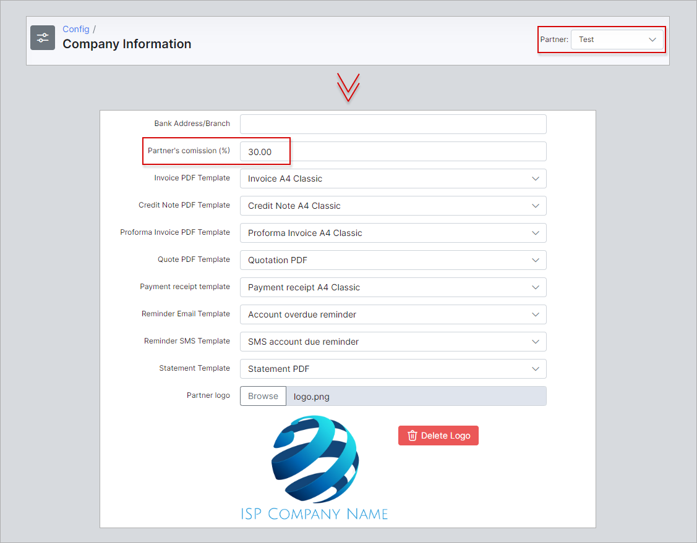

After the commission has been set up, you will be able to check the amount paid to the partner in *Finance → Invoices*. At the top side of the window choose an appropriate *Partner* (with Period of time and Payment Status, if necessary) and below the list of Invoices you will see the "*Totals*" table, displaying total amount paid and amount of commission for the partner.

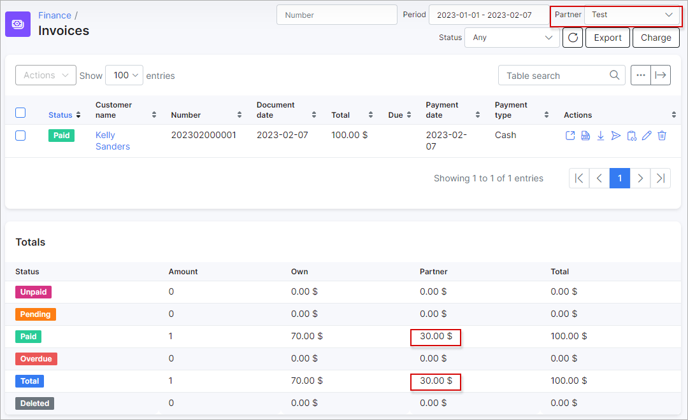
