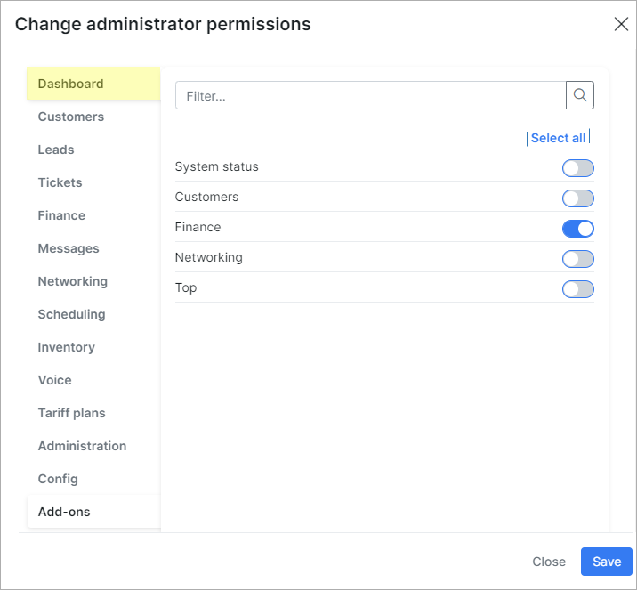
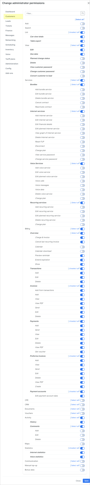
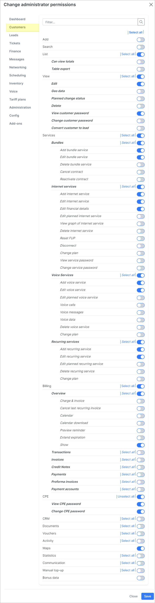
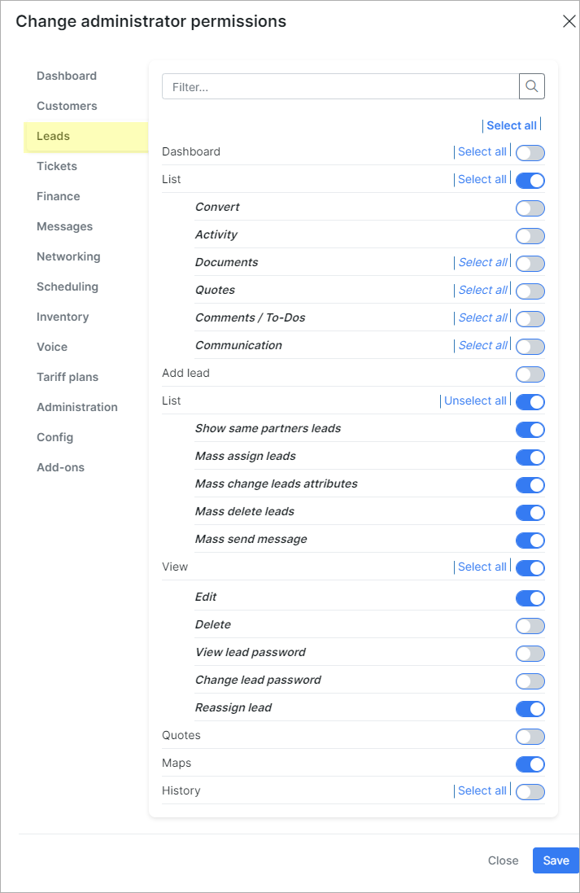

Default roles and its permissions in detail
=======================

On this page we can view the default roles in Splynx with a detailed information about access levels to each of the different modules and features of the system.

By default, there are 7 roles in Splynx:

- `super-administrator`
- `administrator`
- `manager`
- `financial-manager`
- `customer-creator`
- `engineer`
- `technician`

We can create the own role and set the required permissions to it. For the default roles we can only change the *Name* and *Title*. The permissions can be changed only for a newly created role in this window.

Also, you can follow the permissions scheme of existing role when creating a new one:

### The list of default permissions for each of the build-in role:

<b>super-administrator</b>

Administrator account with the `super-administrator`role has access to ALL categories and its sub-categories in Splynx by default.

------------

<b>administrator</b>

<table>
    <tbody>
        <tr>
            <td><b>DASHBOARD</b></td>
            <td><icon class="image-icon">

</icon> 
Full access for the `administrator` by default
 </td>
        </tr>
    </tbody>
</table>

------------

|  CUSTOMERS  |
| ------------ |
|  |

------------

|  LEADS  |
| ------------ |
|  |

------------

|  TICKETS  |
| ------------ |
|  |

------------

<table>
    <tbody>
        <tr>
            <td><b>FINANCE</b></td>
            <td rowspan=2><icon class="image-icon">

</icon> 
Full access for the `administrator` by default
 </td>
        </tr>
        <tr>
            <td><b>MESSAGES</b></td>
        </tr>
    </tbody>
</table>

------------

|  NETWORKING  |
| ------------ |
|  |

------------

<table>
    <tbody>
        <tr>
            <td><b>SCHEDULING</b></td>
            <td rowspan=2><icon class="image-icon">

</icon> 
Full access for the `administrator` by default
 </td>
        </tr>
        <tr>
            <td><b>INVENTORY</b></td>
        </tr>
    </tbody>
</table>

------------

|  VOICE  |
| ------------ |
|  |

------------

|  TARIFF PLANS  |
| ------------ |
|  |

------------

|  ADMINISTRATION  |
| ------------ |
|  |

------------

|  CONFIG  |
| ------------ |
|  |

------------

<table>
    <tbody>
        <tr>
            <td><b>ADD-ONS</b></td>
            <td rowspan=5><icon class="image-icon">

</icon> 
Full access to ALL installed add-ons in Splynx for the `administrator` by default
 </td>
        </tr>
    </tbody>
</table>

------------

<b>manager</b>

| DASHBOARD  |
| ------------ |
|  |

------------

|  CUSTOMERS  |
| ------------ |
|  |

------------

<table>
    <tbody>
        <tr>
            <td><b>LEADS</b></td>
            <td rowspan=5><icon class="image-icon">

</icon> 
No access for the `manager` by default
 </td>
        </tr>
        <tr>
            <td><b>TICKETS</b></td>
        </tr>
        <tr>
            <td><b>FINANCE</b></td>
        </tr>
        <tr>
            <td><b>MESSAGES</b></td>
        </tr>
        <tr>
            <td><b>NETWORKING</b></td>
        </tr>
    </tbody>
</table>

------------

|  SCHEDULING  |
| ------------ |
|  |

------------

<table>
    <tbody>
        <tr>
            <td><b>INVENTORY</b></td>
            <td rowspan=6><icon class="image-icon">

</icon> 
No access for the `manager` by default
 </td>
        </tr>
        <tr>
            <td><b>VOICE</b></td>
        </tr>
        <tr>
            <td><b>TARIFF PLANS</b></td>
        </tr>
        <tr>
            <td><b>ADMINISTRATION</b></td>
        </tr>
        <tr>
            <td><b>CONFIG</b></td>
        </tr>
        <tr>
            <td><b>ADD-ONS</b></td>
        </tr>
    </tbody>
</table>

------------

<b>financial-manager</b>

| DASHBOARD  |
| ------------ |
|  |

------------

|  CUSTOMERS  |
| ------------ |
|   |

------------

|  LEADS  |
| ------------ |
|  |

------------

<table>
    <tbody>
        <tr>
            <td><b>TICKETS</b></td>
            <td><icon class="image-icon">

</icon> 
No access for the `financial-manager` by default
 </td>
        </tr>
    </tbody>
</table>

------------

|  FINANCE  |
| ------------ |
|  |

------------

<table>
    <tbody>
        <tr>
            <td><b>MESSAGES</b></td>
            <td rowspan=6><icon class="image-icon">

</icon> 
No access for the `financial-manager` by default
 </td>
        </tr>
        <tr>
            <td><b>NETWORKING</b></td>
        </tr>
        <tr>
            <td><b>SCHEDULING</b></td>
        </tr>
    </tbody>
</table>

------------

|  INVENTORY  |
| ------------ |
|  |

------------

<table>
    <tbody>
        <tr>
            <td><b>VOICE</b></td>
            <td rowspan=6><icon class="image-icon">

</icon> 
No access for the `financial-manager` by default
 </td>
        </tr>
        <tr>
            <td><b>TARIFF PLANS</b></td>
        </tr>
        <tr>
            <td><b>ADMINISTRATION</b></td>
        </tr>
    </tbody>
</table>

------------

|  CONFIG  |
| ------------ |
|  |

------------

 <table>
    <tbody>
        <tr>
            <td><b>ADD-ONS</b></td>
            <td><icon class="image-icon">

</icon> 
No access for the `financial-manager` by default
 </td>
        </tr>
    </tbody>
</table>

------------

<b>customer-creator</b>

 <table>
    <tbody>
        <tr>
            <td><b>DASHBOARD</b></td>
            <td><icon class="image-icon">

</icon> 
No access for the `customer-creator` by default
 </td>
        </tr>
    </tbody>
</table>

------------

|  CUSTOMERS  |
| ------------ |
| <icon class="image-icon"></icon>
In the customers list, the *customer-creator* can see only 10 customers created by him.
 
 |

------------

|  LEADS  |
| ------------ |
|  |

------------

<table>
    <tbody>
        <tr>
            <td><b>TICKETS</b></td>
            <td rowspan=11><icon class="image-icon">

</icon> 
No access for the `customer-creator` by default
 </td>
        </tr>
        <tr>
            <td><b>FINANCE</b></td>
        </tr>
        <tr>
            <td><b>MESSAGES</b></td>
        </tr>
        <tr>
            <td><b>NETWORKING</b></td>
        </tr>
        <tr>
            <td><b>SCHEDULING</b></td>
        </tr>
        <tr>
            <td><b>INVENTORY</b></td>
        </tr>
        <tr>
            <td><b>VOICE</b></td>
        </tr>
        <tr>
            <td><b>TARIFF PLANS</b></td>
        </tr>
        <tr>
            <td><b>ADMINISTRATION</b></td>
        </tr>
        <tr>
            <td><b>CONFIG</b></td>
        </tr>
        <tr>
            <td><b>ADD-ONS</b></td>
        </tr>
    </tbody>
</table>

------------

<b>engineer</b>

<table>
    <tbody>
        <tr>
            <td><b>DASHBOARD</b></td>
            <td><icon class="image-icon">

</icon> 
No access for the `engineer` by default
 </td>
        </tr>
    </tbody>
</table>

------------

|  CUSTOMERS  |
| ------------ |
|  |

------------

|  LEADS  |
| ------------ |
|  |

------------

|  TICKETS  |
| ------------ |
|  |

------------

<table>
    <tbody>
        <tr>
             <td><b>FINANCE</b></td>
            <td rowspan=11><icon class="image-icon">

</icon> 
No access for the `engineer` by default
 </td>
        </tr>
        <tr>
            <td><b>MESSAGES</b></td>
        </tr>
    </tbody>
</table>

|  NETWORKING  |
| ------------ |
|  |

------------

|  SCHEDULING  |
| ------------ |
|  |

------------

|  INVENTORY  |
| ------------ |
|  |

------------

<table>
    <tbody>
        <tr>
            <td><b>VOICE</b></td>
            <td><icon class="image-icon">

</icon> 
No access for the `engineer` by default
 </td>
        </tr>
    </tbody>
</table>

|  TARIFF PLANS  |
| ------------ |
|  |

------------

|  ADMINISTRATION  |
| ------------ |
|  |

------------

<table>
    <tbody>
        <tr>
            <td><b>CONFIG</b></td>
            <td rowspan=2><icon class="image-icon">

</icon> 
No access for the `engineer` by default
 </td>
        </tr>
        <tr>
            <td><b>ADD-ONS</b></td>
        </tr>
    </tbody>
</table>

------------

<b>technician</b>

<table>
    <tbody>
        <tr>
            <td><b>DASHBOARD</b></td>
            <td><icon class="image-icon">

</icon> 
No access for the `technician` by default
 </td>
        </tr>
    </tbody>
</table>

|  CUSTOMERS  |
| ------------ |
|  |

------------

|  LEADS  |
| ------------ |
|  |

------------

|  TICKETS  |
| ------------ |
|  |

------------

<table>
    <tbody>
        <tr>
            <td><b>FINANCE</b></td>
            <td rowspan=3><icon class="image-icon">

</icon> 
No access for the `technician` by default
 </td>
        </tr>
        <tr>
            <td><b>MESSAGES</b></td>
        </tr>
        <tr>
            <td><b>NETWORKING</b></td>
        </tr>
    </tbody>
</table>

|  SCHEDULING  |
| ------------ |
|  |

------------

<table>
    <tbody>
        <tr>
            <td><b>INVENTORY</b></td>
            <td rowspan=3><icon class="image-icon">

</icon> 
No access for the `technician` by default
 </td>
        </tr>
        <tr>
            <td><b>VOICE</b></td>
        </tr>
        <tr>
            <td><b>TARIFF PLANS</b></td>
        </tr>
    </tbody>
</table>

|  ADMINISTRATION  |
| ------------ |
|  |

------------

<table>
    <tbody>
        <tr>
            <td><b>CONFIG</b></td>
            <td rowspan=3><icon class="image-icon">

</icon> 
No access for the `technician` by default
 </td>
        </tr>
        <tr>
            <td><b>ADD-ONS</b></td>
        </tr>
    </tbody>
</table>

------------

<icon class="image-icon"></icon> If it's necessary to change the default roles permissions (except the `super-administrator` one), you can do it in the [Admins and permissions](administration/main/admins_and_permissions/admins_and_permissions.md) menu for the specific administrator's account.
