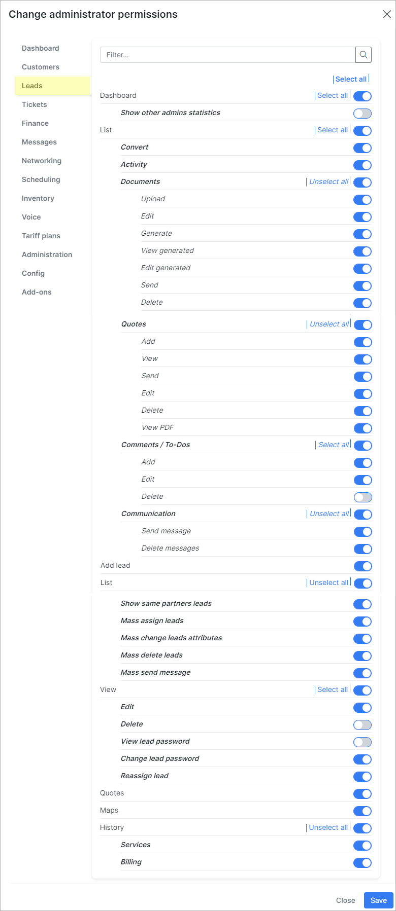

Default roles and its permissions in detail
=======================

On this page we can view the default roles in Splynx with a detailed information about access levels to each of the different modules and features of system.

By default, there are 7 roles in Splynx:

- **super-administrator**
- **administrator**
- **manager**
- **financial-manager**
- **customer-creator**
- **engineer**
- **technician**

We can create the own role and set the required permissions to it. For the default roles we can only change the Name and Title, the permissions can be changed only for a newly created role.

Also, you can follow the permissions scheme of existing role when creating a new one

#### The list of default permissions for each of the build-in role

<b>super-administrator>/b>

Administrator account with `super-administrator`role has the access to ALL categories and its sub-categories in Splynx.

------------

<b>administrator>/b>

| DASHBOARD  |
| ------------ |
| 
  
 |

------------

|  TARIFF PLANS  |
| ------------ |
| 
  
  |

------------

|  CRM  |
| ------------ |
| 
  
  |

------------

|  CUSTOMERS  |
| ------------ |
| 
  
  |

------------

|  TICKETS  |
| ------------ |
| 
  
  |

------------

|  FINANCE  |
| ------------ |
| 
  
   |

------------

|  INVENTORY  |
| ------------ |
| 
  
  |

------------

|  NETWORKING  |
| ------------ |
| 
  
  |

------------

|  MESSAGES  |
| ------------ |
| 
  
  |

------------

|  SCHEDULING  |
| ------------ |
| 
  
  |

------------

|  VOICE  |
| ------------ |
| 
  
 |

------------

|  ADMINISTRATION  |
| ------------ |
| 
  
   |

------------

|  CONFIG  |
| ------------ |
| 
  
   |

------------

|  ADD-ONS  |
| ------------ |
| Administrator account with `administrator` role has the access to ALL installed add-ons in Splynx.  |

<b>manager>/b>

| DASHBOARD  |
| ------------ |
| 
  
 
  
 
  
 
  
 
  
 
  
 
  
 
  
 
  
 
  
 |

------------

|  TARIFF PLANS  |
| ------------ |
| 
  
 
  
 
  
 
  
 
  
 
  
 
  
 
  
 
  
 
  
  |

------------

|  CRM  |
| ------------ |
| 
  
 
  
 
  
 
  
 
  
 
  
 
  
 
  
 
  
 
  
  |

------------

|  CUSTOMERS  |
| ------------ |
| 
  
 
  
 
  
 
  
 
  
 
  
 
  
 
  
 
  
 
  
  |

------------

|  TICKETS  |
| ------------ |
| 
  
 
  
 
  
 
  
 
  
 
  
 
  
 
  
 
  
 
  
  |

------------

|  FINANCE  |
| ------------ |
| 
  
 
  
 
  
 
  
 
  
 
  
 
  
 
  
 
  
 
  
  |

------------

|  INVENTORY  |
| ------------ |
| 
  
 
  
 
  
 
  
 
  
 
  
 
  
 
  
 
  
 
  
  |

------------

|  NETWORKING  |
| ------------ |
| 
  
 
  
 
  
 
  
 
  
 
  
 
  
 
  
 
  
 
  
  |

------------

|  MESSAGES  |
| ------------ |
| 
  
 
  
 
  
 
  
 
  
 
  
 
  
 
  
 
  
 
  
  |

------------

|  SCHEDULING  |
| ------------ |
| 
  
 
  
 
  
 
  
 
  
 
  
 
  
 
  
 
  
 
  
  |

------------

|  VOICE  |
| ------------ |
| 
  
 
  
 
  
 
  
 
  
 
  
 
  
 
  
 
  
 
  
  |

------------

|  ADMINISTRATION  |
| ------------ |
| 
  
 
  
 
  
 
  
 
  
 
  
 
  
 
  
 
  
 
  
  |

------------

|  CONFIG  |
| ------------ |
| 
  
 
  
 
  
 
  
 
  
 
  
 
  
 
  
 
  
 
  
  |

------------

|  ADD-ONS  |
| ------------ |
| Administrator account with `administrator` role has the access to ALL installed add-ons in Splynx.  |

<b>financial-manager>/b>

| DASHBOARD  |
| ------------ |
| 
  
 
  
 
  
 
  
 
  
 
  
 
  
 
  
 
  
 
  
 |

------------

|  TARIFF PLANS  |
| ------------ |
| 
  
 
  
 
  
 
  
 
  
 
  
 
  
 
  
 
  
 
  
  |

------------

|  CRM  |
| ------------ |
| 
  
 
  
 
  
 
  
 
  
 
  
 
  
 
  
 
  
 
  
  |

------------

|  CUSTOMERS  |
| ------------ |
| 
  
 
  
 
  
 
  
 
  
 
  
 
  
 
  
 
  
 
  
  |

------------

|  TICKETS  |
| ------------ |
| 
  
 
  
 
  
 
  
 
  
 
  
 
  
 
  
 
  
 
  
  |

------------

|  FINANCE  |
| ------------ |
| 
  
 
  
 
  
 
  
 
  
 
  
 
  
 
  
 
  
 
  
  |

------------

|  INVENTORY  |
| ------------ |
| 
  
 
  
 
  
 
  
 
  
 
  
 
  
 
  
 
  
 
  
  |

------------

|  NETWORKING  |
| ------------ |
| 
  
 
  
 
  
 
  
 
  
 
  
 
  
 
  
 
  
 
  
  |

------------

|  MESSAGES  |
| ------------ |
| 
  
 
  
 
  
 
  
 
  
 
  
 
  
 
  
 
  
 
  
  |

------------

|  SCHEDULING  |
| ------------ |
| 
  
 
  
 
  
 
  
 
  
 
  
 
  
 
  
 
  
 
  
  |

------------

|  VOICE  |
| ------------ |
| 
  
 
  
 
  
 
  
 
  
 
  
 
  
 
  
 
  
 
  
  |

------------

|  ADMINISTRATION  |
| ------------ |
| 
  
 
  
 
  
 
  
 
  
 
  
 
  
 
  
 
  
 
  
  |

------------

|  CONFIG  |
| ------------ |
| 
  
 
  
 
  
 
  
 
  
 
  
 
  
 
  
 
  
 
  
  |

------------

|  ADD-ONS  |
| ------------ |
| Administrator account with `administrator` role has the access to ALL installed add-ons in Splynx.  |

<b>customer-creator>/b>

| DASHBOARD  |
| ------------ |
| 
  
 
  
 
  
 
  
 
  
 
  
 
  
 
  
 
  
 
  
 |

------------

|  TARIFF PLANS  |
| ------------ |
| 
  
 
  
 
  
 
  
 
  
 
  
 
  
 
  
 
  
 
  
  |

------------

|  CRM  |
| ------------ |
| 
  
 
  
 
  
 
  
 
  
 
  
 
  
 
  
 
  
 
  
  |

------------

|  CUSTOMERS  |
| ------------ |
| 
  
 
  
 
  
 
  
 
  
 
  
 
  
 
  
 
  
 
  
  |

------------

|  TICKETS  |
| ------------ |
| 
  
 
  
 
  
 
  
 
  
 
  
 
  
 
  
 
  
 
  
  |

------------

|  FINANCE  |
| ------------ |
| 
  
 
  
 
  
 
  
 
  
 
  
 
  
 
  
 
  
 
  
  |

------------

|  INVENTORY  |
| ------------ |
| 
  
 
  
 
  
 
  
 
  
 
  
 
  
 
  
 
  
 
  
  |

------------

|  NETWORKING  |
| ------------ |
| 
  
 
  
 
  
 
  
 
  
 
  
 
  
 
  
 
  
 
  
  |

------------

|  MESSAGES  |
| ------------ |
| 
  
 
  
 
  
 
  
 
  
 
  
 
  
 
  
 
  
 
  
  |

------------

|  SCHEDULING  |
| ------------ |
| 
  
 
  
 
  
 
  
 
  
 
  
 
  
 
  
 
  
 
  
  |

------------

|  VOICE  |
| ------------ |
| 
  
 
  
 
  
 
  
 
  
 
  
 
  
 
  
 
  
 
  
  |

------------

|  ADMINISTRATION  |
| ------------ |
| 
  
 
  
 
  
 
  
 
  
 
  
 
  
 
  
 
  
 
  
  |

------------

|  CONFIG  |
| ------------ |
| 
  
 
  
 
  
 
  
 
  
 
  
 
  
 
  
 
  
 
  
  |

------------

|  ADD-ONS  |
| ------------ |
| Administrator account with `administrator` role has the access to ALL installed add-ons in Splynx.  |

<b>engineer>/b>

| DASHBOARD  |
| ------------ |
| 
  
 
  
 
  
 
  
 
  
 
  
 
  
 
  
 
  
 
  
 |

------------

|  TARIFF PLANS  |
| ------------ |
| 
  
 
  
 
  
 
  
 
  
 
  
 
  
 
  
 
  
 
  
  |

------------

|  CRM  |
| ------------ |
| 
  
 
  
 
  
 
  
 
  
 
  
 
  
 
  
 
  
 
  
  |

------------

|  CUSTOMERS  |
| ------------ |
| 
  
 
  
 
  
 
  
 
  
 
  
 
  
 
  
 
  
 
  
  |

------------

|  TICKETS  |
| ------------ |
| 
  
 
  
 
  
 
  
 
  
 
  
 
  
 
  
 
  
 
  
  |

------------

|  FINANCE  |
| ------------ |
| 
  
 
  
 
  
 
  
 
  
 
  
 
  
 
  
 
  
 
  
  |

------------

|  INVENTORY  |
| ------------ |
| 
  
 
  
 
  
 
  
 
  
 
  
 
  
 
  
 
  
 
  
  |

------------

|  NETWORKING  |
| ------------ |
| 
  
 
  
 
  
 
  
 
  
 
  
 
  
 
  
 
  
 
  
  |

------------

|  MESSAGES  |
| ------------ |
| 
  
 
  
 
  
 
  
 
  
 
  
 
  
 
  
 
  
 
  
  |

------------

|  SCHEDULING  |
| ------------ |
| 
  
 
  
 
  
 
  
 
  
 
  
 
  
 
  
 
  
 
  
  |

------------

|  VOICE  |
| ------------ |
| 
  
 
  
 
  
 
  
 
  
 
  
 
  
 
  
 
  
 
  
  |

------------

|  ADMINISTRATION  |
| ------------ |
| 
  
 
  
 
  
 
  
 
  
 
  
 
  
 
  
 
  
 
  
  |

------------

|  CONFIG  |
| ------------ |
| 
  
 
  
 
  
 
  
 
  
 
  
 
  
 
  
 
  
 
  
  |

------------

|  ADD-ONS  |
| ------------ |
| Administrator account with `administrator` role has the access to ALL installed add-ons in Splynx.  |

<b>technician>/b>

| DASHBOARD  |
| ------------ |
| 
  
 
  
 
  
 
  
 
  
 
  
 
  
 
  
 
  
 
  
 |

------------

|  TARIFF PLANS  |
| ------------ |
| 
  
 
  
 
  
 
  
 
  
 
  
 
  
 
  
 
  
 
  
  |

------------

|  CRM  |
| ------------ |
| 
  
 
  
 
  
 
  
 
  
 
  
 
  
 
  
 
  
 
  
  |

------------

|  CUSTOMERS  |
| ------------ |
| 
  
 
  
 
  
 
  
 
  
 
  
 
  
 
  
 
  
 
  
  |

------------

|  TICKETS  |
| ------------ |
| 
  
 
  
 
  
 
  
 
  
 
  
 
  
 
  
 
  
 
  
  |

------------

|  FINANCE  |
| ------------ |
| 
  
 
  
 
  
 
  
 
  
 
  
 
  
 
  
 
  
 
  
  |

------------

|  INVENTORY  |
| ------------ |
| 
  
 
  
 
  
 
  
 
  
 
  
 
  
 
  
 
  
 
  
  |

------------

|  NETWORKING  |
| ------------ |
| 
  
 
  
 
  
 
  
 
  
 
  
 
  
 
  
 
  
 
  
  |

------------

|  MESSAGES  |
| ------------ |
| 
  
 
  
 
  
 
  
 
  
 
  
 
  
 
  
 
  
 
  
  |

------------

|  SCHEDULING  |
| ------------ |
| 
  
 
  
 
  
 
  
 
  
 
  
 
  
 
  
 
  
 
  
  |

------------

|  VOICE  |
| ------------ |
| 
  
 
  
 
  
 
  
 
  
 
  
 
  
 
  
 
  
 
  
  |

------------

|  ADMINISTRATION  |
| ------------ |
| 
  
 
  
 
  
 
  
 
  
 
  
 
  
 
  
 
  
 
  
  |

------------

|  CONFIG  |
| ------------ |
| 
  
 
  
 
  
 
  
 
  
 
  
 
  
 
  
 
  
 
  
  |

------------

|  ADD-ONS  |
| ------------ |
| Administrator account with `administrator` role has the access to ALL installed add-ons in Splynx.  |

