Default roles and its permissions in detail
=======================

On this page we can view the default roles in Splynx with a detailed information about access levels to each of the different modules and features of system.

By default, there are 7 roles in Splynx:

- `super-administrator`
- `administrator`
- `manager`
- `financial-manager`
- `customer-creator`
- `engineer`
- `technician`

We can create the own role and set the required permissions to it. For the default roles we can only change the *Name* and *Title*. The permissions can be changed only for a newly created role in this window. If it's necessary to change the default roles' permissions (except `super-administrator` one), you can do it on [Admins and permissions](administration/main/admins_and_permissions/admins_and_permissions.md) menu for specific administrator account.

Also, you can follow the permissions scheme of existing role when creating a new one

### The list of default permissions for each of the build-in role:

<b>super-administrator</b>

Administrator account with `super-administrator`role has the access to ALL categories and its sub-categories in Splynx by default.

------------

<b>administrator</b>

| DASHBOARD  |
| ------------ |
| 
  
 |

------------

|  TARIFF PLANS  |
| ------------ |
| 
  
  |

------------

|  CRM  |
| ------------ |
| 
  
  |

------------

|  CUSTOMERS  |
| ------------ |
| 
  
  |

------------

|  TICKETS  |
| ------------ |
| 
 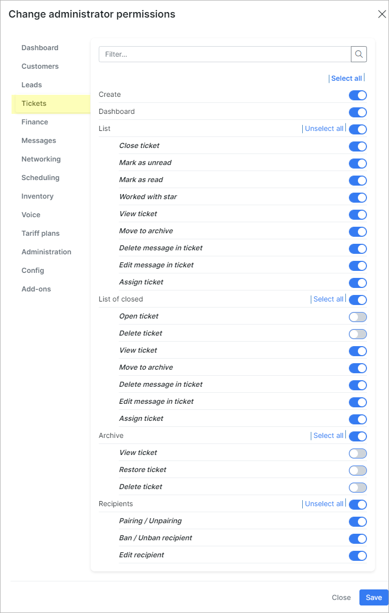 
  |

------------

|  FINANCE  |
| ------------ |
| 
  
   |

------------

|  INVENTORY  |
| ------------ |
| 
  
  |

------------

|  NETWORKING  |
| ------------ |
| 
 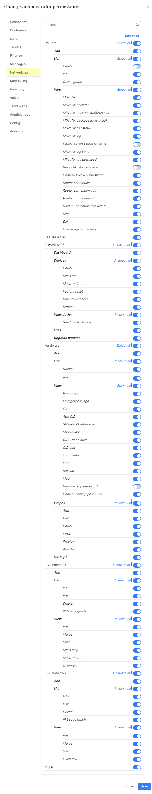 
  |

------------

|  MESSAGES  |
| ------------ |
| 
  
  |

------------

|  SCHEDULING  |
| ------------ |
| 
  
  |

------------

|  VOICE  |
| ------------ |
| 
  
 |

------------

|  ADMINISTRATION  |
| ------------ |
| 
 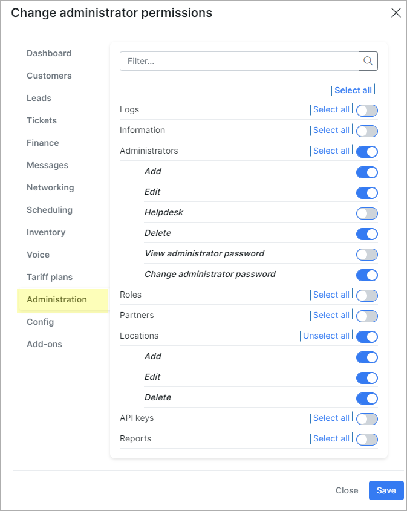 
   |

------------

|  CONFIG  |
| ------------ |
| 
  
   |

------------

|  ADD-ONS  |
| ------------ |
| Administrator account with `administrator` role has the access to ALL installed add-ons in Splynx by default.  |

------------

<b>manager</b>

| DASHBOARD  |
| ------------ |
| 
  
  |

------------

|  TARIFF PLANS  |
| ------------ |
| 
  
   |

------------

|  CRM  |
| ------------ |
| 
  
   |

------------

|  CUSTOMERS  |
| ------------ |
| 
  
   |

------------

|  TICKETS  |
| ------------ |
| 
  
   |

------------

|  FINANCE  |
| ------------ |
| 
  
   |

------------

|  INVENTORY  |
| ------------ |
| 
  
   |

------------

|  NETWORKING  |
| ------------ |
| 
  
   |

------------

|  MESSAGES  |
| ------------ |
| 
  
   |

------------

|  SCHEDULING  |
| ------------ |
| 
 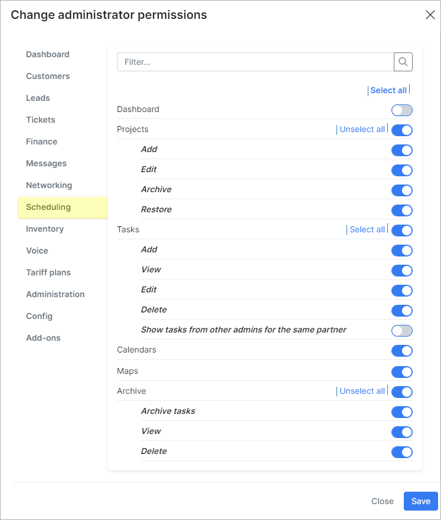 
   |

------------

|  VOICE  |
| ------------ |
| 
  
   |

------------

|  ADMINISTRATION  |
| ------------ |
| 
  
   |

------------

|  CONFIG  |
| ------------ |
| 
  
   |

------------

|  ADD-ONS  |
| ------------ |
| Administrator account with `manager` role has NO access to installed add-ons in Splynx by default.  |

------------

<b>financial-manager</b>

| DASHBOARD  |
| ------------ |
| 
  
  |

------------

|  TARIFF PLANS  |
| ------------ |
| 
  
   |

------------

|  CRM  |
| ------------ |
| 
  
   |

------------

|  CUSTOMERS  |
| ------------ |
| 
  
   |

------------

|  TICKETS  |
| ------------ |
| 
  
   |

------------

|  FINANCE  |
| ------------ |
| 
 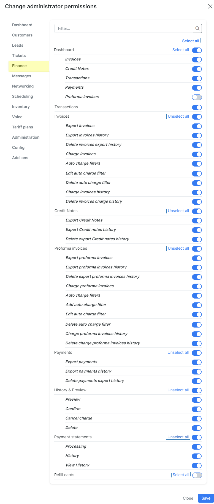 
   |

------------

|  INVENTORY  |
| ------------ |
| 
 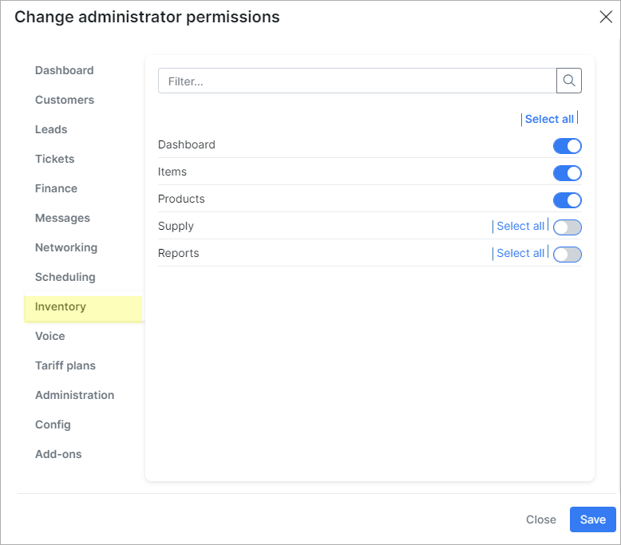 
   |

------------

|  NETWORKING  |
| ------------ |
| 
  
   |

------------

|  MESSAGES  |
| ------------ |
| 
  
   |

------------

|  SCHEDULING  |
| ------------ |
| 
  
   |

------------

|  VOICE  |
| ------------ |
| 
  
   |

------------

|  ADMINISTRATION  |
| ------------ |
| 
  
   |

------------

|  CONFIG  |
| ------------ |
| 
 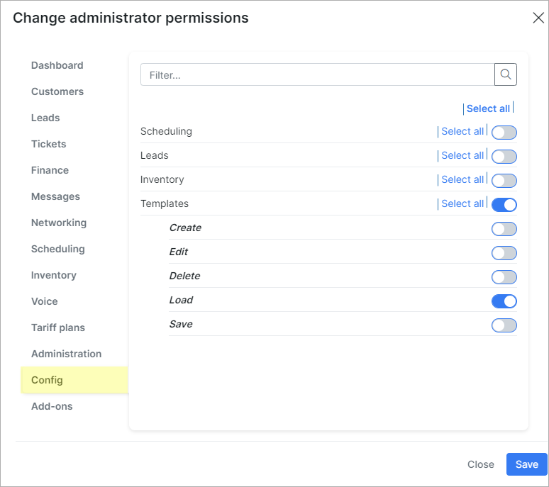 
   |

------------

|  ADD-ONS  |
| ------------ |
| Administrator account with `financial-manager` role has NO access to installed add-ons in Splynx by default.  |

------------

<b>customer-creator</b>

| DASHBOARD  |
| ------------ |
| 
  
  |

------------

|  TARIFF PLANS  |
| ------------ |
| 
  
   |

------------

|  CRM  |
| ------------ |
| 
 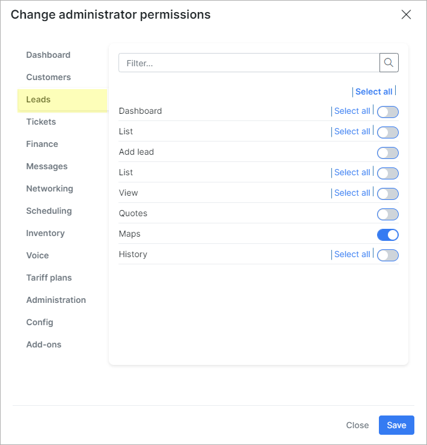 
   |

------------

|  CUSTOMERS  |
| ------------ |
| 
  
   |

------------

|  TICKETS  |
| ------------ |
| 
  
   |

------------

|  FINANCE  |
| ------------ |
| 
  
   |

------------

|  INVENTORY  |
| ------------ |
| 
  
   |

------------

|  NETWORKING  |
| ------------ |
| 
  
   |

------------

|  MESSAGES  |
| ------------ |
| 
  
   |

------------

|  SCHEDULING  |
| ------------ |
| 
  
   |

------------

|  VOICE  |
| ------------ |
| 
  
   |

------------

|  ADMINISTRATION  |
| ------------ |
| 
  
   |

------------

|  CONFIG  |
| ------------ |
| 
  
   |

------------

|  ADD-ONS  |
| ------------ |
| Administrator account with `customer-creator` role has NO access to installed add-ons in Splynx by default.  |

------------

<b>engineer</b>

| DASHBOARD  |
| ------------ |
| 
  
  |

------------

|  TARIFF PLANS  |
| ------------ |
| 
 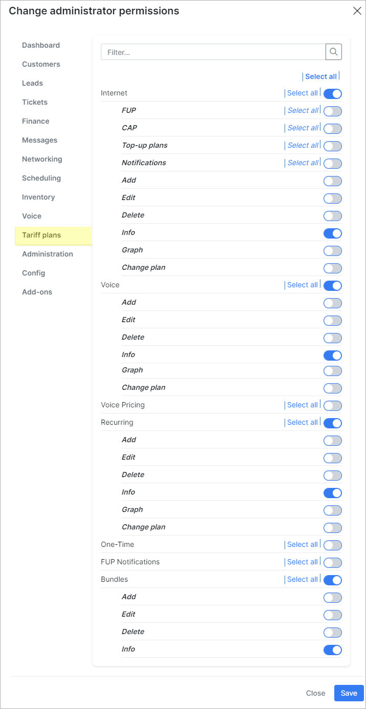 
   |

------------

|  CRM  |
| ------------ |
| 
  
   |

------------

|  CUSTOMERS  |
| ------------ |
| 
  
   |

------------

|  TICKETS  |
| ------------ |
| 
  
   |

------------

|  FINANCE  |
| ------------ |
| 
  
   |

------------

|  INVENTORY  |
| ------------ |
| 
  
   |

------------

|  NETWORKING  |
| ------------ |
| 
 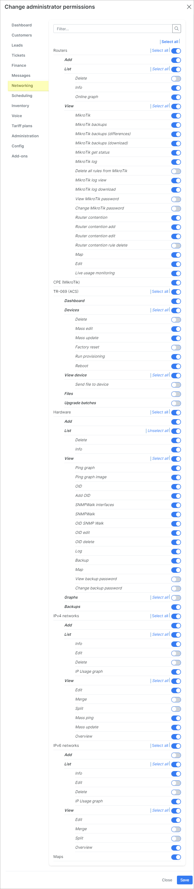 
   |

------------

|  MESSAGES  |
| ------------ |
| 
  
   |

------------

|  SCHEDULING  |
| ------------ |
| 
 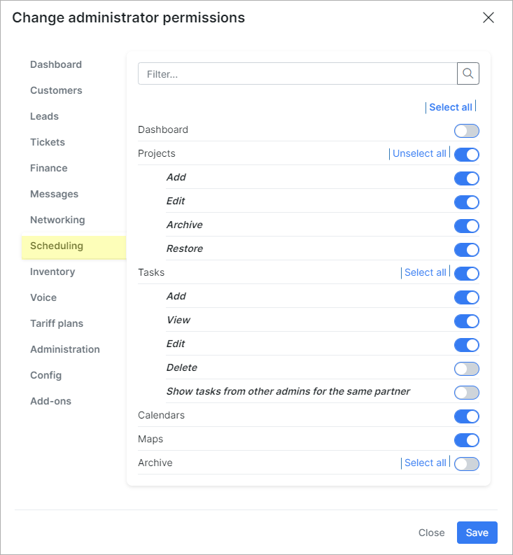 
   |

------------

|  VOICE  |
| ------------ |
| 
  
   |

------------

|  ADMINISTRATION  |
| ------------ |
| 
  
   |

------------

|  CONFIG  |
| ------------ |
| 
  
   |

------------

|  ADD-ONS  |
| ------------ |
| Administrator account with `engineer` role has NO access to installed add-ons in Splynx by default.   |

------------

<b>technician</b>

| DASHBOARD  |
| ------------ |
| 
  
  |

------------

|  TARIFF PLANS  |
| ------------ |
| 
  
   |

------------

|  CRM  |
| ------------ |
| 
 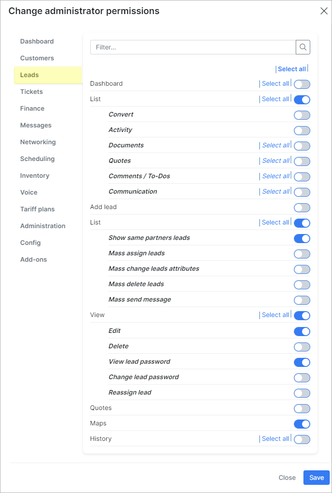 
   |

------------

|  CUSTOMERS  |
| ------------ |
| 
 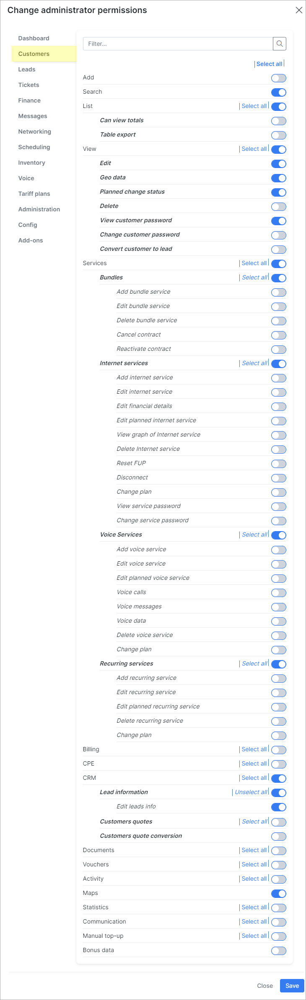 
   |

------------

|  TICKETS  |
| ------------ |
| 
  
   |

------------

|  FINANCE  |
| ------------ |
| 
  
   |

------------

|  INVENTORY  |
| ------------ |
| 
  
   |

------------

|  NETWORKING  |
| ------------ |
| 
  
   |

------------

|  MESSAGES  |
| ------------ |
| 
  
   |

------------

|  SCHEDULING  |
| ------------ |
| 
  
   |

------------

|  VOICE  |
| ------------ |
| 
  
   |

------------

|  ADMINISTRATION  |
| ------------ |
| 
  
   |

------------

|  CONFIG  |
| ------------ |
| 
  
   |

------------

|  ADD-ONS  |
| ------------ |
| Administrator account with `technician` role has NO access to installed add-ons in Splynx by default.  |

