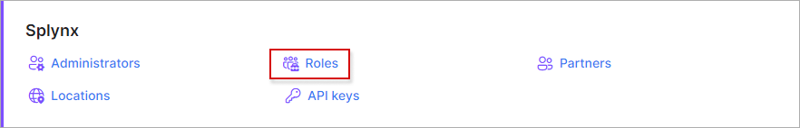

Roles
=================

In this section we can configure custom roles with modified permissions to assign to administrators on the system.

We can use roles to limit administrative access to particular modules on the system.

### Adding a new role

To add a new role, click the *Add* button at the top right corner:

The following window will appear for you to enter a name and a title for the new role, and you may choose a permission scheme of one of the existing roles to apply the same permissions to the role or you can simply leave it as none:

You can customize the permissions granted in the role by clicking on the permissions icon <icon class="image-icon"></icon>:

When you have customized the permissions to you like, please do not forget to save your changes.

All custom roles can be edited or deleted with the icons provided in the actions column:

***Please be advised that default roles cannot be deleted or customized, however, default roles can be renamed.***

For more information on the default roles in Splynx, please follow the link below:
[Default roles and its permissions in detail](administration/main/roles/default_roles/default_roles.md).
