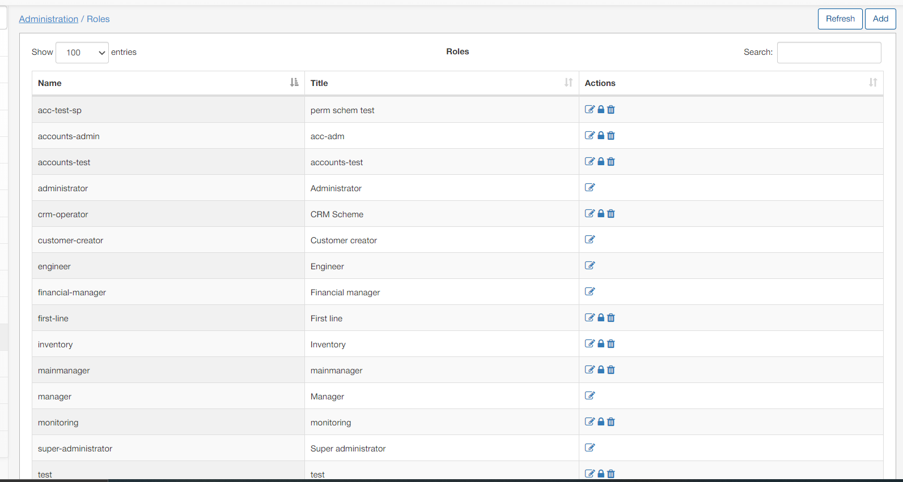
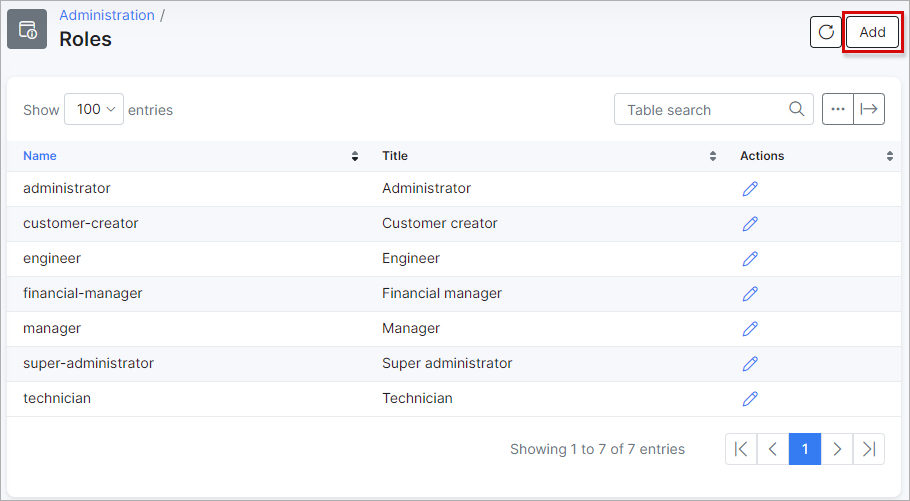
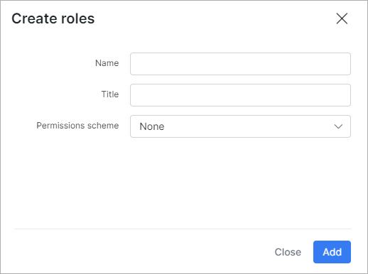
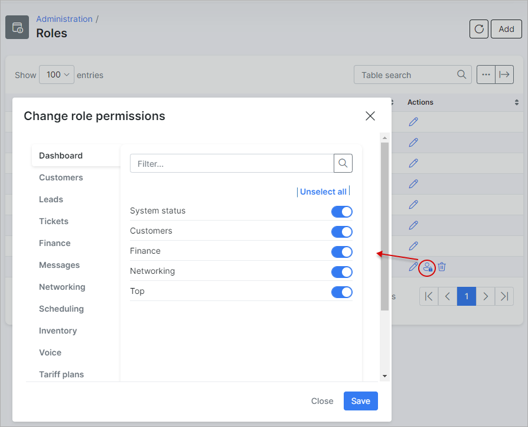
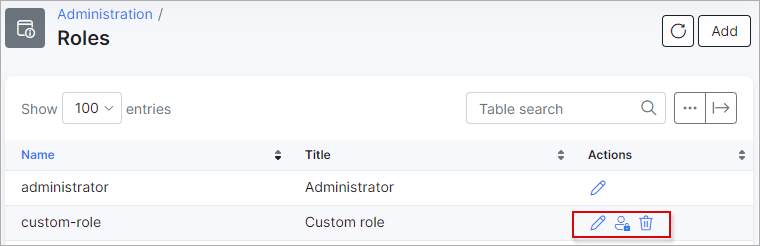

Roles
=================

In this section we can configure custom roles with modified permissions to assign to administrators on the system.

We can use roles to limit administrative access to particular modules on the system.

### Adding a new role

To add a new role, navigate to *Administration / Roles*:

Click on the *Add* button at the top right of the table:

The following window will appear for you to enter a name and a title for the new role, and you may choose a permission scheme of one of the existing roles to apply the same permissions to the role or you can simply leave it as none:

Thereafter, you can customize the permissions granted in the role by clicking on the permissions icon <icon class="image-icon"></icon>:

You will then be able to customize permissions under each of the module by enabling/disable each of the permissions/categories with the toggles provided:

When you have customized the permissions to you liking, please do not forgot to save your changes.

All custom roles can be edited or delete with the icons provided in the actions column:

***Please be advised that default roles cannot be deleted or customized, however, default roles can be renamed.***

For more information on the default roles in Splynx, please follow the link below:
[Default Roles](administration/main/roles/default_roles/roles.md)
