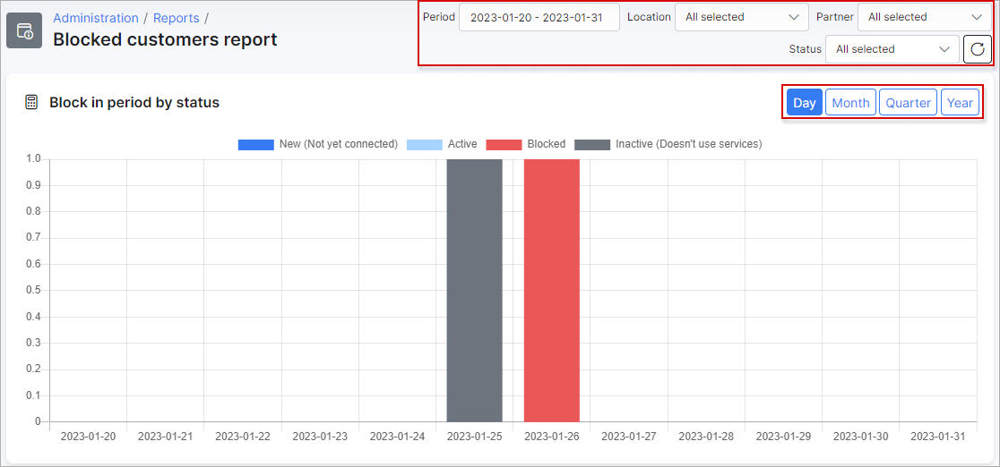

Blocked Customers Report
=======

In this section, we can view reports of customers who have been blocked by the system.

The report is presented in a table format which can be filtered by a specific period of time, partner or location

This table, like all tables in Splynx, can be exported in a format of choice from that which is available. The table can also be customized to display data of your preferences ordered in a preferred layout. The following button can be used to export the table  and this button  can be used to modify the layout of the table.

When using the export button, you will be presented with the following option as methods to export the table:

Simply click on the desired method and a download will begin.

When using the modify button, you will be presented with the following window:

In this window, you can simply enable or disable each field according to your preference with the toggles provided, and you can drag and drop the field to order it in a layout of your choice.
