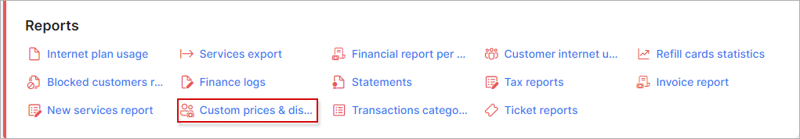
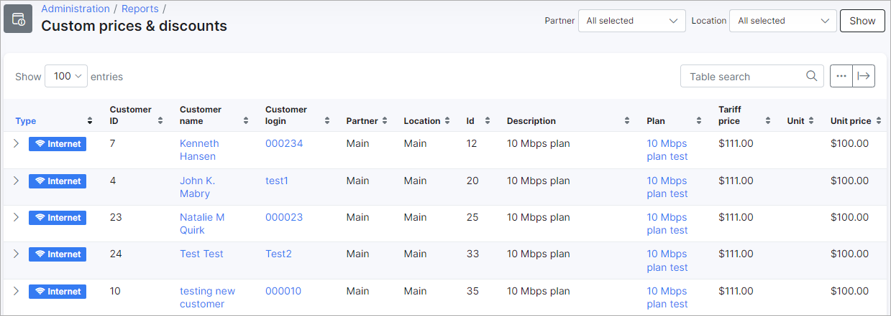
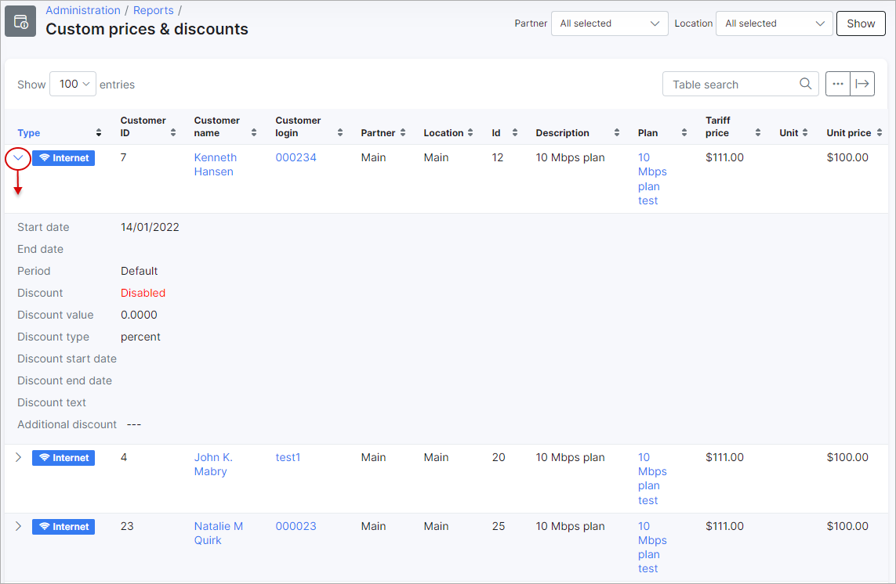
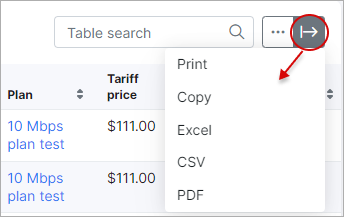
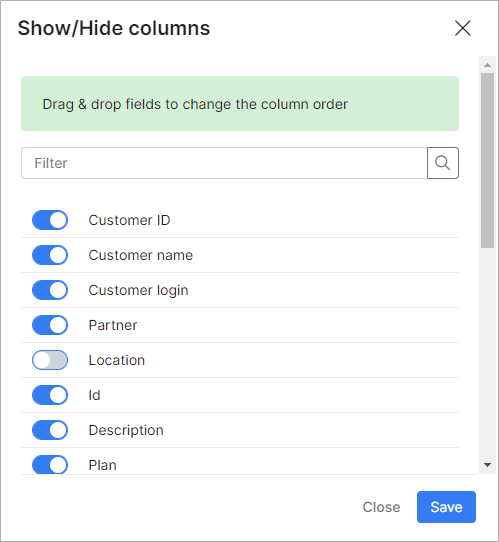

Custom prices & discounts
=========

In this section, we can view a report of all tariffs with any custom prices or discounts applied from the customer services page.

The report is presented in a table format displaying the type of tariff, customer details and tariff details with the custom unit price and a period if specified:

To view any discounts applied to the tariff simply click on the `+` button on the tariff type. All the details of the discount on the tariff will be displayed as depicted below:

The table can be filtered by Partner or Location with the use of the filter provided at the top right of the table. Simply select the partner and/or location and click on the show button.

This table, like all tables in Splynx, can be exported in a format of choice from that which is available. The table can also be customized to display data of your preferences ordered in a preferred layout. The following button can be used to export the table  and this button  can be used to modify the layout of the table.

When using the export button, you will be presented with the following option as methods to export the table:

Simply click on the desired method and a download will begin.

When using the modify button, you will be presented with the following window:

In this window, you can simply enable or disable each field according to your preference with the toggles provided, and you can drag and drop the field to order it in a layout of your choice.
